# Core Concepts

This page provides a deep technical reference for the three foundational classes in Hera: **Project**, **ToolkitHome**, and **abstractToolkit**. Understanding these is essential for working with any part of the system.

---

## Class Hierarchy Overview

The diagram below shows the **core hierarchy** — `Project` at the base, `abstractToolkit` adding datasource management on top, and `ToolkitHome` acting as the registry/factory.


<!-- mermaid source (for editing, paste into mermaid.live):
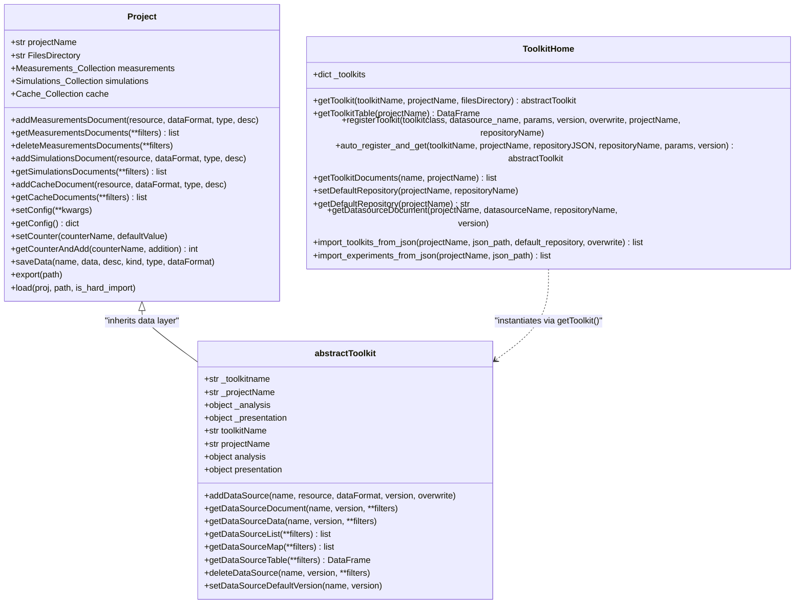
-->    Project <|-- abstractToolkit : "inherits data layer"
    ToolkitHome ..> abstractToolkit : "instantiates via getToolkit()"
```
-->
-->    Project <|-- abstractToolkit : "inherits data layer"
    ToolkitHome ..> abstractToolkit : "instantiates via getToolkit()"
```
-->
-->

| Class | Role | Key methods |
|-------|------|------------|
| `Project` | Central data access layer — CRUD for measurements, simulations, cache | `addMeasurementsDocument`, `getMeasurementsDocuments`, `setConfig`, `getCounterAndAdd`, `saveData`, `export` |
| `abstractToolkit` | Base for all domain toolkits — adds datasource management, analysis/presentation layers | `addDataSource`, `getDataSourceData`, `getDataSourceList`, `deleteDataSource`, `setDataSourceDefaultVersion` |
| `ToolkitHome` | Registry/factory — resolves toolkit names to classes | `getToolkit`, `getToolkitTable`, `registerToolkit`, `getToolkitDocuments` |

### Concrete Toolkit Hierarchy

All domain toolkits extend `abstractToolkit`. The diagram below shows the full inheritance tree including the special `dataToolkit` that manages repositories.


<!-- mermaid source (for editing, paste into mermaid.live):
```mermaid
classDiagram
    class abstractToolkit {
        +str toolkitName
        +object analysis
        +object presentation
        +addDataSource()
        +getDataSourceData()
    }

    class dataToolkit {
        +addRepository(repositoryName, repositoryPath)
        +getRepository(repositoryName) dict
        +getRepositoryTable() DataFrame
        +loadAllDatasourcesInRepositoryToProject(projectName, repositoryName, overwrite)
        +loadAllDatasourcesInRepositoryJSONToProject(projectName, repositoryJSON, basedir, overwrite, auto_register_missing)
        +resolveDataSourcePaths(repositoryJSON, basedir) dict
        +loadRepositoryFromPath(json_path) dict
    }

    class TopographyToolkit {
        +getPointElevation(lat, lon) float
        +getPointListElevation(points) list
        +getElevation(minx, miny, maxx, maxy, dxdy) xarray
        +getElevationOfXarray(ds) xarray
        +createElevationSTL(...)
        +convertPointsCRS(points, inputCRS, outputCRS) list
    }

    class lowFreqToolKit {
        +analysis LowFreqAnalysis
        +presentation LowFreqPresentation
        +str docType
    }

    class HighFreqToolKit {
        +analysis HighFreqAnalysis
        +str docType
    }

    class DemographyToolkit {
        +calculatePopulationInPolygon(polygon, datasource) float
        +createNewArea(polygon, datasource) GeoDataFrame
        +setDefaultDirectory(path)
    }

    class LandCoverToolkit {
        +getLandCoverAtPoint(lat, lon) str
        +getLandCover(minx, miny, maxx, maxy, dxdy) xarray
        +getRoughness(...) xarray
    }

    class BuildingsToolkit {
        +createBuildingsSTL(...)
        +getBuildingsGDF(...)
    }

    class OFToolkit {
        +runCase(casePath, nproc)
        +analysis OFAnalysis
    }

    class LSMToolkit {
        +analysis LSMAnalysis
        +presentation LSMPresentation
    }

    class RiskToolkit {
        +analysis RiskAnalysis
        +presentation RiskPresentation
    }

    abstractToolkit <|-- dataToolkit : "repository management"
    abstractToolkit <|-- TopographyToolkit : "GIS raster"
    abstractToolkit <|-- lowFreqToolKit : "meteorology"
    abstractToolkit <|-- HighFreqToolKit : "meteorology"
    abstractToolkit <|-- DemographyToolkit : "GIS vector"
    abstractToolkit <|-- LandCoverToolkit : "GIS raster"
    abstractToolkit <|-- BuildingsToolkit : "GIS vector"
    abstractToolkit <|-- OFToolkit : "simulations"
    abstractToolkit <|-- LSMToolkit : "simulations"
    abstractToolkit <|-- RiskToolkit : "risk assessment"
```
-->t : "simulations"
    abstractToolkit <|-- LSMToolkit : "simulations"
    abstractToolkit <|-- RiskToolkit : "risk assessment"
```
-->
-->t : "simulations"
    abstractToolkit <|-- LSMToolkit : "simulations"
    abstractToolkit <|-- RiskToolkit : "risk assessment"
```
-->
-->

| Toolkit class | Domain | Key capabilities |
|--------------|--------|-----------------|
| `dataToolkit` | Data | Repository management, loading data sources into projects |
| `TopographyToolkit` | GIS (raster) | Elevation data, STL generation, CRS conversion |
| `BuildingsToolkit` | GIS (vector) | Building footprints, 3D STL for CFD |
| `DemographyToolkit` | GIS (vector) | Population calculations within polygons |
| `LandCoverToolkit` | GIS (raster) | Land cover classification, roughness estimation |
| `lowFreqToolKit` | Meteorology | Hourly/daily station data with analysis + presentation |
| `HighFreqToolKit` | Meteorology | High-frequency sonic anemometer data |
| `OFToolkit` | Simulations | OpenFOAM lifecycle (templates, running, post-processing) |
| `LSMToolkit` | Simulations | Lagrangian Stochastic Model |
| `RiskToolkit` | Risk | Agent-based hazard and casualty modeling |

---

## Project

**Source:** `hera/datalayer/project.py`

The `Project` class is the central data access layer. Every interaction with stored data — measurements, simulations, cached results — goes through a `Project` instance.

### Responsibilities

1. **Document CRUD** — Add, query, and delete documents across three MongoDB collections: Measurements, Simulations, and Cache.
2. **Configuration** — Per-project key-value config stored as a special Cache document (type = `<projectName>__config__`).
3. **Counters** — Atomic counters for generating sequential IDs (stored inside the config document under `desc.counters`).
4. **File Management** — Each project has a `filesDirectory` where physical files (parquet, netcdf, etc.) are stored on disk.
5. **Import/Export** — Projects can be exported to a zip file and loaded into another MongoDB instance.

### Initialization Flow


<!-- mermaid source (for editing, paste into mermaid.live):
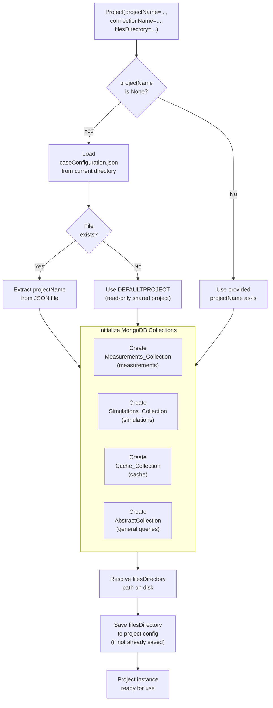
-->["Save filesDirectory\nto project config\n(if not already saved)"]
    SaveConfig --> Ready["Project instance\nready for use"]
```
-->
-->["Save filesDirectory\nto project config\n(if not already saved)"]
    SaveConfig --> Ready["Project instance\nready for use"]
```
-->
-->

!!! note "The Default Project"
    When `projectName=None` and no `caseConfiguration.json` exists, Hera uses a special `"defaultProject"` which is **read-only**. This is used by the `dataToolkit` to store repository metadata without polluting user projects.

### Key Methods

| Method | Description |
|--------|-------------|
| `addMeasurementsDocument(resource, dataFormat, type, desc)` | Insert a new measurement document into MongoDB |
| `getMeasurementsDocuments(**filters)` | Query measurement documents by any combination of fields |
| `deleteMeasurementsDocuments(**kwargs)` | Remove matching measurement documents |
| `setConfig(**kwargs)` | Update project configuration (atomic per-key updates) |
| `getConfig()` | Return the full config dict |
| `setCounter(name, default)` | Define a named counter |
| `getCounterAndAdd(name, addition)` | Atomically read and increment a counter |
| `saveData(name, data, desc, kind)` | Auto-detect format, save to disk, and create a document |
| `export(path)` | Export all project documents to a zip file |
| `Project.load(proj, path, is_hard_import)` | Import documents from an exported zip |

### Document Structure

Every document in Hera has the following top-level fields:

```python
{
    "projectName": "MY_PROJECT",
    "_cls": "Metadata.Measurements",   # or .Simulations / .Cache
    "type": "ToolkitDataSource",        # application-defined type tag
    "resource": "/path/to/data.parquet",
    "dataFormat": "parquet",
    "desc": {                           # free-form metadata dict
        "toolkit": "MeteoLowFreq",
        "datasourceName": "YAVNEEL",
        "version": [0, 0, 1],
        ...
    }
}
```

---

## ToolkitHome

**Source:** `hera/toolkit.py` (class `ToolkitHome`)

`ToolkitHome` is the **central registry** for all available toolkits. A singleton instance `toolkitHome` is created at import time in `hera/__init__.py`.

### Responsibilities

1. **Static Registry** — A dict mapping toolkit names (e.g., `"MeteoLowFreq"`) to their full Python class paths.
2. **Dynamic Registry** — Toolkits registered at runtime via `registerToolkit()` are stored as `ToolkitDataSource` documents in MongoDB.
3. **Instantiation** — `getToolkit(name, projectName)` resolves the class, imports it, and returns a new instance.
4. **Auto-Registration** — `auto_register_and_get()` can discover toolkit classes from repository JSON hints or DB documents.

### Toolkit Resolution Flow


<!-- mermaid source (for editing, paste into mermaid.live):
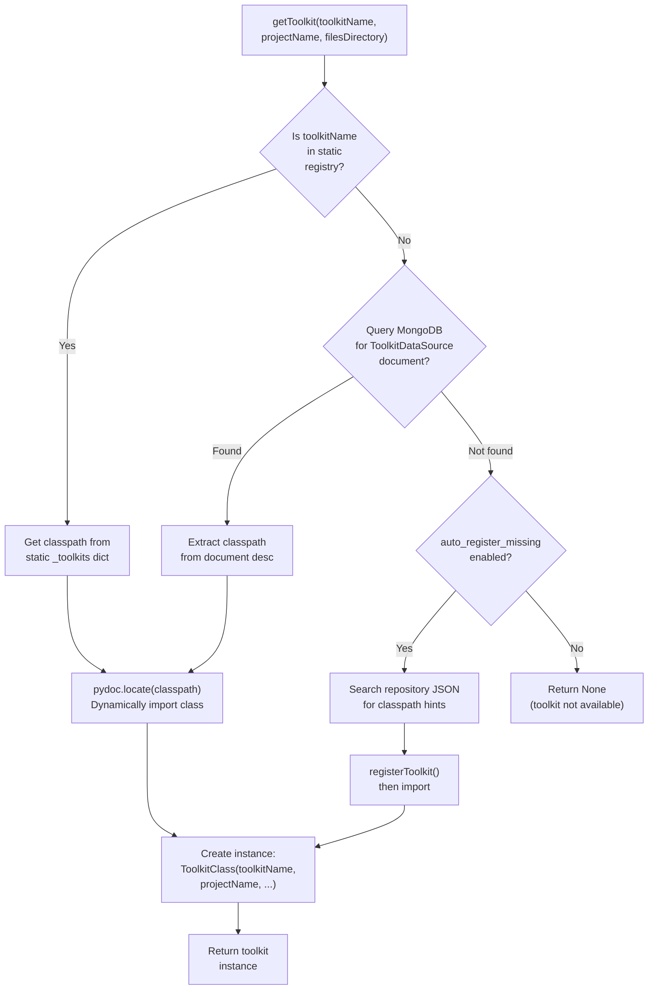
-->mport"]
    RegisterAndImport --> Instantiate

    AutoRegister -- "No" --> ReturnNone["Return None\n(toolkit not available)"]
```
-->
-->mport"]
    RegisterAndImport --> Instantiate

    AutoRegister -- "No" --> ReturnNone["Return None\n(toolkit not available)"]
```
-->
-->

!!! warning "Singleton Pattern"
    `ToolkitHome` is instantiated once at `hera/__init__.py` as `toolkitHome = ToolkitHome()`. All code should use this singleton rather than creating new instances. The static registry dict is populated in `__init__` and shared across the entire process.

### Static Toolkit Registry

The `_toolkits` dict is structured as:

```python
{
    "GIS_Raster_Topography": {
        "cls": "hera.measurements.GIS.raster.topography.TopographyToolkit",
        "desc": None,
        "type": "measurements"
    },
    "MeteoLowFreq": {
        "cls": "hera.measurements.meteorology.lowfreqdata.toolkit.lowFreqToolKit",
        "desc": None,
        "type": "measurements"
    },
    # ... 16 built-in toolkits total
}
```

### Save Modes

`ToolkitHome` defines standard save-mode constants used throughout the system:

| Constant | Value | Meaning |
|----------|-------|---------|
| `TOOLKIT_SAVEMODE_NOSAVE` | `None` | Do not persist |
| `TOOLKIT_SAVEMODE_ONLYFILE` | `"File"` | Save to disk only |
| `TOOLKIT_SAVEMODE_ONLYFILE_REPLACE` | `"File_overwrite"` | Save to disk, overwrite |
| `TOOLKIT_SAVEMODE_FILEANDDB` | `"DB"` | Save to disk + MongoDB document |
| `TOOLKIT_SAVEMODE_FILEANDDB_REPLACE` | `"DB_overwrite"` | Save to disk + MongoDB, overwrite |

---

## abstractToolkit

**Source:** `hera/toolkit.py` (class `abstractToolkit`)

`abstractToolkit` is the **base class for all domain toolkits**. It inherits from `Project`, meaning every toolkit instance **is** a project — it has full access to measurements, simulations, cache, config, and counters.

!!! info "Design Decision: Inheritance over Composition"
    `abstractToolkit` inherits from `Project` rather than wrapping it. This means every toolkit call like `toolkit.getMeasurementsDocuments(...)` goes directly to the `Project` implementation. The toolkit adds a **datasource management layer** on top, where each datasource is a measurement document tagged with `type="ToolkitDataSource"` and the toolkit's name.

### What It Adds Over Project

1. **Toolkit Identity** — `toolkitName` property, automatically injected into every document created by the toolkit.
2. **Datasource Versioning** — Each datasource has a name + version tuple `(major, minor, patch)`. The system supports multiple versions and a default-version mechanism.
3. **Analysis & Presentation Layers** — `self._analysis` and `self._presentation` hold domain-specific logic (e.g., statistical calculations, plotting).
4. **Automatic Tagging** — `addMeasurementsDocument`, `addSimulationsDocument`, and `addCacheDocument` are overridden to inject the toolkit name into every document's `desc`.

### Datasource Lifecycle


<!-- mermaid source (for editing, paste into mermaid.live):
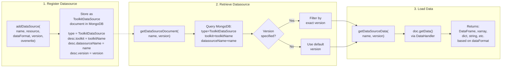
-->-> UseDefault
    UseVersion --> GetData
    UseDefault --> GetData
    GetData --> CallGetData
    CallGetData --> ReturnData
```
-->
-->-> UseDefault
    UseVersion --> GetData
    UseDefault --> GetData
    GetData --> CallGetData
    CallGetData --> ReturnData
```
-->
-->

### Key Methods

| Method | Description |
|--------|-------------|
| `addDataSource(name, resource, dataFormat, version)` | Register a new datasource (versioned) |
| `getDataSourceDocument(name, version)` | Get the MongoDB document for a datasource |
| `getDataSourceData(name, version)` | Load and return the actual data |
| `getDataSourceList(**filters)` | List all datasource names |
| `getDataSourceTable(**filters)` | DataFrame of all datasources with metadata |
| `deleteDataSource(name, version)` | Remove a datasource document |
| `setDataSourceDefaultVersion(name, version)` | Set which version is returned by default |

### Concrete Toolkit Example

A concrete toolkit like `lowFreqToolKit` extends `abstractToolkit` and provides:

- **`analysis`** — Methods like `addDatesColumns()`, `calcHourlyDist()`, `resampleSecondMoments()`
- **`presentation`** — Plot generators like `dailyPlots.plotScatter()`, `seasonalPlots.plotProbContourf_bySeason()`
- **`docType`** — A string identifying the data type this toolkit handles

```python
from hera import toolkitHome

# Instantiate via the registry
lf = toolkitHome.getToolkit(toolkitHome.METEOROLOGY_LOWFREQ, projectName="MY_PROJECT")

# Access data
df = lf.getDataSourceData("YAVNEEL")

# Use analysis
enriched = lf.analysis.addDatesColumns(df, datecolumn="datetime")

# Use presentation
ax = lf.presentation.dailyPlots.plotScatter(enriched, plotField="RH")
```

---

## dataToolkit

**Source:** `hera/utils/data/toolkit.py`

`dataToolkit` extends `abstractToolkit` and serves as the **repository management layer**. It operates on the `defaultProject` (read-only for normal users) and manages the mapping between repository JSON files and project datasources.

### Responsibilities

1. **Repository Registration** — `addRepository(name, path)` stores a reference to a repository JSON file as a datasource in the default project.
2. **Repository Loading** — `loadAllDatasourcesInRepositoryJSONToProject()` iterates through a parsed repository JSON and, for each toolkit section, dispatches to specialized handlers.
3. **Static Helpers** — `resolveDataSourcePaths()` and `loadRepositoryFromPath()` allow working with repository JSONs without MongoDB.

### Repository JSON Loading Pipeline


<!-- mermaid source (for editing, paste into mermaid.live):
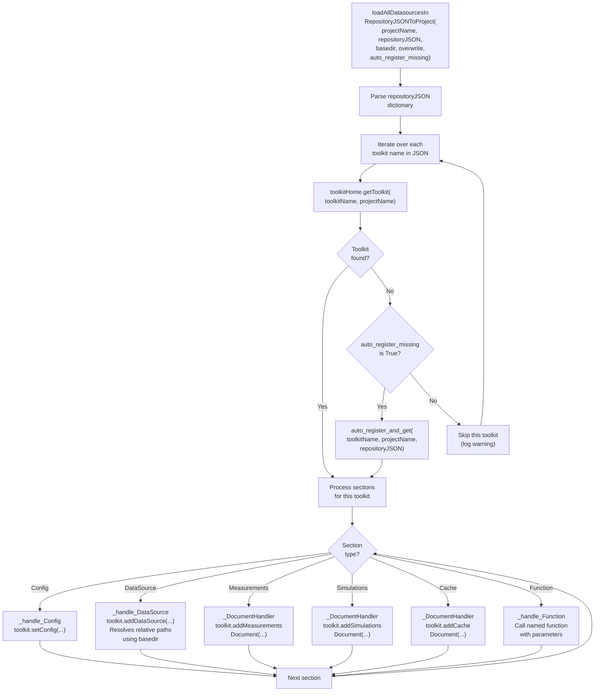
-->on
    HandleSim --> NextSection
    HandleCache --> NextSection
    HandleFunc --> NextSection
    NextSection --> SectionType
```
-->
-->on
    HandleSim --> NextSection
    HandleCache --> NextSection
    HandleFunc --> NextSection
    NextSection --> SectionType
```
-->
-->

### Handler Dispatch Table

| JSON Section Key | Handler Method | Action |
|-----------------|----------------|--------|
| `Config` | `_handle_Config` | Calls `toolkit.setConfig(**docTypeDict)` |
| `Datasource` | `_handle_DataSource` | Adds each item as a versioned datasource |
| `Measurements` | `_DocumentHandler` | Adds raw measurement documents |
| `Simulations` | `_DocumentHandler` | Adds simulation documents |
| `Cache` | `_DocumentHandler` | Adds cache documents |
| `Function` | `_handle_Function` | Calls a named function with parameters |

---

## API Reference

::: hera.toolkit.ToolkitHome
    options:
      members:
        - getToolkit
        - getToolkitTable
        - registerToolkit
        - getToolkitDocuments

::: hera.toolkit.abstractToolkit
    options:
      members:
        - addDataSource
        - getDataSourceDocument
        - getDataSourceData
        - getDataSourceList
        - getDataSourceTable
        - deleteDataSource

::: hera.datalayer.project.Project
    options:
      members:
        - addMeasurementsDocument
        - getMeasurementsDocuments
        - deleteMeasurementsDocuments
        - setConfig
        - getConfig
        - setCounter
        - getCounterAndAdd
