# Data Layer

This page covers the MongoDB document model, the `datatypes` system for format dispatch, and the repository JSON pipeline that loads data into projects.

---

## MongoDB Document Model

Hera stores all metadata in MongoDB using a single base model (`Metadata`) with three subtypes. Each document represents a pointer to data — the actual data lives on disk (or inline for small values).


<!-- mermaid source (for editing, paste into mermaid.live):
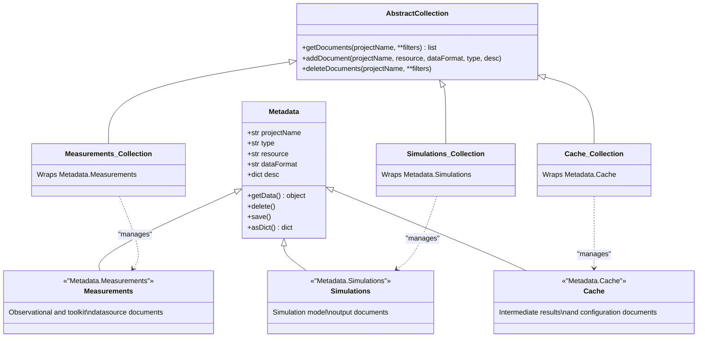
--> Measurements : "manages"
    Simulations_Collection ..> Simulations : "manages"
    Cache_Collection ..> Cache : "manages"
```
-->
--> Measurements : "manages"
    Simulations_Collection ..> Simulations : "manages"
    Cache_Collection ..> Cache : "manages"
```
-->
-->

### Document Fields

| Field | Type | Description |
|-------|------|-------------|
| `projectName` | `str` | The project this document belongs to |
| `_cls` | `str` | Discriminator: `"Metadata.Measurements"`, `"Metadata.Simulations"`, or `"Metadata.Cache"` |
| `type` | `str` | Application-defined type tag (e.g., `"ToolkitDataSource"`, `"Experiment_rawData"`) |
| `resource` | `str` | Path to the data file on disk, or inline value for small data |
| `dataFormat` | `str` | One of the `datatypes` constants (see below) |
| `desc` | `dict` | Free-form metadata dictionary — toolkit name, version, parameters, etc. |

### Collection Architecture

Each collection type wraps a MongoEngine document class and provides the standard CRUD interface:


<!-- mermaid source (for editing, paste into mermaid.live):
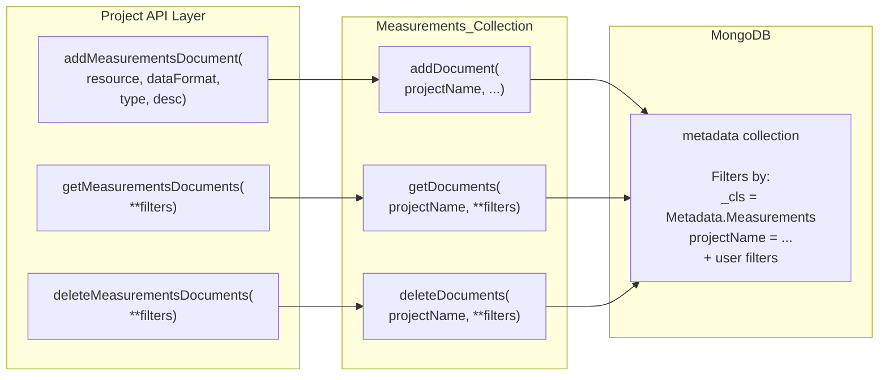
--> GetMeas --> GetDoc
    DelMeas --> DelDoc
    AddDoc --> MetadataCol
    GetDoc --> MetadataCol
    DelDoc --> MetadataCol
```
-->
--> GetMeas --> GetDoc
    DelMeas --> DelDoc
    AddDoc --> MetadataCol
    GetDoc --> MetadataCol
    DelDoc --> MetadataCol
```
-->
-->

!!! note "Three Parallel APIs"
    The `Project` class exposes identical method sets for all three collection types: `addMeasurementsDocument` / `addSimulationsDocument` / `addCacheDocument`, and similarly for get and delete. Under the hood, each delegates to its own `Collection` instance which filters by the `_cls` discriminator.

---

## The datatypes System

**Source:** `hera/datalayer/datahandler.py` (class `datatypes`)

The `datatypes` class defines all supported data format constants and provides the dispatch logic to read and write data in each format.

### Supported Formats


<!-- mermaid source (for editing, paste into mermaid.live):
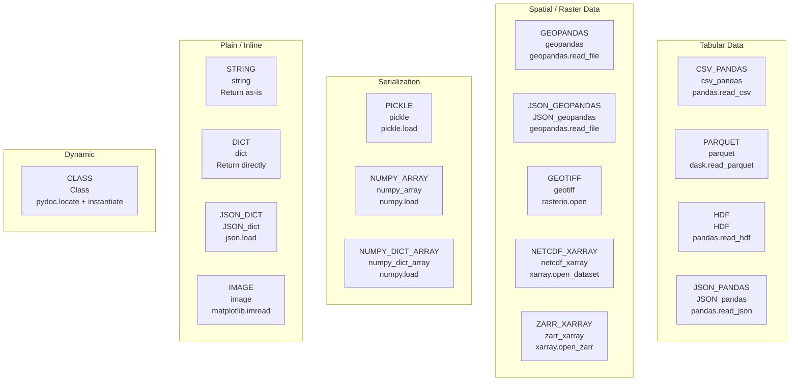
--> subgraph DynamicFormats ["Dynamic"]
        direction LR
        CLASS["CLASS\nClass\npydoc.locate + instantiate"]
    end
```
-->
--> subgraph DynamicFormats ["Dynamic"]
        direction LR
        CLASS["CLASS\nClass\npydoc.locate + instantiate"]
    end
```
-->
-->

| Constant | Value | Description |
|----------|-------|-------------|
| `STRING` | `"string"` | Plain text / path string |
| `CSV_PANDAS` | `"csv_pandas"` | CSV file read via pandas |
| `HDF` | `"HDF"` | HDF5 file |
| `NETCDF_XARRAY` | `"netcdf_xarray"` | NetCDF file read via xarray |
| `ZARR_XARRAY` | `"zarr_xarray"` | Zarr archive read via xarray |
| `JSON_DICT` | `"JSON_dict"` | JSON file parsed to dict |
| `JSON_PANDAS` | `"JSON_pandas"` | JSON file read via pandas |
| `JSON_GEOPANDAS` | `"JSON_geopandas"` | GeoJSON file read via geopandas |
| `GEOPANDAS` | `"geopandas"` | Shapefile / GeoPackage read via geopandas |
| `GEOTIFF` | `"geotiff"` | GeoTIFF raster read via rasterio |
| `PARQUET` | `"parquet"` | Parquet file read via dask/pandas |
| `IMAGE` | `"image"` | Image file read via matplotlib |
| `PICKLE` | `"pickle"` | Python pickle file |
| `DICT` | `"dict"` | Inline dictionary (stored in resource) |
| `NUMPY_ARRAY` | `"numpy_array"` | NumPy .npy/.npz file |
| `NUMPY_DICT_ARRAY` | `"numpy_dict_array"` | Dict of NumPy arrays |
| `CLASS` | `"Class"` | Dynamic Python class (imported at runtime) |

### Format Dispatch Flow

When `document.getData()` is called, the system resolves the handler based on `dataFormat`:


<!-- mermaid source (for editing, paste into mermaid.live):
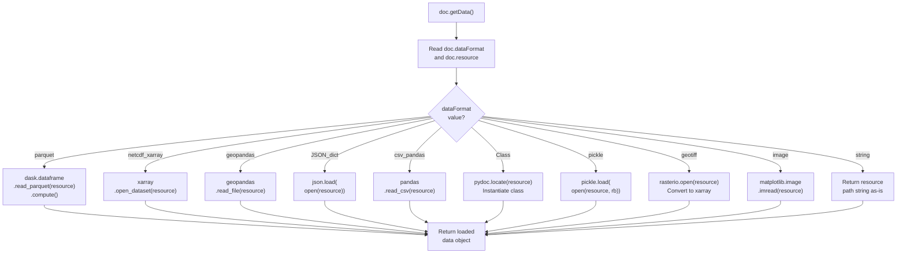
-->  LoadClass --> Return
    ReadPickle --> Return
    ReadTiff --> Return
    ReadImg --> Return
    ReturnString --> Return
```
-->
-->  LoadClass --> Return
    ReadPickle --> Return
    ReadTiff --> Return
    ReadImg --> Return
    ReturnString --> Return
```
-->
-->

!!! tip "Auto-Detection"
    The `datatypes.getDataFormatName(data)` static method can auto-detect the format from a Python object (DataFrame -> `"parquet"`, xarray.Dataset -> `"netcdf_xarray"`, dict -> `"JSON_dict"`, etc.). This is used by `Project.saveData()` to automatically choose the right format and file extension.

---

## Repository JSON Structure

A **repository JSON** is the standard way to declare and load data into a Hera project. It maps toolkit names to their configuration, datasources, and documents.

### Format

```json
{
    "<ToolkitName>": {
        "Config": {
            "key1": "value1",
            "key2": "value2"
        },
        "Datasource": {
            "<datasource_name>": {
                "isRelativePath": "True",
                "item": {
                    "resource": "relative/path/to/data.parquet",
                    "dataFormat": "parquet",
                    "version": [0, 0, 1],
                    "desc": { ... }
                }
            }
        },
        "Measurements": {
            "<measurement_name>": {
                "isRelativePath": "True",
                "item": {
                    "resource": "relative/path/to/file.shp",
                    "dataFormat": "geopandas",
                    "type": "SomeType",
                    "desc": { ... }
                }
            }
        }
    }
}
```

### Loading Pipeline

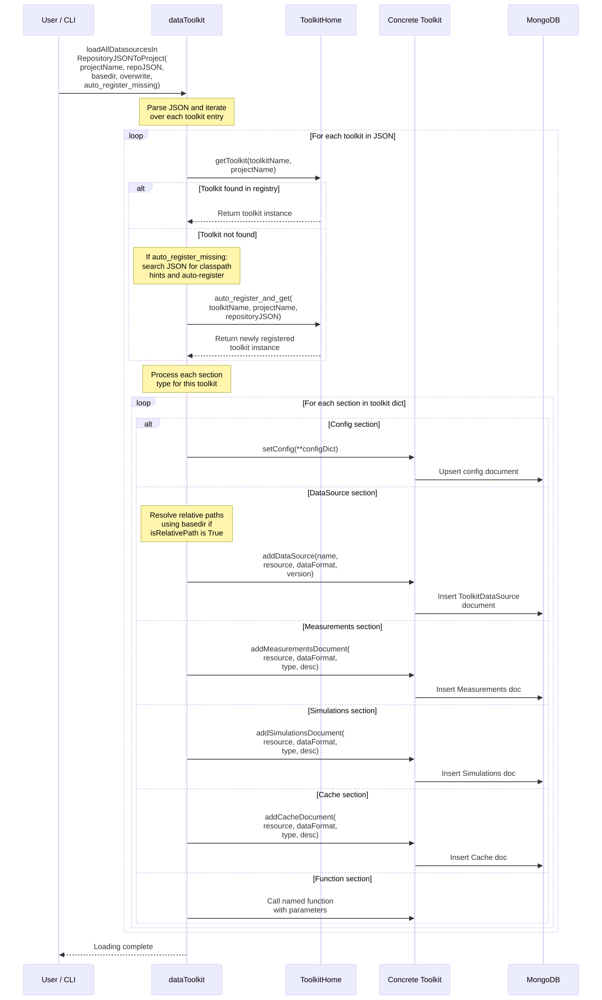

<!-- mermaid source (for editing, paste into mermaid.live):
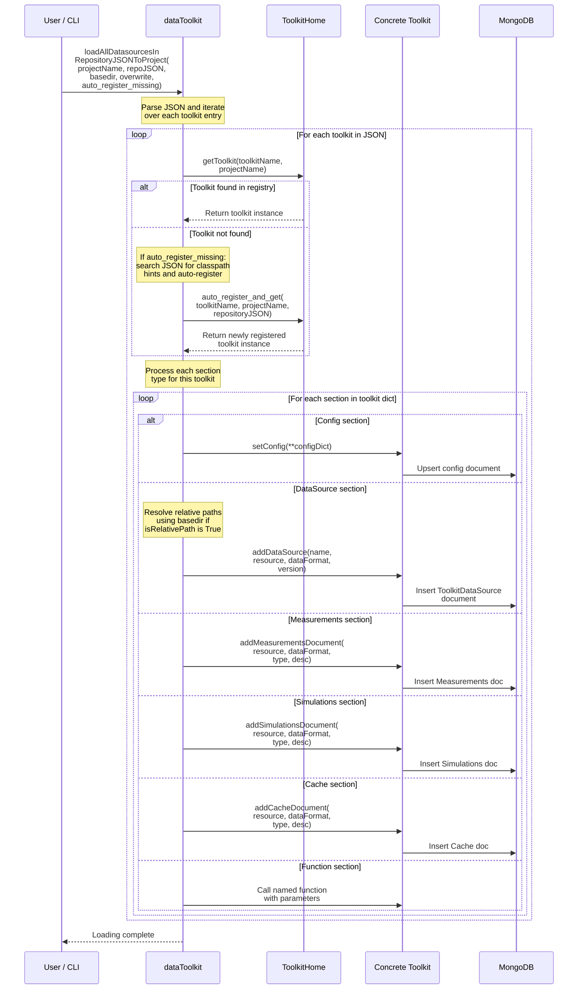
-->DT->>Toolkit: Call named function<br/>with parameters
            end
        end
    end

    DT-->>User: Loading complete
```
-->
-->DT->>Toolkit: Call named function<br/>with parameters
            end
        end
    end

    DT-->>User: Loading complete
```
-->
-->

### Path Resolution

Each item in the repository JSON has an `isRelativePath` flag:

- **`"True"`** — The `resource` path is relative to the JSON file's directory. The loader prepends `basedir` to make it absolute.
- **`"False"`** — The `resource` is already an absolute path and is used as-is.

!!! warning "String Booleans"
    The `isRelativePath` field accepts both string `"True"/"False"` and Python booleans `true/false`. The loader checks for both forms. Always be explicit to avoid ambiguity.

### Static Loading (No MongoDB)

For testing or lightweight scripts, `dataToolkit` provides two static methods that work without MongoDB:

```python
from hera.utils.data.toolkit import dataToolkit

# Load and resolve all paths in one call
repo = dataToolkit.loadRepositoryFromPath("/path/to/repository.json")

# Or resolve paths on an already-parsed dict
resolved = dataToolkit.resolveDataSourcePaths(repo_dict, basedir="/data/root")
```

These methods perform a deep copy of the JSON and resolve all relative `resource` paths to absolute, but do **not** insert anything into MongoDB.

---

## ToolkitDataSource Documents

When a datasource is registered via `abstractToolkit.addDataSource()`, it creates a special document:

```python
{
    "projectName": "MY_PROJECT",
    "_cls": "Metadata.Measurements",
    "type": "ToolkitDataSource",
    "resource": "/data/meteorology/YAVNEEL.parquet",
    "dataFormat": "parquet",
    "desc": {
        "toolkit": "MeteoLowFreq",
        "datasourceName": "YAVNEEL",
        "version": [0, 0, 1]
    }
}
```

!!! info "Querying Datasources"
    The `abstractToolkit` methods always filter by `type="ToolkitDataSource"` and `toolkit=self.toolkitName`. This ensures that each toolkit only sees its own datasources, even though all documents share the same MongoDB collection.

### Version Resolution

When `getDataSourceDocument(name)` is called without a version:


<!-- mermaid source (for editing, paste into mermaid.live):
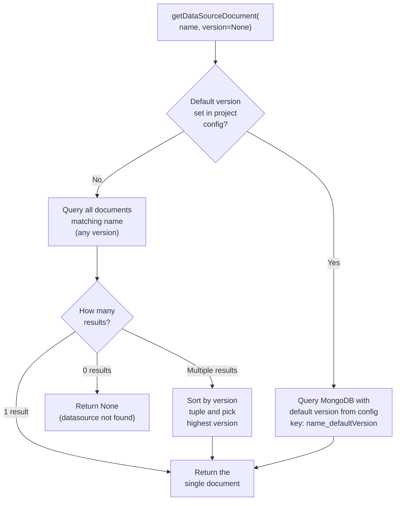
-->s" --> PickMax["Sort by version\ntuple and pick\nhighest version"]

    PickMax --> ReturnDoc
    QueryDefault --> ReturnDoc
```
-->
-->s" --> PickMax["Sort by version\ntuple and pick\nhighest version"]

    PickMax --> ReturnDoc
    QueryDefault --> ReturnDoc
```
-->
-->

---

## Connection Management (`document/__init__.py`)

### How connections are established

When `hera` is imported, the `document/__init__.py` module automatically connects to all databases defined in `~/.pyhera/config.json`:

```python
# Runs at import time (bottom of document/__init__.py)
for user in getDBNamesFromJSON():
    createDBConnection(
        connectionName=user,
        mongoConfig=getMongoConfigFromJson(connectionName=user)
    )
```

### Dynamic class creation

MongoDB document classes are created **dynamically at runtime** using Python's `type()` builtin. This allows each database connection to have its own set of MongoEngine document classes with the correct `db_alias`:

```python
# Creates a new class: Metadata(DynamicDocument, MetadataFrame)
new_Metadata = type('Metadata', (DynamicDocument, MetadataFrame), {
    'meta': {
        'db_alias': f'{dbName}-alias',  # binds to specific DB
        'allow_inheritance': True,       # enables Measurements/Simulations/Cache subtypes
        'auto_create_indexes': True,
        'indexes': ['projectName']       # index for fast project queries
    }
})

# Subtypes inherit from the dynamic Metadata class
new_Measurements = type('Measurements', (new_Metadata,), {})
new_Simulations = type('Simulations', (new_Metadata,), {})
new_Cache = type('Cache', (new_Metadata,), {})
```

### The `dbObjects` registry

All connections and document classes are stored in a module-level dictionary:

```python
dbObjects = {
    "connectionName1": {
        "connection": <mongoengine connection>,
        "Metadata": <dynamic Metadata class>,
        "Measurements": <dynamic Measurements class>,
        "Simulations": <dynamic Simulations class>,
        "Cache": <dynamic Cache class>,
    },
    "connectionName2": { ... },
}
```

`getDBObject(objectName, connectionName)` retrieves a class from this registry. Collections use it to get their MongoEngine document class:

```python
# Inside AbstractCollection.__init__:
self._metadataCol = getDBObject('Metadata', connectionName)
# or for typed collections:
self._metadataCol = getDBObject('Measurements', connectionName)
```

### Multi-database support

Each connection name maps to a separate MongoDB database. This enables:
- Different projects on different servers
- Shared "public" databases alongside local ones
- Parallel connections with different aliases

---

## MetadataFrame (`document/metadataDocument.py`)

### getData() dispatch

`MetadataFrame.getData()` is the bridge between metadata and actual data:

```python
def getData(self, **kwargs):
    storeParametersDict = self.desc.get("storeParameters", {})
    storeParametersDict.update(kwargs)
    return getHandler(self.dataFormat).getData(
        resource=self.resource, desc=self.desc, **storeParametersDict
    )
```

1. Reads `storeParameters` from the document's `desc` — these were saved when the data was written (e.g., `usePandas=True` for parquet)
2. Merges with any kwargs passed by the caller
3. Calls `getHandler(dataFormat)` to find the right `DataHandler_*` class
4. Delegates to the handler's `getData(resource, desc, **params)`

### nonDBMetadataFrame

A wrapper for data that isn't stored in MongoDB. Used by `saveData` when `saveMode=NOSAVE` and by `createNewArea` when data is computed in memory:

```python
class nonDBMetadataFrame:
    def __init__(self, data, projectName=None, type=None, ...):
        self._data = data   # the actual Python object

    def getData(self, **kwargs):
        return self._data   # just returns the object, no handler dispatch
```

---

## DataHandler Pattern (`datahandler.py`)

### How handlers work

Each `DataHandler_*` class is a static utility with two methods:

```python
class DataHandler_parquet:
    @staticmethod
    def saveData(resource, fileName, **kwargs):
        # Save the data object to disk
        resource.to_parquet(fileName, **kwargs)
        return {"usePandas": True}  # store parameters returned to caller

    @staticmethod
    def getData(resource, desc={}, usePandas=False, **kwargs):
        # Load data from disk
        df = dask.dataframe.read_parquet(resource, **kwargs)
        if usePandas:
            df = df.compute()
        return df
```

Key pattern:
- `saveData` writes to disk and returns a dict of **store parameters** — these are saved in `desc.storeParameters` so `getData` can reproduce the exact same load behavior
- `getData` reads from disk using `resource` (file path) and `desc` for metadata

### Handler dispatch

```python
def getHandler(objectType):
    handlerName = f"DataHandler_{objectType}"
    return getattr(datahandler_module, handlerName)
```

`objectType` is the `dataFormat` string (e.g., `"parquet"` → `DataHandler_parquet`).

### Auto-detection

When saving data with `Project.saveData()`, the format is auto-detected:

```python
datatypes.typeDatatypeMap = {
    "pandas.core.frame.DataFrame": {"typeName": "parquet", "ext": "parquet"},
    "geopandas.geodataframe.GeoDataFrame": {"typeName": "geopandas", "ext": "gpkg"},
    "xarray.core.dataarray.DataArray": {"typeName": "zarr_xarray", "ext": "zarr"},
    "numpy.ndarray": {"typeName": "numpy_array", "ext": "npy"},
    "dict": {"typeName": "pickle", "ext": "pckle"},
    # ...
}
```

`datatypes.getDataFormatName(obj)` looks up the fully-qualified class name in this map and returns the format string.

### Adding a new handler

1. Create a class `DataHandler_myformat` in `datahandler.py`:
   ```python
   class DataHandler_myformat:
       @staticmethod
       def saveData(resource, fileName, **kwargs):
           # write resource to fileName
           return {}

       @staticmethod
       def getData(resource, desc={}, **kwargs):
           # read and return data from resource
           pass
   ```

2. Add a constant to `datatypes`:
   ```python
   MYFORMAT = "myformat"
   ```

3. Optionally add to `typeDatatypeMap` for auto-detection:
   ```python
   "mypackage.MyClass": {"typeName": "myformat", "ext": "myext"}
   ```

---

## Function Caching (`autocache.py`)

### How `@cacheFunction` works

The `cacheFunction` decorator caches function return values in the project database:

```python
@cacheFunction(returnFormat=datatypes.PARQUET, projectName="MY_PROJECT")
def expensive_computation(x, y):
    # ... long computation ...
    return result_df
```

### Cache lookup flow

```
1. Function called with (args, kwargs)
    ↓
2. Bind args to function signature → dict of all parameters
    ↓
3. Convert to JSON (ConfigurationToJSON) with standardized MKS units
    ↓
4. Serialize non-BSON values to base64 text
    ↓
5. Add function's fully-qualified name
    ↓
6. Query Cache collection: type="functionCacheData" + all serialized params
    ↓
7a. Cache HIT → doc.getData() → return
7b. Cache MISS → execute function → saveData → create cache document → return
```

### Argument serialization

Each function argument is checked for BSON compatibility:

```python
for key, value in call_info.items():
    serializable = BSON.encode({'test': value})  # try BSON
    if serializable:
        call_info_serialized[key] = (True, value)      # store as-is
    else:
        call_info_serialized[key] = (False, base64(pickle(value)))  # serialize
```

This handles complex objects (numpy arrays, custom classes) that MongoDB can't store natively.

### Unit standardization

Arguments with physical units (pint Quantities or Unum) are converted to MKS before querying. This means `5 * ureg.km` and `5000 * ureg.m` produce the same cache key — the cache is unit-aware.

---

## API Reference

::: hera.datalayer.datahandler.datatypes
    options:
      show_root_heading: true
      members:
        - STRING
        - CSV_PANDAS
        - NETCDF_XARRAY
        - JSON_DICT
        - GEOPANDAS
        - PARQUET
        - CLASS

::: hera.utils.data.toolkit.dataToolkit
    options:
      show_root_heading: true
      members:
        - addRepository
        - getRepository
        - loadAllDatasourcesInRepositoryJSONToProject
        - resolveDataSourcePaths
        - loadRepositoryFromPath
