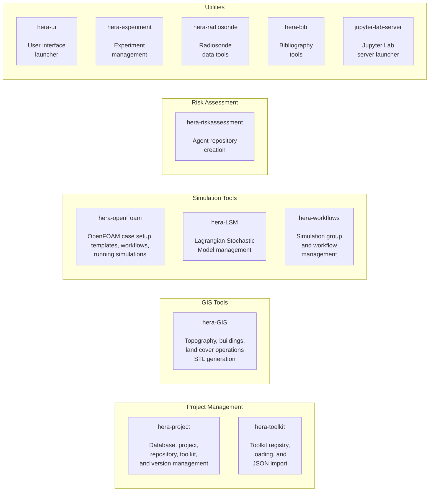

# CLI Reference

Hera provides a set of command-line tools in `hera/bin/` for managing projects, toolkits, repositories, GIS operations, simulations, and risk assessment workflows. All tools require an active virtual environment with Hera installed and `hera/bin/` added to your `PATH`.

---

## Overview



<!-- mermaid source (for editing, paste into mermaid.live):

-->

| Tool | Category | Description |
|------|----------|-------------|
| `hera-project` | Project Management | Database connections, project CRUD, repositories, toolkit registration, version management |
| `hera-toolkit` | Project Management | Toolkit registry, loading, JSON import, default repository config |
| `hera-GIS` | GIS Tools | Topography (raster/vector), buildings, land cover, STL generation |
| `hera-openFoam` | Simulation Tools | OpenFOAM case setup, templates, workflows, running simulations |
| `hera-LSM` | Simulation Tools | Lagrangian Stochastic Model management |
| `hera-workflows` | Simulation Tools | Simulation group and workflow management |
| `hera-riskassessment` | Risk Assessment | Agent repository creation |
| `hera-ui` | Utilities | User interface launcher |
| `hera-experiment` | Utilities | Experiment management |
| `hera-radiosonde` | Utilities | Radiosonde data tools |
| `hera-bib` | Utilities | Bibliography tools |
| `jupyter-lab-server` | Utilities | Jupyter Lab server launcher |

---

## hera-project

The primary CLI for managing database connections, projects, repositories, and datasource versions.

### Database Management

```bash
# List all database connections
hera-project db list
hera-project db list --onlyName

# Create a new database connection
hera-project db create myConnection \
    --username admin \
    --password secret \
    --IP localhost:27017 \
    --databaseName hera_db

# Remove a database connection
hera-project db remove myConnection
```

### Project Management

```bash
# List all projects
hera-project project list
hera-project project list --connectionName myConnection
hera-project project list --onlyName

# Create a new project
hera-project project create MY_PROJECT
hera-project project create MY_PROJECT --directory /data/myproject
hera-project project create MY_PROJECT --noRepositories

# Dump project data to file
hera-project project dump MY_PROJECT --format table
hera-project project dump MY_PROJECT --format json --fileName project_dump.json
hera-project project dump MY_PROJECT type=ToolkitDataSource

# Load dumped data into a project
hera-project project load MY_PROJECT project_dump.json

# Update repositories for a project
hera-project project updateRepositories
hera-project project updateRepositories --projectName MY_PROJECT --overwrite
```

### Measurements, Simulations, and Cache

```bash
# List measurements in a project
hera-project project measurements list --project MY_PROJECT
hera-project project measurements list --project MY_PROJECT --type ToolkitDataSource
hera-project project measurements list --project MY_PROJECT --contains YAVNEEL

# Use shortcuts for common document groups
hera-project project measurements list --project MY_PROJECT --shortcut ds     # dynamic toolkits
hera-project project measurements list --project MY_PROJECT --shortcut exp    # experiments
hera-project project measurements list --project MY_PROJECT --shortcut sim    # simulations
hera-project project measurements list --project MY_PROJECT --shortcut cache  # cache
hera-project project measurements list --project MY_PROJECT --shortcut all    # everything

# Convenience aliases for simulations and cache
hera-project project simulations list --project MY_PROJECT
hera-project project simulations list --project MY_PROJECT --contains windProfile

hera-project project cache list --project MY_PROJECT
hera-project project cache list --project MY_PROJECT --contains functionCache
```

### Repository Management

```bash
# List registered repositories
hera-project repository list

# Add a repository
hera-project repository add myRepository
hera-project repository add myRepository --overwrite

# Remove a repository
hera-project repository remove myRepository

# Show repository contents
hera-project repository show myRepository

# Load repository data into a project
hera-project repository load myRepository MY_PROJECT
hera-project repository load myRepository MY_PROJECT --overwrite
```

### Toolkit Registration

```bash
# Register a toolkit by name and filesystem path
hera-project addToolkit myToolkit /path/to/toolkit/directory
hera-project addToolkit myToolkit /path/to/toolkit/directory --version "1,0,0"
hera-project addToolkit myToolkit /path/to/toolkit/directory --params '{"key": "value"}'
hera-project addToolkit myToolkit /path/to/toolkit/directory --overwrite
```

### Version Management

```bash
# Display datasource versions
hera-project project version display MY_PROJECT
hera-project project version display MY_PROJECT --datasource YAVNEEL
hera-project project version display MY_PROJECT --default

# Update default version for a datasource
hera-project project version update MY_PROJECT YAVNEEL "0,0,2"
```

---

## hera-toolkit

Manages the toolkit registry: listing, loading, registering, and importing toolkits.

```bash
# List available toolkits for a project
hera-toolkit list --project MY_PROJECT

# Load (instantiate) a toolkit by name
hera-toolkit load --project MY_PROJECT --name MeteoLowFreq

# Register a custom toolkit
hera-toolkit register \
    --project MY_PROJECT \
    --cls my_package.MyToolkit \
    --name MyCustomToolkit \
    --repository defaultRepo \
    --version "0,0,1"

# Show/set default repository
hera-toolkit default-repository show --project MY_PROJECT
hera-toolkit default-repository set --project MY_PROJECT --repository myRepo

# Import toolkits from a JSON file
hera-toolkit import-json --project MY_PROJECT --file /path/to/repo.json
hera-toolkit import-json --project MY_PROJECT --file /path/to/repo.json --no-experiments
```

---

## hera-GIS

Geographic Information System operations: topography, buildings, and land cover.

### Topography (Raster)

```bash
# List topography datasources
hera-GIS topography_raster list

# Create an STL file from elevation data
hera-GIS topography_raster toSTL \
    --minx 35.0 --miny 32.0 --maxx 35.1 --maxy 32.1 \
    --dxdy 30 \
    --inputCRS 4326 \
    --fileName topography.stl \
    --projectName MY_PROJECT
```

### Topography (Vector)

```bash
# List vector topography datasources
hera-GIS topography_vector list
```

### Buildings

```bash
# List building datasources
hera-GIS buildings list

# Create buildings STL
hera-GIS buildings toSTL \
    --minx 35.0 --miny 32.0 --maxx 35.1 --maxy 32.1 \
    --dxdy 30 \
    --inputCRS 4326 \
    --outputCRS 2039 \
    --solidName Buildings \
    --fileName buildings.stl
```

### Land Cover

```bash
# Get land cover data for an area
hera-GIS landcover getLandcover \
    --minx 35.0 --miny 32.0 --maxx 35.1 --maxy 32.1 \
    --dxdy 30 \
    --roughness True \
    --filePath landcover_output.csv \
    --projectName MY_PROJECT
```

---

## hera-openFoam

Manages OpenFOAM simulation cases, templates, and workflows.

### Templates

```bash
# List templates for a solver
hera-openFoam simpleFoam templates list --projectName MY_PROJECT

# Save a template
hera-openFoam simpleFoam templates save templateName \
    --projectName MY_PROJECT \
    --directory /path/to/template/case

# Load a template
hera-openFoam simpleFoam templates load templateName \
    --projectName MY_PROJECT \
    --toDirectory /path/to/output \
    --caseName myCase
```

### Simulation Workflows

```bash
# List workflow groups
hera-openFoam simpleFoam workflows list groups --projectName MY_PROJECT

# Create a workflow
hera-openFoam simpleFoam workflows create \
    --projectName MY_PROJECT \
    --groupName myGroup
```

---

## hera-workflows

General simulation workflow management (solver-agnostic).

```bash
# List workflow groups
hera-workflows list groups --projectName MY_PROJECT

# List groups with details
hera-workflows list groups --projectName MY_PROJECT --solver simpleFoam --workflowName
```

---

## hera-LSM

Lagrangian Stochastic Model management.

```bash
# Load an LSM template
hera-LSM load PROJECT_NAME /path/to/resource modelFolder "0,0,1" params.json

# List LSM simulations
hera-LSM list PROJECT_NAME
```

---

## hera-riskassessment

Risk assessment tools for agent-based modeling.

```bash
# Create an agent repository from JSON files
hera-riskassessment agents createRepository myRepo --path /path/to/agents/
```

---

## Utility Tools

### hera-ui

Launches the Hera user interface.

### hera-experiment

Manages experiment workflows.

### hera-radiosonde

Tools for working with radiosonde atmospheric data.

### hera-bib

Bibliography management tools.

### jupyter-lab-server

Starts a Jupyter Lab server configured for Hera development.

---

## Common Patterns

### Working with a New Project

```bash
# 1. Create the project
hera-project project create MY_PROJECT --directory /data/myproject

# 2. Load a repository
hera-project repository load myRepo MY_PROJECT --overwrite

# 3. Verify loaded data
hera-toolkit list --project MY_PROJECT
hera-project project measurements list --project MY_PROJECT
```

### Exporting and Importing Projects

```bash
# Export
hera-project project dump MY_PROJECT --format json --fileName backup.json

# Import into another project
hera-project project load OTHER_PROJECT backup.json
```
