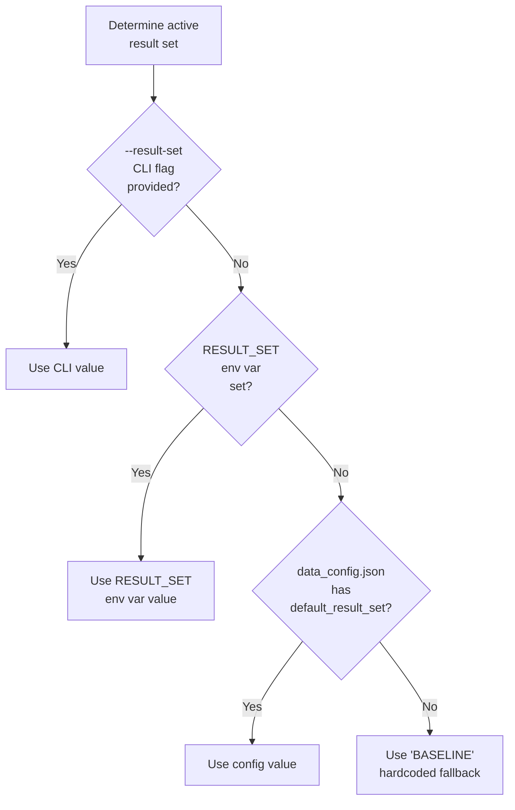

# Environment Variables Reference

This page documents all environment variables used by the Hera system, organized by context.

---

## Runtime Variables

These variables affect how Hera operates in normal production use.

| Variable | Required | Default | Description |
|----------|----------|---------|-------------|
| `HOME` | Yes (OS) | OS default | Used to locate the MongoDB config file at `~/.pyhera/config.json`. This is a standard OS variable and is always set. |
| `MPLBACKEND` | No | system default | Matplotlib backend selection. Set to `Agg` for headless (no GUI) operation, e.g., on servers or in CI/CD pipelines. |

### MongoDB Configuration

The MongoDB connection is not configured via environment variables but through the JSON config file at `~/.pyhera/config.json`:

```json
{
    "connectionName": {
        "username": "your_username",
        "password": "your_password",
        "dbIP": "localhost:27017",
        "dbName": "hera_db"
    }
}
```

See [Installation](../getting_started/installation.md) for setup instructions.

---

## Testing Variables

These variables control the behavior of the Pytest test suite.

| Variable | Required | Default | Description |
|----------|----------|---------|-------------|
| `TEST_HERA` | No | `~/hera_unittest_data` | Root directory containing the test data repository. This directory should contain `test_repository.json`, `data_config.json`, `measurements/`, and `expected/` subdirectories. |
| `RESULT_SET` | No | `BASELINE` | Name of the expected-output result set to compare against. Must correspond to a directory under `expected/` in the test data root. |
| `PREPARE_EXPECTED_OUTPUT` | No | unset | When set to `"1"`, switches the test suite into **generation mode**: tests write their current outputs as the new expected baselines instead of comparing against existing ones. |
| `GDF_TOL_AREA` | No | `1e-7` | Tolerance for geometry comparison in GeoDataFrame tests. The comparison uses `symmetric_difference().area` and checks that the area is below this threshold. |
| `HERA_FULL_LOGGING_TESTS` | No | unset | When set (to any value), enables full logging output during test runs. When unset, verbose logging tests are skipped. |

### Usage Examples

```bash
# Run tests with default settings
pytest hera/tests/ -v

# Run tests against a specific result set
RESULT_SET=REGRESSION_2025_11_11 pytest hera/tests/ -v

# Generate new expected outputs (baseline creation)
PREPARE_EXPECTED_OUTPUT=1 pytest hera/tests/ -v

# Use custom test data location
TEST_HERA=/data/test_data pytest hera/tests/ -v

# Headless matplotlib for CI
MPLBACKEND=Agg pytest hera/tests/ -v

# Combine multiple settings
MPLBACKEND=Agg RESULT_SET=BASELINE TEST_HERA=/data/test pytest hera/tests/ -v
```

---

## Variable Resolution Priority

For the result set selection, the system uses the following priority chain:



---

## Test Data Directory Structure

The `TEST_HERA` directory should follow this layout:

```
$TEST_HERA/                          # Default: ~/hera_unittest_data
├── data_config.json                 # Metadata and result set defaults
├── test_repository.json             # Hera repository JSON mapping
├── measurements/                    # Test data files
│   ├── GIS/
│   │   ├── raster/                  # HGT, TIF files
│   │   └── vector/                  # SHP, GeoJSON files
│   └── meteorology/
│       ├── lowfreqdata/             # Parquet station data
│       └── highfreqdata/            # High-frequency parquet data
└── expected/                        # Expected output result sets
    ├── BASELINE/                    # Default result set
    │   ├── *.parquet                # DataFrame outputs
    │   ├── *.json                   # Dict/scalar outputs
    │   ├── *.nc                     # xarray outputs
    │   └── *.npz                    # NumPy array outputs
    └── REGRESSION_YYYYMMDD/         # Named regression sets
```

---

## Setting Variables Permanently

### Linux / macOS

Add to your shell profile (`~/.bashrc`, `~/.zshrc`, etc.):

```bash
# Hera test configuration
export TEST_HERA="$HOME/hera_unittest_data"
export MPLBACKEND="Agg"
```

### Per-Project (.env file)

If using tools like `direnv` or IDE-specific env files:

```ini
TEST_HERA=/home/user/hera_unittest_data
MPLBACKEND=Agg
RESULT_SET=BASELINE
```

### In pytest.ini

Some variables can be set in `pytest.ini` using the `env` plugin:

```ini
[pytest]
env =
    MPLBACKEND=Agg
```
