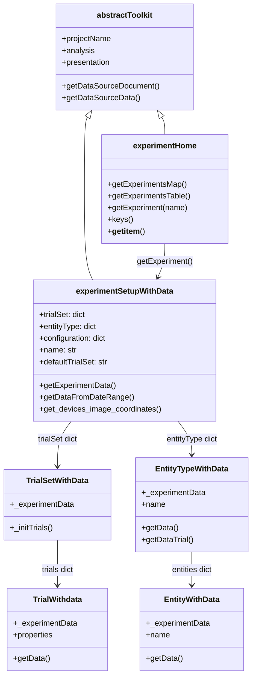
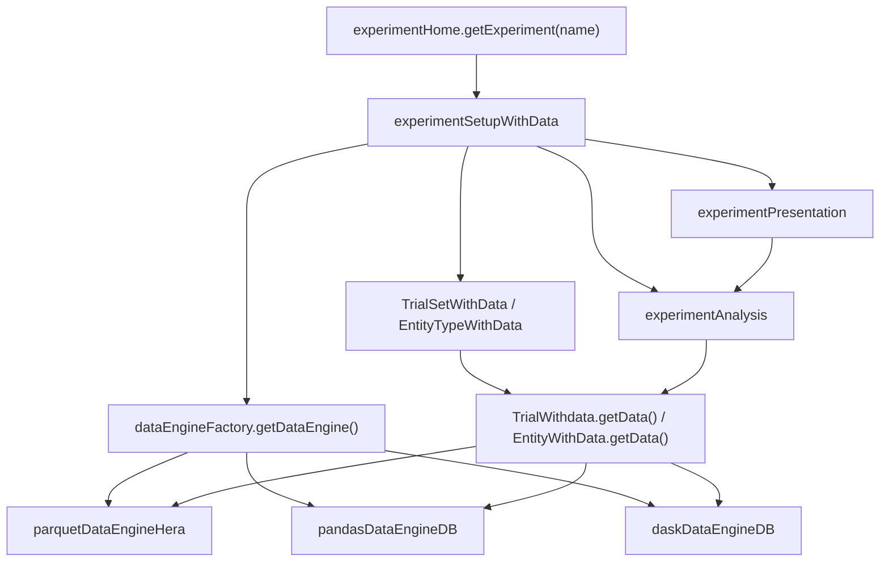

# Experiment Toolkit Implementation

Implementation details for the experiment toolkit package (`hera/measurements/experiment/`).

For user-facing documentation, see [User Guide > Toolkits > Measurements > Experiment](../../toolkits/measurements/experiment.md).

---

## Package structure

```
hera/measurements/experiment/
    __init__.py              # exports experimentHome
    experiment.py            # core class hierarchy (experimentHome → experimentSetupWithData → Trial/Entity)
    dataEngine.py            # data engine factory + 3 backends (Parquet, Pandas/MongoDB, Dask/MongoDB)
    analysis.py              # experimentAnalysis — transmission frequency, turbulence, metadata
    presentation.py          # experimentPresentation — device plots, heatmaps, LaTeX reports
    parsers.py               # data format parsers (OldStyleMetaDataParquet, CampbellBinary, TOA5)
    CLI.py                   # hera-experiment CLI entry points
```

---

## Class hierarchy

All experiment classes extend Argos data objects with data-engine awareness. The shared `_experimentData` reference ensures a single data connection across the hierarchy.


<!-- mermaid source (for editing, paste into mermaid.live):

-->

| Class | Module | Inherits from | Role |
|-------|--------|--------------|------|
| `experimentHome` | `experiment.py` | `abstractToolkit` | Factory — list/get experiments |
| `experimentSetupWithData` | `experiment.py` | `ExperimentZipFile`, `abstractToolkit` | Main experiment object with data engine |
| `TrialSetWithData` | `experiment.py` | `argosDataObjects.TrialSet` | Collection of trials with data access |
| `TrialWithdata` | `experiment.py` | `argosDataObjects.Trial` | Single trial — time-bounded data retrieval |
| `EntityTypeWithData` | `experiment.py` | `argosDataObjects.EntityType` | Device type — aggregated data access |
| `EntityWithData` | `experiment.py` | `argosDataObjects.Entity` | Single device/sensor — per-device data |

### Argos integration

`experimentSetupWithData` uses multiple inheritance — it extends both `argosDataObjects.ExperimentZipFile` (for experiment metadata from Argos zip files) and `abstractToolkit` (for Hera data layer access). Trial and Entity classes similarly extend their Argos counterparts while adding the `_experimentData` reference for data retrieval.

---

## Data engine layer (`dataEngine.py`)

Three interchangeable backends provide data access. All share the same interface (`getData`, `getDataFromTrial`) and are selected at initialization via `dataEngineFactory`.

### Factory

```python
from hera.measurements.experiment.dataEngine import dataEngineFactory, PARQUETHERA, PANDASDB, DASKDB

engine = dataEngineFactory.getDataEngine(
    projectName="MyProject",
    datasourceConfiguration={...},
    experimentObj=experiment,
    dataType=PARQUETHERA   # or PANDASDB or DASKDB
)
```

### Engine comparison

| Engine | Backend | Returns | Best for |
|--------|---------|---------|----------|
| `parquetDataEngineHera` | Hera data layer (Parquet files) | `dask.DataFrame` or `pandas.DataFrame` | Local file-based experiments |
| `pandasDataEngineDB` | MongoDB direct | `pandas.DataFrame` | Small-to-medium datasets in MongoDB |
| `daskDataEngineDB` | MongoDB via Dask | `dask.DataFrame` | Large datasets requiring lazy evaluation |

### Shared data engine pattern

All data classes (Trial, Entity, EntityType) hold a reference to the same `_experimentData` instance created by `experimentSetupWithData`. This ensures:

- Single connection to the data source
- Consistent caching behavior
- Efficient resource usage

```python
# Inside experimentSetupWithData.__init__:
self._experimentData = dataEngineFactory.getDataEngine(
    projectName, datasourceConfiguration, self, dataType
)

# Passed to all children:
TrialSetWithData(self, trialSetSetup, self._experimentData)
EntityTypeWithData(self, metadata, self._experimentData)
```

### parquetDataEngineHera

Extends `datalayer.Project`. Queries measurement documents from the Hera data layer and returns Parquet-backed DataFrames.

```python
data = engine.getData(
    deviceType="Sonic",
    deviceName="S01",          # optional — specific device
    startTime=start,           # optional — time filter
    endTime=end,
    autoCompute=True,          # True → pandas, False → dask (lazy)
    perDevice=True             # True → one file per device
)
```

### pandasDataEngineDB

Connects directly to MongoDB. Converts timestamps to milliseconds since epoch for queries, returns DataFrames with Israel-timezone datetime index.

```python
# Timestamp handling:
pandas.to_datetime(x, unit="ms", utc=True).tz_convert("israel")
```

### daskDataEngineDB

Same interface as `pandasDataEngineDB` but returns lazy Dask DataFrames via `dask_mongo.read_mongo()` with chunked reads (10 records per chunk).

---

## Analysis layer (`analysis.py`)

`experimentAnalysis` provides analytical methods that operate on data from the engine layer.

| Method | Purpose |
|--------|---------|
| `getDeviceLocations(entityTypeName, trialName, trialSetName)` | Device location metadata as DataFrame |
| `getTurbulenceStatistics(sonicData, samplingWindow, height)` | Turbulence analysis for sonic anemometer data |
| `getDeviceTypeTransmissionFrequencyOfTrial(...)` | Data transmission frequency heatmap data |
| `getDeviceTypePlannedMessageCount(deviceType, samplingWindow)` | Expected message count per sampling window |
| `addMetadata(dataset, trialName, trialSetName)` | Merge device metadata into a dataset |
| `addTrialProperties(data, trialName, trialSetName)` | Add `fromStart`, `fromRelease`, time-delta columns |

### Transmission frequency analysis

The most complex analysis method. Computes how reliably each device transmitted data during a trial:

```python
pvt = experiment.analysis.getDeviceTypeTransmissionFrequencyOfTrial(
    deviceType="Sonic",
    trialName="Trial_01",
    trialSetName="MainSet",
    samplingWindow="1min",     # time bin size
    normalize=True,            # normalize to planned message rate
    completeTimeSeries=True,   # fill gaps with zeros
    completeDevices=True,      # include non-transmitting devices
    wideFormat=True,           # pivot table format
    recalculate=False          # use cache if available
)
```

Results are cached in the data layer (cache collection) to avoid recomputation. The `recalculate` flag forces fresh computation.

---

## Presentation layer (`presentation.py`)

`experimentPresentation` provides three categories of visualizations:

### Setup plots

| Method | Purpose |
|--------|---------|
| `plotImage(imageName, ax, ...)` | Experiment site image with grid overlay |
| `plotDevicesOnImage(trialSetName, trialName, deviceType, mapName, ...)` | Device locations on a map image |
| `plotDevices(trialSetName, trialName, deviceType, ...)` | Device locations in ITM coordinates |
| `plotOrigin(ax, s)` | Origin marker on axes |

### Technical plots

| Method | Purpose |
|--------|---------|
| `plotDeviceTypeFunctionality(deviceType, trialName, trialSetName, ...)` | Heatmap of normalized transmission frequency — color-codes device health (red=none, orange=poor, green=good) |

### Reporting

| Method | Purpose |
|--------|---------|
| `generateLatexTable(latex_template, folder_path)` | LaTeX/PDF report with device maps and metadata tables |

---

## Parsers (`parsers.py`)

Parsers convert raw data files into structured experiment data.

### Parser_OldStyleMetaDataParquet

Reads `metadata.json` and `campaignDescription.json` to build experiment dictionaries from Parquet-based experiments.

```python
parser = Parser_OldStyleMetaDataParquet()
result = parser.parse(pathToData="/path/to/experiment")
# Returns: {experimentName: {Stations: {...}, devices: [...], trials: [...], ...}}
```

### Parser_CampbellBinary

Reads Campbell Scientific TOB1 binary data files. Supports multiple measurement heights and instruments.

```python
parser = Parser_CampbellBinary()
dask_df, metadata = parser.parse(
    path="/path/to/data",
    fromTime=start_time,
    toTime=end_time
)
```

Uses `CampbellBinaryInterface` internally — a low-level reader that handles:
- Binary record parsing with `struct` module
- Multi-height data (6m, 11m, 16m) with per-height column slicing
- Binary search by timestamp for efficient time-range queries
- Format types: ULONG, FP2, IEEE4, IEEE8, USHORT, LONG, BOOL, ASCII

### Parser_TOA5

Campbell Scientific TOA5 ASCII format. Stub — not yet implemented.

---

## CLI commands (`CLI.py`)

| Function | CLI Usage | Purpose |
|----------|-----------|---------|
| `experiments_list` | `hera-experiment list` | List experiment names in a project |
| `experiments_table` | `hera-experiment table` | Print formatted experiment table |
| `get_experiment_data` | `hera-experiment data` | Retrieve measurement data for a device type |
| `create_experiment` | `hera-experiment create` | Scaffold new experiment directory structure |
| `load_experiment_to_project` | `hera-experiment load` | Load experiment repository into project |

### Experiment scaffolding

`create_experiment` generates a complete experiment directory:

```
experiment_path/
├── code/
│   └── {experimentName}.py              # Boilerplate Python class
├── data/                                # Data files (Parquet, etc.)
├── runtimeExperimentData/
│   ├── Datasources_Configurations.json  # Experiment config
│   └── {experimentName}.zip             # Argos metadata
└── {experimentName}_repository.json     # Data repository for loading
```

---

## Data flow


<!-- mermaid source (for editing, paste into mermaid.live):

-->

1. `experimentHome` resolves experiment name to data source document
2. `experimentSetupWithData` initializes with the appropriate data engine
3. Trial sets and entity types are populated from Argos metadata
4. Data access flows through the shared `_experimentData` engine
5. Analysis methods query data via the engine and cache results
6. Presentation methods call analysis for data and render visualizations

---

## Design patterns

| Pattern | Where | Why |
|---------|-------|-----|
| **Shared engine reference** | All data classes hold `_experimentData` | Single connection, consistent caching |
| **Factory** | `dataEngineFactory.getDataEngine()` | Switch backends without code changes |
| **Lazy evaluation** | Parquet and Dask engines | Efficient for large datasets — compute only when needed |
| **Metadata inheritance** | Trial/Entity extend Argos base classes | Add data awareness via composition without modifying Argos |
| **Caching** | Analysis layer stores results in cache collection | Avoid recomputation; controlled by `recalculate` flag |
| **Multiple inheritance** | `experimentSetupWithData` extends both Argos and Hera | Unifies experiment metadata with data layer access |

---

## Cross-references

| What | Where |
|------|-------|
| User guide (experiment usage) | [Toolkits > Measurements > Experiment](../../toolkits/measurements/experiment.md) |
| API reference (auto-generated) | [API > Measurements](../api/measurements.md) |
| Argos data objects | `hera/measurements/experiment/argosDataObjects.py` |
| CLI reference | [CLI Reference > hera-experiment](../../cli/reference.md#hera-experiment) |
