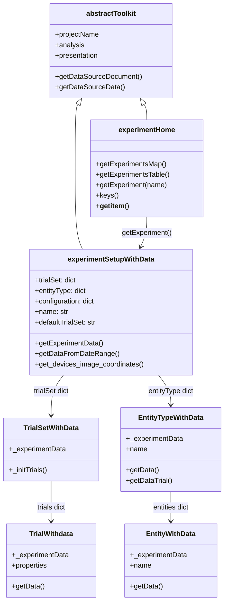
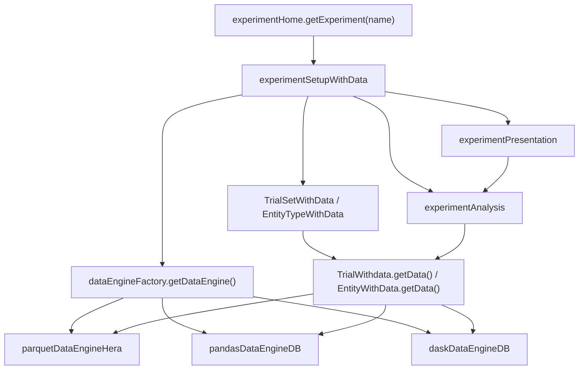
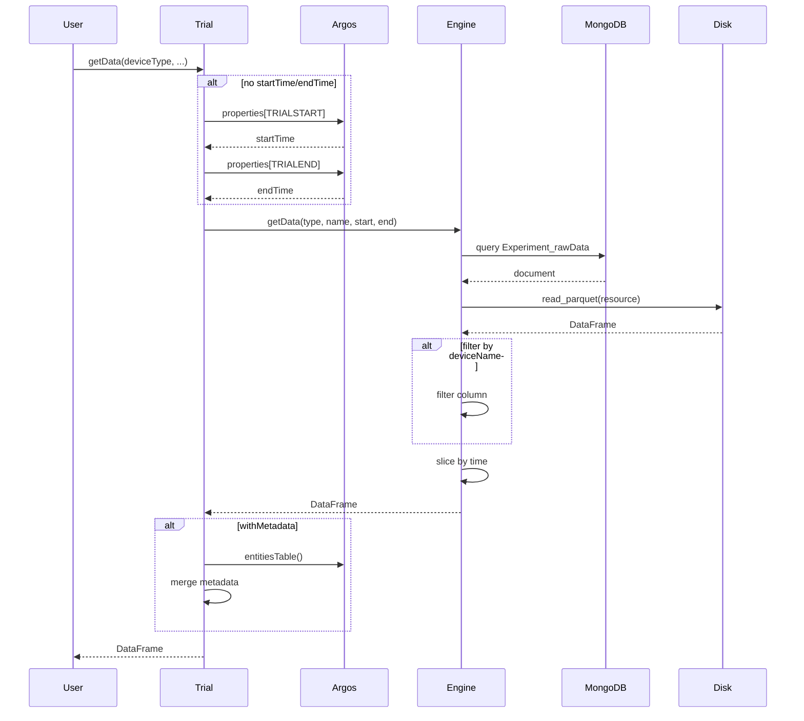
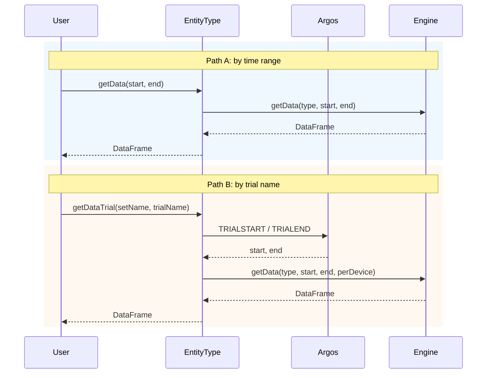
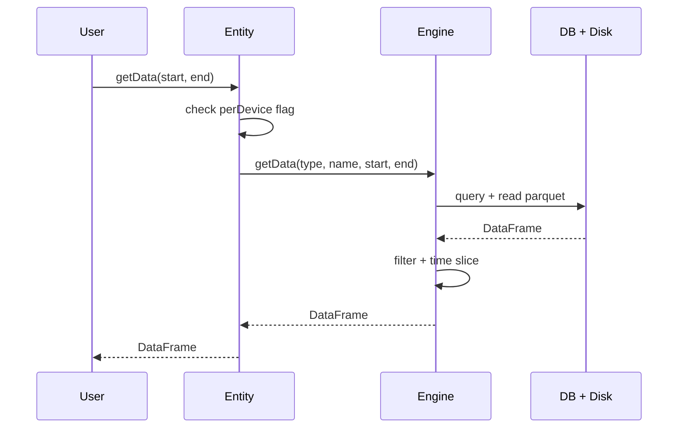
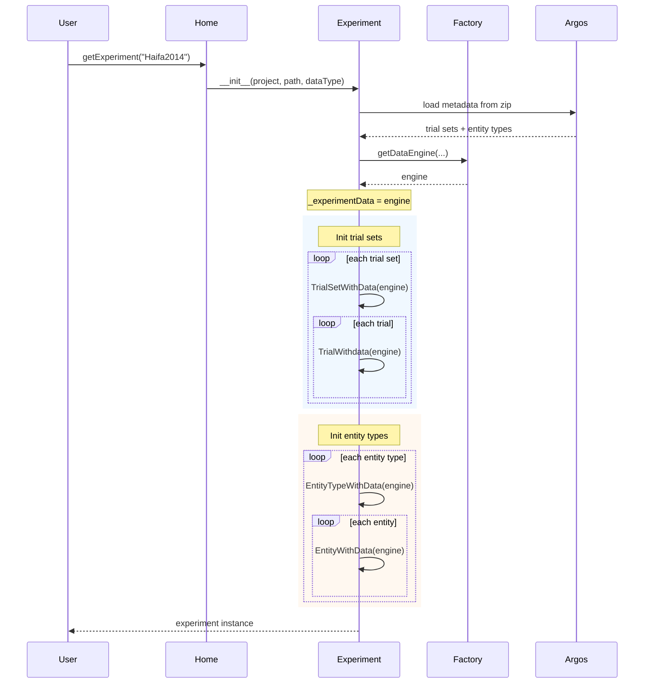

# Experiment Toolkit Implementation

Implementation details for the experiment toolkit package (`hera/measurements/experiment/`).

For user-facing documentation, see [User Guide > Toolkits > Measurements > Experiment](../../toolkits/measurements/experiment.md).

---

## Package structure

```
hera/measurements/experiment/
    __init__.py              # exports experimentHome
    experiment.py            # core class hierarchy (experimentHome → experimentSetupWithData → Trial/Entity)
    dataEngine.py            # data engine factory + 3 backends (Parquet, Pandas/MongoDB, Dask/MongoDB)
    analysis.py              # experimentAnalysis — transmission frequency, turbulence, metadata
    presentation.py          # experimentPresentation — device plots, heatmaps, LaTeX reports
    parsers.py               # data format parsers (OldStyleMetaDataParquet, CampbellBinary, TOA5)
    CLI.py                   # hera-experiment CLI entry points
```

---

## Class hierarchy

All experiment classes extend Argos data objects with data-engine awareness. The shared `_experimentData` reference ensures a single data connection across the hierarchy.


<!-- mermaid source (for editing, paste into mermaid.live):

-->

| Class | Module | Inherits from | Role |
|-------|--------|--------------|------|
| `experimentHome` | `experiment.py` | `abstractToolkit` | Factory — list/get experiments |
| `experimentSetupWithData` | `experiment.py` | `ExperimentZipFile`, `abstractToolkit` | Main experiment object with data engine |
| `TrialSetWithData` | `experiment.py` | `argosDataObjects.TrialSet` | Collection of trials with data access |
| `TrialWithdata` | `experiment.py` | `argosDataObjects.Trial` | Single trial — time-bounded data retrieval |
| `EntityTypeWithData` | `experiment.py` | `argosDataObjects.EntityType` | Device type — aggregated data access |
| `EntityWithData` | `experiment.py` | `argosDataObjects.Entity` | Single device/sensor — per-device data |

### Argos integration

`experimentSetupWithData` uses multiple inheritance — it extends both `argosDataObjects.ExperimentZipFile` (for experiment metadata from Argos zip files) and `abstractToolkit` (for Hera data layer access). Trial and Entity classes similarly extend their Argos counterparts while adding the `_experimentData` reference for data retrieval.

### ArgosWEB as the authoring tool

[ArgosWEB](https://github.com/KaplanOpenSource/argos) is the web UI where experiments are authored. It produces the ZIP file that Hera consumes. The data flow is:

```
ArgosWEB (browser)  →  Export ZIP  →  hera-experiment create  →  Hera Project (MongoDB)
                    ↘                                         ↗
                     GraphQL API  →  webExperimentFactory  →
```

ArgosWEB stores the experiment as a JSON document internally and exports it as `data.json` inside a ZIP archive. The JSON schema has evolved through 3 versions (see [JSON version migration](#json-version-migration) below) — all are normalised on load.

### Experiment factory pattern

Argos experiments can be loaded from two sources:

| Factory | Source | When to use |
|---------|--------|-------------|
| `fileExperimentFactory` | Local ZIP file or directory | Standard path: user exports ZIP from ArgosWEB, runs `hera-experiment create` |
| `webExperimentFactory` | ArgosWEB server via GraphQL | Automation: skip the export step, query the experiment directly from the server |

Both return the same `Experiment` interface. In Hera, `experimentSetupWithData.__init__` uses `fileExperimentFactory` internally when loading from the experiment directory.

**GraphQL access:**

```python
from argos.experimentSetup import webExperimentFactory

factory = webExperimentFactory(
    url="http://argos-server/graphql",
    token="auth-token",
)
experiment = factory.getExperiment("MyExperiment")
# Returns the same Experiment object as fileExperimentFactory
# with trialSet, entityType, entitiesTable, etc.
```

The GraphQL factory queries ArgosWEB's API endpoint, receives the JSON structure, and constructs the same object hierarchy. This enables CI/CD pipelines and automated workflows that don't require manual ZIP export.

### JSON version migration

The Argos ZIP `data.json` has three schema versions. All are normalised to an internal canonical format on load:

| Version | Key naming | Structure |
|---------|-----------|-----------|
| **1.0.0** | `entityTypes`, `trialSets` | Matches internal format (pass-through) |
| **2.0.0** | `entityTypes`, `entities`, `trialSets`, `trials` | Flat references with cross-linking by key |
| **3.0.0** (current) | `deviceTypes`, `trialTypes` | Device-centric naming, nested structure |

Migration is handled by `_fix_json_version_X_X_X()` methods in `ExperimentZipFile`. The canonical internal format always uses:

```python
{
    "experiment": {"name": "...", "description": "...", "version": "..."},
    "entityTypes": [{"name": "...", "attributeTypes": [...], "entities": [...]}],
    "trialSets": [{"name": "...", "attributeTypes": [...], "trials": [...]}],
    "maps": [...]
}
```

### Property type parsing

When `Trial.__init__` processes properties, each type has a dedicated parser:

| Type | Parser | Conversion |
|------|--------|------------|
| `String` / `text` / `textArea` | `_parseProperty_text` | Pass-through |
| `Number` | `_parseProperty_number` | `float(value)` |
| `Boolean` | `_parseProperty_boolean` | Handles `"true"/"false"`, `"yes"/"no"`, `"1"/"0"` |
| `Date` | `_parseProperty_datetime` | ISO 8601 string (not converted to Timestamp) |
| `datetime_local` | `_parseProperty_datetime` | Parsed to `pandas.Timestamp` with Israel TZ |
| `location` | `_parseProperty_location` | Expands to `locationName`, `latitude`, `longitude` |
| `selectList` | `_parseProperty_selectList` | Value from predefined options |

### Containment resolution algorithm

`fill_properties_by_contained()` in `pyargos/argos/experimentSetup/fillContained.py`:

1. For each entity in a trial's `devicesOnTrial`:
2. If `containedIn` is set, walk up the parent chain
3. Copy missing attributes from parent to child (child's own values take precedence)
4. Inherit location from parent if child has none
5. Flatten `location` object into `mapName`, `latitude`, `longitude` columns
6. Flatten `containedIn` into `containedInType`, `containedIn` (name only)

---

## Argos zip file structure

The Argos zip file (e.g. `HaifaFluxes2014.zip`) is the single source of truth for experiment metadata. It contains a `data.json` file, optionally an `images/` directory with map images, and optionally a `shapes.geojson` file.

`ExperimentZipFile.__init__()` extracts `data.json`, migrates it from any supported version (1.0.0, 2.0.0, 3.0.0) to the canonical internal format, then initialises `TrialSet` and `EntityType` objects from the parsed structure.

### data.json root structure (version 3.0.0)

```json
{
  "version": "3.0.0",
  "name": "Haifa2014",
  "startDate": "2014-06-01T00:00:00.000Z",
  "endDate": "2014-09-30T00:00:00.000Z",
  "description": "Haifa flux measurement campaign",
  "trialTypes": [ ... ],
  "deviceTypes": [ ... ],
  "imageStandalone": [ ... ],
  "shapes": [ ... ]
}
```

After version migration, the internal canonical format uses `trialSets`, `entityTypes`, and `maps` as key names.

### trialTypes → Trial Sets

Each entry in `trialTypes` defines a trial set containing trials:

```json
{
  "name": "Measurements",
  "attributeTypes": [
    {"type": "Date",   "name": "TrialStart", "scope": "Trial"},
    {"type": "Date",   "name": "TrialEnd",   "scope": "Trial"},
    {"type": "String", "name": "ReleaseStart", "scope": "Trial", "required": false}
  ],
  "trials": [
    {
      "name": "Measurement",
      "createdDate": "2014-06-15T08:00:00.000Z",
      "cloneFrom": null,
      "properties": [
        {"key": "TrialStart", "val": "2014-06-15T06:00:00.000Z", "type": "Date"},
        {"key": "TrialEnd",   "val": "2014-06-15T18:00:00.000Z", "type": "Date"}
      ],
      "devicesOnTrial": [
        {
          "deviceTypeName": "Sonic",
          "deviceItemName": "sonic01",
          "location": {
            "name": "OSMMap",
            "coordinates": [32.789483, 35.040617]
          },
          "containedIn": null,
          "attributes": [
            {"name": "height", "value": "9"}
          ]
        }
      ]
    }
  ]
}
```

| Field | Maps to | Description |
|-------|---------|-------------|
| `name` | `TrialSet.name` | Trial set identifier |
| `attributeTypes` | `TrialSet.properties` | Defines the property schema for trials (type, name, scope) |
| `trials[].name` | `Trial.name` | Trial identifier |
| `trials[].properties` | `Trial.properties` | Key-value pairs; `TRIALSTART` and `TRIALEND` define the time window |
| `trials[].devicesOnTrial` | `Trial.entities` | Which devices participate, with per-trial location and attributes |

### deviceTypes → Entity Types

Each entry in `deviceTypes` defines a device type and its instances:

```json
{
  "name": "Sonic",
  "attributeTypes": [
    {
      "type": "Boolean",
      "name": "StoreDataPerDevice",
      "defaultValue": false,
      "scope": "Constant"
    },
    {"type": "String", "name": "stationName", "scope": "Device"},
    {"type": "Number", "name": "height", "scope": "Device"}
  ],
  "devices": [
    {
      "name": "sonic01",
      "attributes": [
        {"name": "stationName", "value": "Check_Post"},
        {"name": "height", "value": "9"}
      ]
    },
    {
      "name": "sonic02",
      "attributes": [
        {"name": "stationName", "value": "Gan-Margalit"},
        {"name": "height", "value": "6"}
      ]
    }
  ]
}
```

| Field | Maps to | Description |
|-------|---------|-------------|
| `name` | `EntityType.name` | Device type identifier |
| `attributeTypes` | `EntityType.properties` | Property schema with scope rules |
| `devices[].name` | `Entity.name` | Device instance identifier |
| `devices[].attributes` | `Entity.properties` | Device-scope property values |

### Attribute scopes

| Scope | Meaning | Where defined | Example |
|-------|---------|---------------|---------|
| `Constant` | Same value for all entities of this type | `attributeTypes[].defaultValue` | `StoreDataPerDevice=false` |
| `Device` | Per-device value | `devices[].attributes` | `stationName`, `height` |
| `Trial` | Per-trial-per-device value | `devicesOnTrial[].attributes` | Calibration values |

### Entity containment hierarchy

Entities can be nested via `containedIn`. Child entities inherit missing attributes (including location) from their parent:

```json
{
  "deviceTypeName": "TRH",
  "deviceItemName": "TRH01",
  "containedIn": {
    "deviceTypeName": "Sonic",
    "deviceItemName": "sonic01"
  },
  "attributes": []
}
```

The `fillContained` module resolves the hierarchy: walks up the containment tree, copies missing attributes from parent to child, and flattens `location` into `mapName`, `latitude`, `longitude`.

### Key trial properties

| Property | Type | Role |
|----------|------|------|
| `TrialStart` / `TRIALSTART` | Date | Start of measurement period — used by `TrialWithdata.getData()` |
| `TrialEnd` / `TRIALEND` | Date | End of measurement period — used by `TrialWithdata.getData()` |
| `ReleaseStart` | Date | Optional: release event time (used by `addTrialProperties()` for `fromRelease`) |
| `StoreDataPerDevice` | Boolean (Constant) | Controls whether parquet files are per-device or per-type |

---

## Experiment repository JSON

The repository JSON registers an experiment with the Hera project system. It is generated by `hera-experiment create` and loaded via `hera-project repository add`.

### Complete structure

```json
{
  "experiment": {
    "DataSource": {
      "<experimentName>": {
        "isRelativePath": "True",
        "item": {
          "dataSourceName": "<experimentName>",
          "resource": "",
          "dataFormat": "string",
          "overwrite": "True"
        }
      }
    },
    "Measurements": {
      "<parquetName_1>": {
        "isRelativePath": "True",
        "item": {
          "type": "Experiment_rawData",
          "resource": "data/<parquetName_1>.parquet",
          "dataFormat": "parquet",
          "desc": {
            "deviceType": "<entityTypeName>",
            "experimentName": "<experimentName>",
            "deviceName": "<entityName or empty>"
          }
        }
      },
      "<parquetName_2>": {
        "isRelativePath": "True",
        "item": {
          "type": "Experiment_rawData",
          "resource": "data/<parquetName_2>.parquet",
          "dataFormat": "parquet",
          "desc": {
            "deviceType": "<entityTypeName>",
            "experimentName": "<experimentName>",
            "deviceName": "<entityName or empty>"
          }
        }
      }
    }
  }
}
```

### DataSource section

Registers the experiment class as a toolkit data source (type `ToolkitDataSource`). The `resource` field points to the experiment directory containing `code/`, `data/`, and `runtimeExperimentData/`.

### Measurements section

One entry per parquet file. The `<parquetName>` depends on `StoreDataPerDevice`:

| `StoreDataPerDevice` | `parquetName` | `desc.deviceName` | Parquet file contains |
|----------------------|---------------|--------------------|-----------------------|
| `false` (default) | Entity type name (e.g. `Sonic`) | `""` (empty) | All devices of this type in one file |
| `true` | Entity name (e.g. `sonic01`) | `"sonic01"` | Single device per file |

### Example (Haifa2014)

```json
{
  "experiment": {
    "DataSource": {
      "Haifa2014": {
        "isRelativePath": "True",
        "item": {
          "dataSourceName": "Haifa2014",
          "resource": "",
          "dataFormat": "string",
          "overwrite": "True"
        }
      }
    },
    "Measurements": {
      "Sonic": {
        "isRelativePath": "True",
        "item": {
          "type": "Experiment_rawData",
          "resource": "data/Sonic.parquet",
          "dataFormat": "parquet",
          "desc": {
            "deviceType": "Sonic",
            "experimentName": "Haifa2014",
            "deviceName": ""
          }
        }
      },
      "TRH": {
        "isRelativePath": "True",
        "item": {
          "type": "Experiment_rawData",
          "resource": "data/TRH.parquet",
          "dataFormat": "parquet",
          "desc": {
            "deviceType": "TRH",
            "experimentName": "Haifa2014",
            "deviceName": ""
          }
        }
      }
    }
  }
}
```

### How the repository is loaded

```
hera-project repository add Haifa2014_repository.json
hera-project project create MY_PROJECT
```

Loading resolves `isRelativePath` entries against the repository file's directory, then:

1. **DataSource** entries → `experimentHome.addDataSource()` → creates a `ToolkitDataSource` document pointing to the experiment directory
2. **Measurements** entries → `experimentHome.addMeasurementsDocument()` → creates `Experiment_rawData` documents pointing to parquet files

The `parquetDataEngineHera.getData()` method later queries these `Experiment_rawData` documents to find and load the correct parquet file for a given device type.

---

## Data engine layer (`dataEngine.py`)

Three interchangeable backends provide data access. All share the same interface (`getData`, `getDataFromTrial`) and are selected at initialization via `dataEngineFactory`.

### Factory

```python
from hera.measurements.experiment.dataEngine import dataEngineFactory, PARQUETHERA, PANDASDB, DASKDB

engine = dataEngineFactory.getDataEngine(
    projectName="MyProject",
    datasourceConfiguration={...},
    experimentObj=experiment,
    dataType=PARQUETHERA   # or PANDASDB or DASKDB
)
```

### Engine comparison

| Engine | Backend | Returns | Best for |
|--------|---------|---------|----------|
| `parquetDataEngineHera` | Hera data layer (Parquet files) | `dask.DataFrame` or `pandas.DataFrame` | Local file-based experiments |
| `pandasDataEngineDB` | MongoDB direct | `pandas.DataFrame` | Small-to-medium datasets in MongoDB |
| `daskDataEngineDB` | MongoDB via Dask | `dask.DataFrame` | Large datasets requiring lazy evaluation |

### Shared data engine pattern

All data classes (Trial, Entity, EntityType) hold a reference to the same `_experimentData` instance created by `experimentSetupWithData`. This ensures:

- Single connection to the data source
- Consistent caching behavior
- Efficient resource usage

```python
# Inside experimentSetupWithData.__init__:
self._experimentData = dataEngineFactory.getDataEngine(
    projectName, datasourceConfiguration, self, dataType
)

# Passed to all children:
TrialSetWithData(self, trialSetSetup, self._experimentData)
EntityTypeWithData(self, metadata, self._experimentData)
```

### parquetDataEngineHera

Extends `datalayer.Project`. Queries measurement documents from the Hera data layer and returns Parquet-backed DataFrames.

```python
data = engine.getData(
    deviceType="Sonic",
    deviceName="S01",          # optional — specific device
    startTime=start,           # optional — time filter
    endTime=end,
    autoCompute=True,          # True → pandas, False → dask (lazy)
    perDevice=True             # True → one file per device
)
```

### pandasDataEngineDB

Connects directly to MongoDB. Converts timestamps to milliseconds since epoch for queries, returns DataFrames with Israel-timezone datetime index.

```python
# Timestamp handling:
pandas.to_datetime(x, unit="ms", utc=True).tz_convert("israel")
```

### daskDataEngineDB

Same interface as `pandasDataEngineDB` but returns lazy Dask DataFrames via `dask_mongo.read_mongo()` with chunked reads (10 records per chunk).

---

## Analysis layer (`analysis.py`)

`experimentAnalysis` provides analytical methods that operate on data from the engine layer.

| Method | Purpose |
|--------|---------|
| `getDeviceLocations(entityTypeName, trialName, trialSetName)` | Device location metadata as DataFrame |
| `getTurbulenceStatistics(sonicData, samplingWindow, height)` | Turbulence analysis for sonic anemometer data |
| `getDeviceTypeTransmissionFrequencyOfTrial(...)` | Data transmission frequency heatmap data |
| `getDeviceTypePlannedMessageCount(deviceType, samplingWindow)` | Expected message count per sampling window |
| `addMetadata(dataset, trialName, trialSetName)` | Merge device metadata into a dataset |
| `addTrialProperties(data, trialName, trialSetName)` | Add `fromStart`, `fromRelease`, time-delta columns |

### Transmission frequency analysis

The most complex analysis method. Computes how reliably each device transmitted data during a trial:

```python
pvt = experiment.analysis.getDeviceTypeTransmissionFrequencyOfTrial(
    deviceType="Sonic",
    trialName="Trial_01",
    trialSetName="MainSet",
    samplingWindow="1min",     # time bin size
    normalize=True,            # normalize to planned message rate
    completeTimeSeries=True,   # fill gaps with zeros
    completeDevices=True,      # include non-transmitting devices
    wideFormat=True,           # pivot table format
    recalculate=False          # use cache if available
)
```

Results are cached in the data layer (cache collection) to avoid recomputation. The `recalculate` flag forces fresh computation.

---

## Presentation layer (`presentation.py`)

`experimentPresentation` provides three categories of visualizations:

### Setup plots

| Method | Purpose |
|--------|---------|
| `plotImage(imageName, ax, ...)` | Experiment site image with grid overlay |
| `plotDevicesOnImage(trialSetName, trialName, deviceType, mapName, ...)` | Device locations on a map image |
| `plotDevices(trialSetName, trialName, deviceType, ...)` | Device locations in ITM coordinates |
| `plotOrigin(ax, s)` | Origin marker on axes |

### Technical plots

| Method | Purpose |
|--------|---------|
| `plotDeviceTypeFunctionality(deviceType, trialName, trialSetName, ...)` | Heatmap of normalized transmission frequency — color-codes device health (red=none, orange=poor, green=good) |

### Reporting

| Method | Purpose |
|--------|---------|
| `generateLatexTable(latex_template, folder_path)` | LaTeX/PDF report with device maps and metadata tables |

---

## Parsers (`parsers.py`)

Parsers convert raw data files into structured experiment data.

### Parser_OldStyleMetaDataParquet

Reads `metadata.json` and `campaignDescription.json` to build experiment dictionaries from Parquet-based experiments.

```python
parser = Parser_OldStyleMetaDataParquet()
result = parser.parse(pathToData="/path/to/experiment")
# Returns: {experimentName: {Stations: {...}, devices: [...], trials: [...], ...}}
```

### Parser_CampbellBinary

Reads Campbell Scientific TOB1 binary data files. Supports multiple measurement heights and instruments.

```python
parser = Parser_CampbellBinary()
dask_df, metadata = parser.parse(
    path="/path/to/data",
    fromTime=start_time,
    toTime=end_time
)
```

Uses `CampbellBinaryInterface` internally — a low-level reader that handles:
- Binary record parsing with `struct` module
- Multi-height data (6m, 11m, 16m) with per-height column slicing
- Binary search by timestamp for efficient time-range queries
- Format types: ULONG, FP2, IEEE4, IEEE8, USHORT, LONG, BOOL, ASCII

### Parser_TOA5

Campbell Scientific TOA5 ASCII format. Stub — not yet implemented.

---

## CLI commands (`CLI.py`)

| Function | CLI Usage | Purpose |
|----------|-----------|---------|
| `experiments_list` | `hera-experiment list` | List experiment names in a project |
| `experiments_table` | `hera-experiment table` | Print formatted experiment table |
| `get_experiment_data` | `hera-experiment data` | Retrieve measurement data for a device type |
| `create_experiment` | `hera-experiment create` | Scaffold new experiment directory structure |
| `load_experiment_to_project` | `hera-experiment load` | Load experiment repository into project |

### Experiment scaffolding

`create_experiment` generates a complete experiment directory:

```
experiment_path/
├── code/
│   └── {experimentName}.py              # Boilerplate Python class
├── data/                                # Data files (Parquet, etc.)
├── runtimeExperimentData/
│   ├── Datasources_Configurations.json  # Experiment config
│   └── {experimentName}.zip             # Argos metadata
└── {experimentName}_repository.json     # Data repository for loading
```

---

## Data flow


<!-- mermaid source (for editing, paste into mermaid.live):

-->

1. `experimentHome` resolves experiment name to data source document
2. `experimentSetupWithData` initializes with the appropriate data engine
3. Trial sets and entity types are populated from Argos metadata
4. Data access flows through the shared `_experimentData` engine
5. Analysis methods query data via the engine and cache results
6. Presentation methods call analysis for data and render visualizations

### Trial.getData swimlane

The call chain when retrieving data for a specific trial. The trial resolves its own start/end times from Argos metadata, then delegates to the shared data engine:


<!-- mermaid source (for editing, paste into mermaid.live):

-->

### EntityType.getData and EntityType.getDataTrial swimlanes

Entity types provide two data access paths — by time range or by trial name. Both resolve to the same data engine call:


<!-- mermaid source (for editing, paste into mermaid.live):

-->

### Entity.getData swimlane

A single entity (device/sensor) retrieves its own data by passing both its type and name to the engine:


<!-- mermaid source (for editing, paste into mermaid.live):

-->

### Experiment initialization swimlane

How the shared data engine is created and propagated to all child objects during experiment setup:


<!-- mermaid source (for editing, paste into mermaid.live):

-->

---

## Design patterns

| Pattern | Where | Why |
|---------|-------|-----|
| **Shared engine reference** | All data classes hold `_experimentData` | Single connection, consistent caching |
| **Factory** | `dataEngineFactory.getDataEngine()` | Switch backends without code changes |
| **Lazy evaluation** | Parquet and Dask engines | Efficient for large datasets — compute only when needed |
| **Metadata inheritance** | Trial/Entity extend Argos base classes | Add data awareness via composition without modifying Argos |
| **Caching** | Analysis layer stores results in cache collection | Avoid recomputation; controlled by `recalculate` flag |
| **Multiple inheritance** | `experimentSetupWithData` extends both Argos and Hera | Unifies experiment metadata with data layer access |

---

## Data pipeline infrastructure

The experiment system supports a real-time data pipeline from field sensors to Parquet files. This infrastructure is implemented in pyArgos (`argos/`) and integrated with Hera's experiment toolkit.

### Pipeline architecture

```
Field Devices → Node-RED → Kafka → pyArgos Consumer → Parquet files → Hera
               (normalise   (1 topic    (batch consume     (data/ dir)    (analysis +
                + route)     per type)   up to 5000 msgs)                  presentation)
```

### Kafka consumer (`argos/kafka/`)

The Kafka consumer reads messages from per-device-type topics and writes Parquet files:

1. Poll messages in batches (up to 5000 per batch)
2. JSON → Pandas DataFrame
3. Add `datetime` column (Israel timezone)
4. Cast numeric columns (Temperature, RH → `float64`)
5. Sort by timestamp, remove duplicates
6. Append to or create Parquet file in `data/` directory

```python
from argos.kafka.consumer import consume_topic, consume_topic_server

# One-shot: drain all messages and exit
consume_topic("Sonic", "data/")

# Continuous: poll in loop with delay
consume_topic_server("Sonic", "data/", delayInSeconds=300)
```

Configuration in `Datasources_Configurations.json`:
```json
{
    "experimentName": "MyExperiment",
    "kafka": {
        "bootstrap_servers": ["127.0.0.1:9092"]
    }
}
```

### ThingsBoard integration (`argos/thingsboard/`)

The experiment manager can load device configurations to ThingsBoard for IoT device management:

```python
from argos.manager import experimentManager

manager = experimentManager("/path/to/experiment")
manager.loadDevicesToThingsboard()                              # create profiles + devices
manager.loadTrialDesignToThingsboard("design", "myTrial")       # upload trial config
manager.clearDevicesFromThingsboard()                           # cleanup
```

When loading a trial, pyArgos:
1. Clears all attribute scopes on each device
2. Writes trial-specific attributes as `SERVER_SCOPE`
3. Devices receive the new configuration

### Node-RED integration (`argos/nodered/`)

Node-RED normalises and routes sensor data. A device map connects device identifiers to entity types:

```json
{
    "Sensor 1": {"entityType": "DEVICE", "entityName": "Sensor_0001"},
    "Sensor 2": {"entityType": "DEVICE", "entityName": "Sensor_0002"}
}
```

Generate with:
```bash
python -m argos.bin.trialManager --noderedCreateDeviceMap
```

### NoSQL backends (`argos/noSQLdask/`)

For experiments that store data in NoSQL databases rather than Parquet files:

| Class | Backend | Use case |
|-------|---------|----------|
| `CassandraBag` | Cassandra (ThingsBoard telemetry) | Read from `ts_kv_cf` table |
| `MongoBag` | MongoDB | Time-range queries on collections |

Both use Dask for parallel partitioned reads across time ranges.

### Configuration files

| File | Location | Purpose |
|------|----------|---------|
| `Datasources_Configurations.json` | `runtimeExperimentData/` | Kafka bootstrap servers, ThingsBoard credentials, experiment name |
| `deviceMap.json` | `runtimeExperimentData/` | Node-RED device routing table |
| `<experiment>.zip` | `runtimeExperimentData/` | Argos metadata (data.json + images) |
| `<experiment>_repository.json` | Experiment root | Hera data source registration |

---

## Cross-references

| What | Where |
|------|-------|
| User guide (experiment usage) | [Toolkits > Measurements > Experiment](../../toolkits/measurements/experiment.md) |
| API reference (auto-generated) | [API > Measurements](../api/measurements.md) |
| Argos data objects | `pyargos/argos/experimentSetup/dataObjects.py` |
| Argos documentation | `pyargos/docs/` |
| CLI reference | [CLI Reference > hera-experiment](../../cli/reference.md#hera-experiment) |
