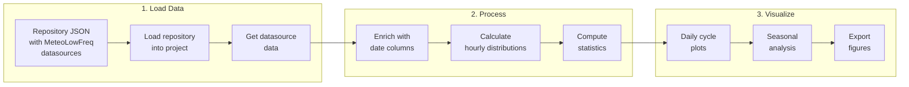
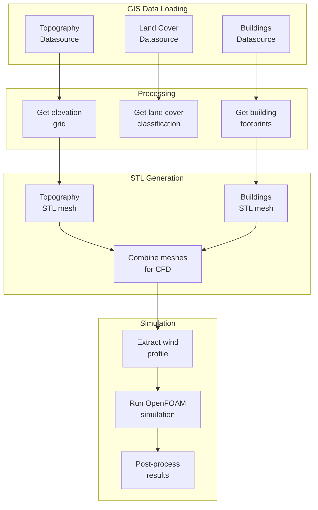
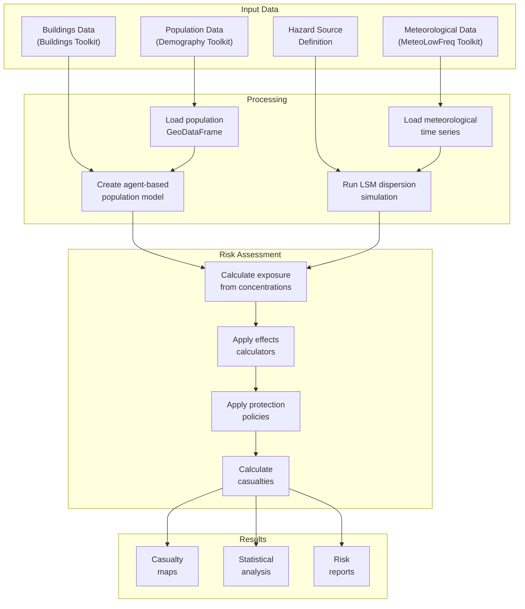

# Workflow Examples

End-to-end workflow examples demonstrating how to use multiple Hera toolkits together.

---

## Workflow 1: Meteorological Analysis Pipeline

Complete pipeline for analyzing low-frequency meteorological station data.

### Overview



<!-- mermaid source (for editing, paste into mermaid.live):

-->

### Step-by-Step Code

```python
from hera import Project, toolkitHome
from hera.utils.data.toolkit import dataToolkit
import json

# Step 1: Load repository into project
proj = Project(projectName="METEOROLOGY_ANALYSIS")

with open("meteo_repository.json") as f:
    repo_json = json.load(f)

dt = dataToolkit()
dt.loadAllDatasourcesInRepositoryJSONToProject(
    projectName="METEOROLOGY_ANALYSIS",
    repositoryJSON=repo_json,
    basedir="/path/to/repo",
    overwrite=True
)

# Step 2: Get toolkit and load data
lf = toolkitHome.getToolkit(toolkitHome.METEOROLOGY_LOWFREQ, projectName="METEOROLOGY_ANALYSIS")
df = lf.getDataSourceData("YAVNEEL").compute()  # Materialize dask DataFrame

# Step 3: Enrich with date columns
enriched = lf.analysis.addDatesColumns(df, datecolumn="datetime")

# Step 4: Calculate hourly distributions
hourly_temp = lf.analysis.calcHourlyDist(
    enriched,
    field="T",
    density=True
)

hourly_rh = lf.analysis.calcHourlyDist(
    enriched,
    field="RH",
    density=True
)

# Step 5: Generate visualizations
import matplotlib.pyplot as plt

# Daily scatter plot
fig, ax = plt.subplots(figsize=(12, 6))
lf.presentation.dailyPlots.plotScatter(enriched, plotField="RH", ax=ax)
plt.savefig("daily_rh_scatter.png")

# Seasonal probability contours
fig, ax = plt.subplots(figsize=(12, 8))
lf.presentation.seasonalPlots.plotProbContourf_bySeason(
    enriched,
    fields=["T", "RH"],
    ax=ax
)
plt.savefig("seasonal_contours.png")

# Step 6: Save processed results
proj.addCacheDocument(
    resource=hourly_temp,
    dataFormat="parquet",
    type="ProcessedStatistics",
    desc={
        "name": "hourly_temperature_distribution",
        "station": "YAVNEEL",
        "processedDate": "2024-11-20"
    }
)

print("Analysis complete!")
```

### Expected Outputs

- **Daily scatter plot** — Time series of relative humidity
- **Seasonal contours** — Probability distributions by season
- **Cached statistics** — Hourly distributions saved to project cache

---

## Workflow 2: GIS + Simulation Integration

Generate STL meshes for CFD simulation from GIS data.

### Overview



<!-- mermaid source (for editing, paste into mermaid.live):

-->

### Step-by-Step Code

```python
from hera import Project, toolkitHome
from hera.utils.data.toolkit import dataToolkit
import json

# Step 1: Load GIS repository
proj = Project(projectName="CFD_SIMULATION")

with open("gis_repository.json") as f:
    repo_json = json.load(f)

dt = dataToolkit()
dt.loadAllDatasourcesInRepositoryJSONToProject(
    projectName="CFD_SIMULATION",
    repositoryJSON=repo_json,
    basedir="/path/to/repo",
    overwrite=True
)

# Step 2: Get GIS toolkits
topo = toolkitHome.getToolkit(toolkitHome.GIS_RASTER_TOPOGRAPHY, projectName="CFD_SIMULATION")
landcover = toolkitHome.getToolkit(toolkitHome.GIS_LANDCOVER, projectName="CFD_SIMULATION")
buildings = toolkitHome.getToolkit(toolkitHome.GIS_BUILDINGS, projectName="CFD_SIMULATION")

# Step 3: Define simulation domain
minx, miny = 35.0, 32.0
maxx, maxy = 35.1, 32.1
dxdy = 30  # 30m resolution

# Step 4: Get elevation data
elevation = topo.getElevation(minx, miny, maxx, maxy, dxdy)

# Step 5: Get land cover and roughness
landcover_data = landcover.getLandCover(
    minx, miny, maxx, maxy, dxdy,
    roughness=True
)

# Step 6: Get building footprints
buildings_gdf = buildings.getBuildingsFromRectangle(
    minx, miny, maxx, maxy,
    withElevation=True  # Add elevation from topography
)

# Step 7: Generate STL meshes
# Topography STL
topo_stl = topo.createElevationSTL(
    elevation,
    solidName="Terrain",
    inputCRS=4326,
    outputCRS=2039
)

with open("terrain.stl", "w") as f:
    f.write(topo_stl)

# Buildings STL (if needed)
if len(buildings_gdf) > 0:
    buildings_stl = buildings.regionToSTL(
        buildings_gdf,
        dxdy=dxdy,
        solidName="Buildings"
    )
    with open("buildings.stl", "w") as f:
        f.write(buildings_stl)

# Step 8: Extract wind profile for simulation
# (Assuming wind profile toolkit is available)
wind_profile_tk = toolkitHome.getToolkit(toolkitHome.WINDPROFILE, projectName="CFD_SIMULATION")
wind_profile = wind_profile_tk.getWindProfile(
    lat=(miny + maxy) / 2,
    lon=(minx + maxx) / 2
)

# Step 9: Run OpenFOAM simulation (if toolkit available)
of_tk = toolkitHome.getToolkit(toolkitHome.SIMULATIONS_OPENFOAM, projectName="CFD_SIMULATION")

# Create case from template
case = of_tk.createCaseFromTemplate(
    templateName="simpleFoam_terrain",
    caseName="terrain_simulation",
    terrainSTL="terrain.stl",
    buildingsSTL="buildings.stl",
    windProfile=wind_profile
)

# Run simulation
of_tk.runOFSimulation(case, nproc=4)

# Step 10: Post-process results
results = of_tk.analysis.extractResults(case)
proj.addSimulationsDocument(
    resource=results,
    dataFormat="netcdf_xarray",
    type="OpenFOAM_Results",
    desc={
        "caseName": "terrain_simulation",
        "solver": "simpleFoam",
        "simulationDate": "2024-11-20"
    }
)

print("CFD simulation complete!")
```

### Expected Outputs

- **Terrain STL** — 3D mesh of topography
- **Buildings STL** — 3D mesh of buildings
- **Wind profile** — Vertical wind profile data
- **Simulation results** — OpenFOAM output in NetCDF format

---

## Workflow 3: Risk Assessment Pipeline

Complete risk assessment workflow from population data to casualty estimates.

### Overview



<!-- mermaid source (for editing, paste into mermaid.live):

-->

### Step-by-Step Code

```python
from hera import Project, toolkitHome
from hera.utils.data.toolkit import dataToolkit
import json

# Step 1: Load all required repositories
proj = Project(projectName="RISK_ASSESSMENT")

# Load demography repository
with open("demography_repository.json") as f:
    demo_repo = json.load(f)

# Load meteorology repository
with open("meteo_repository.json") as f:
    meteo_repo = json.load(f)

dt = dataToolkit()
dt.loadAllDatasourcesInRepositoryJSONToProject(
    projectName="RISK_ASSESSMENT",
    repositoryJSON={**demo_repo, **meteo_repo},  # Merge repositories
    basedir="/path/to/repos",
    overwrite=True
)

# Step 2: Get toolkits
demo = toolkitHome.getToolkit(toolkitHome.GIS_DEMOGRAPHY, projectName="RISK_ASSESSMENT")
meteo = toolkitHome.getToolkit(toolkitHome.METEOROLOGY_LOWFREQ, projectName="RISK_ASSESSMENT")
lsm = toolkitHome.getToolkit(toolkitHome.LSM, projectName="RISK_ASSESSMENT")
risk = toolkitHome.getToolkit(toolkitHome.RISKASSESSMENT, projectName="RISK_ASSESSMENT")

# Step 3: Load population data
population_gdf = demo.getDataSourceData("lamas_population")

# Step 4: Load meteorological data
meteo_df = meteo.getDataSourceData("YAVNEEL").compute()
enriched_meteo = meteo.analysis.addDatesColumns(meteo_df, datecolumn="datetime")

# Step 5: Define hazard source
hazard_source = {
    "location": {"lat": 32.0853, "lon": 34.7818},
    "releaseRate": 100.0,  # kg/s
    "duration": 3600,  # seconds
    "substance": "chlorine"
}

# Step 6: Create agent-based population model
agents = risk.analysis.createAgents(
    population=population_gdf,
    agentType="static",  # or "dynamic" for evacuation scenarios
    desc={"scenario": "baseline"}
)

# Step 7: Run LSM dispersion simulation
lsm_results = lsm.runSimulation(
    hazardSource=hazard_source,
    meteorology=enriched_meteo,
    domain={
        "minx": 34.7, "miny": 32.0,
        "maxx": 34.9, "maxy": 32.2
    },
    resolution=50  # 50m grid
)

# Step 8: Calculate exposure
exposure = risk.analysis.calculateExposure(
    agents=agents,
    concentrationField=lsm_results["concentration"],
    exposureTime=3600  # 1 hour
)

# Step 9: Apply effects calculators
effects = risk.analysis.applyEffects(
    exposure=exposure,
    substance="chlorine",
    effectsType="toxic"
)

# Step 10: Apply protection policies
protected_effects = risk.analysis.applyProtectionPolicy(
    effects=effects,
    policy={
        "sheltering": True,
        "evacuation": False,
        "responseTime": 300  # 5 minutes
    }
)

# Step 11: Calculate casualties
casualties = risk.analysis.calculateCasualties(
    effects=protected_effects,
    injuryLevels=["fatal", "severe", "moderate", "minor"]
)

# Step 12: Generate visualizations
import matplotlib.pyplot as plt

# Casualty map
fig, ax = plt.subplots(figsize=(12, 10))
risk.presentation.plotCasualtyMap(
    casualties,
    population_gdf,
    ax=ax
)
plt.savefig("casualty_map.png")

# Casualty rose (wind direction analysis)
fig, ax = plt.subplots(figsize=(10, 10))
risk.presentation.plotCasualtyRose(
    casualties,
    meteo_df,
    ax=ax
)
plt.savefig("casualty_rose.png")

# Statistical summary
stats = risk.analysis.calculateStatistics(casualties)
print(f"Total casualties: {stats['total']}")
print(f"Fatal: {stats['fatal']}")
print(f"Severe: {stats['severe']}")

# Step 13: Save results
proj.addSimulationsDocument(
    resource=casualties,
    dataFormat="geopandas",
    type="RiskAssessment_Results",
    desc={
        "scenario": "baseline",
        "hazardSource": hazard_source,
        "assessmentDate": "2024-11-20"
    }
)

print("Risk assessment complete!")
```

### Expected Outputs

- **Casualty map** — Spatial distribution of casualties
- **Casualty rose** — Wind direction analysis
- **Statistics** — Summary of casualty counts by injury level
- **Results document** — GeoDataFrame saved to Simulations collection

---

## Common Patterns

### Pattern 1: Chaining Toolkit Operations

```python
# Output of one toolkit feeds into another
topo = toolkitHome.getToolkit(toolkitHome.GIS_RASTER_TOPOGRAPHY, projectName="MY_PROJECT")
buildings = toolkitHome.getToolkit(toolkitHome.GIS_BUILDINGS, projectName="MY_PROJECT")

# Get elevation
elevation = topo.getElevation(minx, miny, maxx, maxy, dxdy=30)

# Get buildings with elevation
buildings_gdf = buildings.getBuildingsFromRectangle(
    minx, miny, maxx, maxy,
    withElevation=True  # Uses topography toolkit internally
)
```

### Pattern 2: Batch Processing Multiple Datasources

```python
toolkit = toolkitHome.getToolkit(toolkitHome.METEOROLOGY_LOWFREQ, projectName="MY_PROJECT")
sources = toolkit.getDataSourceList()

results = {}
for source_name in sources:
    data = toolkit.getDataSourceData(source_name).compute()
    processed = toolkit.analysis.addDatesColumns(data)
    results[source_name] = processed

# Combine results
combined = pd.concat(results.values(), keys=results.keys())
```

### Pattern 3: Conditional Workflow Execution

```python
# Check if datasource exists before processing
if "YAVNEEL" in toolkit.getDataSourceList():
    data = toolkit.getDataSourceData("YAVNEEL")
    # Process...
else:
    print("Datasource not found, skipping...")
```

---

## See Also

- [Best Practices Guide](../guides/best_practices.md) — Workflow organization tips
- [Repository Examples](repository_examples.md) — Setting up data repositories
- [Toolkit Catalog](../toolkits/overview.md) — Available toolkit methods
