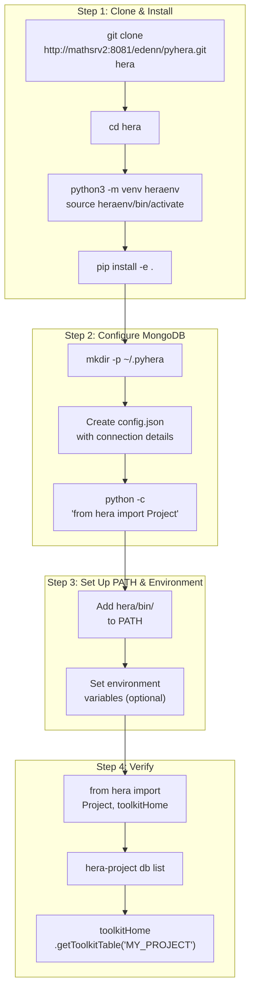

# Installation & Setup

This guide walks you through installing Hera and configuring the required services from scratch.

---

## Prerequisites

| Requirement | Minimum Version | Notes |
|-------------|----------------|-------|
| **Python** | 3.9+ | Tested with 3.9, 3.10, 3.11 |
| **MongoDB** | 4.4+ | Must be running and accessible |
| **Git** | 2.x | For cloning the repository |
| **pip** | 21+ | For installing Python packages |

---

## Installation Flow



---

## Step 1: Clone and Install

```bash
# Clone the repository
git clone http://mathsrv2:8081/edenn/pyhera.git hera
cd hera

# Create and activate a virtual environment
python3 -m venv heraenv
source heraenv/bin/activate

# Install in development mode
pip install -e .

# Install runtime dependencies
pip install -r requirements.txt
```

!!! tip "Development Mode"
    Using `pip install -e .` installs Hera in **editable mode**, meaning changes to the source code take effect immediately without reinstalling.

---

## Step 2: Configure MongoDB Connection

Hera requires a MongoDB instance for storing metadata. The connection details are stored in a JSON configuration file.

### Create the Config File

```bash
mkdir -p ~/.pyhera
```

Create `~/.pyhera/config.json` with the following structure:

```json
{
    "connectionName": {
        "username": "your_username",
        "password": "your_password",
        "dbIP": "localhost:27017",
        "dbName": "hera_db"
    }
}
```

### Config File Format

| Field | Type | Description |
|-------|------|-------------|
| `connectionName` | `str` (top-level key) | A name for this connection. Defaults to the OS username if not specified at runtime. |
| `username` | `str` | MongoDB username |
| `password` | `str` | MongoDB password |
| `dbIP` | `str` | MongoDB server address (hostname:port) |
| `dbName` | `str` | Name of the MongoDB database to use |

!!! note "Multiple Connections"
    You can define multiple connection entries in the same config file. Each entry is a top-level key. When creating a `Project`, you can specify which connection to use via `connectionName`:

    ```python
    from hera import Project
    proj = Project(projectName="MY_PROJECT", connectionName="production")
    ```

    If `connectionName` is not provided, Hera uses the current OS username as the key.

### What Happens on First Run

If `~/.pyhera/config.json` does not exist when Hera is first imported, the system will:

1. Automatically create the directory `~/.pyhera/`
2. Generate a template `config.json` with placeholder values
3. Raise an `IOError` with a message asking you to fill in the connection details

---

## Step 3: Set Up PATH and Environment

### Add CLI Tools to PATH

Hera provides command-line tools in the `hera/bin/` directory. To use them, add this directory to your `PATH`:

```bash
# Add to your shell profile (~/.bashrc, ~/.zshrc, etc.)
export PATH="/path/to/hera/hera/bin:$PATH"
```

### Environment Variables

These variables are optional but useful for testing and advanced configurations:

| Variable | Required | Default | Description |
|----------|----------|---------|-------------|
| `HOME` | Yes (OS) | OS default | Location of `~/.pyhera/config.json` |
| `TEST_HERA` | No | `~/hera_unittest_data` | Root directory for test data |
| `RESULT_SET` | No | `BASELINE` | Name of the expected-output result set for tests |
| `PREPARE_EXPECTED_OUTPUT` | No | unset | Set to `1` to generate test baselines |
| `MPLBACKEND` | No | system default | Set to `Agg` for headless matplotlib (no display) |
| `GDF_TOL_AREA` | No | `1e-7` | Tolerance for geometry comparison in tests |
| `HERA_FULL_LOGGING_TESTS` | No | unset | Set to enable full logging during tests |

See the [Environment Variables Reference](../configuration/env_vars.md) for complete details.

---

## Step 4: Verify Installation

### Python API

```python
# Activate the environment
# source heraenv/bin/activate

from hera import Project, toolkitHome

# Create or connect to a project
proj = Project(projectName="MY_PROJECT")
print(f"Project: {proj.projectName}")
print(f"Files directory: {proj.FilesDirectory}")

# List available toolkits
table = toolkitHome.getToolkitTable("MY_PROJECT")
print(table)
```

### CLI Tools

```bash
# List database connections
hera-project db list

# List projects
hera-project project list

# List available toolkits
hera-toolkit list --project MY_PROJECT
```

### Expected Output

If everything is configured correctly, you should see:

- No `IOError` about missing config files
- A list of database connections
- A list of registered toolkits (may be empty for a new project)

---

## Troubleshooting Installation

| Problem | Cause | Solution |
|---------|-------|----------|
| `IOError: config file doesn't exist` | Missing `~/.pyhera/config.json` | Create the file with valid MongoDB connection details |
| `ConnectionRefusedError` | MongoDB not running | Start MongoDB: `sudo systemctl start mongod` |
| `ModuleNotFoundError: No module named 'hera'` | Package not installed | Run `pip install -e .` from the hera root |
| `command not found: hera-project` | `hera/bin/` not in PATH | Add to PATH: `export PATH="/path/to/hera/hera/bin:$PATH"` |
| `ImportError: mongoengine` | Missing dependencies | Run `pip install -r requirements.txt` |

See the [Troubleshooting](../troubleshooting.md) page for more common errors and solutions.
