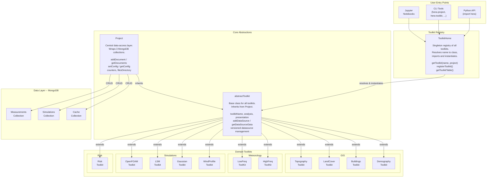

# Hera Documentation

**Version 2.16.1** | Scientific Data Management & Analysis Platform

---

## What is Hera?

Hera is a Python-based platform for managing scientific data across measurements, simulations, and cached results. It provides a unified data layer backed by MongoDB and a rich set of domain-specific **Toolkits** for GIS, meteorology, risk assessment, dispersion modeling, and more.

!!! tip "Quick Start"
    ```bash
    git clone https://github.com/KaplanOpenSource/hera
    cd hera
    source init_with_mongo.sh
    ```
    Then in Python:
    ```python
    from hera import Project, toolkitHome
    proj = Project(projectName="MY_PROJECT")
    topo = toolkitHome.getToolkit(toolkitHome.GIS_RASTER_TOPOGRAPHY, projectName="MY_PROJECT")
    ```

---

## High-Level Architecture

The entire system is built around three core abstractions: **Project**, **ToolkitHome**, and **abstractToolkit**. The diagram below shows how they relate to each other and to the concrete domain toolkits.



<!-- mermaid source (for editing, paste into mermaid.live):

-->  Project -- "CRUD" --> MeasColl
    Project -- "CRUD" --> SimColl
    Project -- "CRUD" --> CacheColl
```
-->
-->  Project -- "CRUD" --> MeasColl
    Project -- "CRUD" --> SimColl
    Project -- "CRUD" --> CacheColl
```
-->
-->

---

## Documentation Sections

### [User Guide](user_guide/index.md)

For users working **with** Hera — installation, configuration, toolkit usage, and workflows.

| Section | Description |
|---------|-------------|
| [**Installation & Setup**](user_guide/installation.md) | Quick install and manual setup instructions |
| [**CLI Reference**](cli/reference.md) | All `hera-*` command-line tools with usage examples |
| [**Toolkit Catalog**](toolkits/overview.md) | Per-domain toolkit guides: GIS, Meteorology, Simulations, Risk |
| [**Workflows & Examples**](examples/workflows.md) | Step-by-step data processing guides |
| [**Cheat Sheet**](reference/cheat_sheet.md) | Quick command and API reference |
| [**Troubleshooting**](troubleshooting.md) | Common errors and their solutions |

### [Developer Guide](developer_guide/index.md)

For developers working **on** Hera — architecture, data model, testing, and extending the platform.

| Section | Description |
|---------|-------------|
| [**Core Concepts**](architecture/core_concepts.md) | Deep dive into `Project`, `ToolkitHome`, and `abstractToolkit` with class diagrams |
| [**Data Layer**](architecture/data_layer.md) | MongoDB document model, `datatypes`, and the repository JSON pipeline |
| [**Testing Flow**](testing/flow.md) | Pytest session lifecycle, fixtures, comparison helpers, and expected-output mechanism |
| [**Repository Schema**](reference/repository_schema.md) | Detailed schema documentation |
| [**Environment Variables**](configuration/env_vars.md) | Complete reference of all environment variables |
| [**Glossary**](glossary.md) | Definitions of key Hera terms |

---

## Available Toolkits

Hera ships with the following built-in toolkits, all registered in the `ToolkitHome` static registry:

| Toolkit Name | Category | Class Path |
|-------------|----------|------------|
| `GIS_Buildings` | Measurements | `hera.measurements.GIS.vector.buildings.toolkit.BuildingsToolkit` |
| `GIS_Tiles` | Measurements | `hera.measurements.GIS.raster.tiles.TilesToolkit` |
| `GIS_Raster_Topography` | Measurements | `hera.measurements.GIS.raster.topography.TopographyToolkit` |
| `GIS_Vector_Topography` | Measurements | `hera.measurements.GIS.vector.topography.TopographyToolkit` |
| `GIS_Demography` | Measurements | `hera.measurements.GIS.vector.demography.DemographyToolkit` |
| `GIS_LandCover` | Measurements | `hera.measurements.GIS.raster.landcover.LandCoverToolkit` |
| `MeteoLowFreq` | Measurements | `hera.measurements.meteorology.lowfreqdata.toolkit.lowFreqToolKit` |
| `MeteoHighFreq` | Measurements | `hera.measurements.meteorology.highfreqdata.toolkit.HighFreqToolKit` |
| `OpenFOAM` | Simulations | `hera.simulations.openFoam.toolkit.OFToolkit` |
| `LSM` | Simulations | `hera.simulations.LSM.toolkit.LSMToolkit` |
| `WindProfile` | Simulations | `hera.simulations.windProfile.toolkit.WindProfileToolkit` |
| `GaussianDispersion` | Simulations | `hera.simulations.gaussian.toolkit.gaussianToolkit` |
| `RiskAssessment` | Risk | `hera.riskassessment.riskToolkit.RiskToolkit` |
| `experiment` | Measurements | `hera.measurements.experiment.experiment.experimentHome` |

---

## Project Structure

```
hera/
├── hera/                          # Main package
│   ├── __init__.py                # Version, logging init, toolkitHome singleton
│   ├── toolkit.py                 # ToolkitHome + abstractToolkit
│   ├── datalayer/                 # Project, Collection, DataHandler, datatypes
│   ├── measurements/              # GIS, meteorology, experiment toolkits
│   ├── simulations/               # OpenFOAM, LSM, Gaussian, WindProfile
│   ├── riskassessment/            # Risk assessment agents and toolkit
│   ├── utils/                     # Logging, data utilities, CLI helpers
│   ├── bin/                       # CLI tools (hera-project, hera-toolkit, ...)
│   └── tests/                     # Pytest test suite
│       ├── conftest.py            # Session fixtures, comparison helpers
│       ├── test_*.py              # Per-domain test modules
│       └── expected/              # Expected output result sets
├── docs/                          # MkDocs documentation source
├── notebooks/                     # Jupyter exploration notebooks
├── pytest.ini                     # Pytest configuration
├── setup.py                       # Package setup
├── requirements.txt               # Runtime dependencies
└── mkdocs.yml                     # Documentation site config
```
