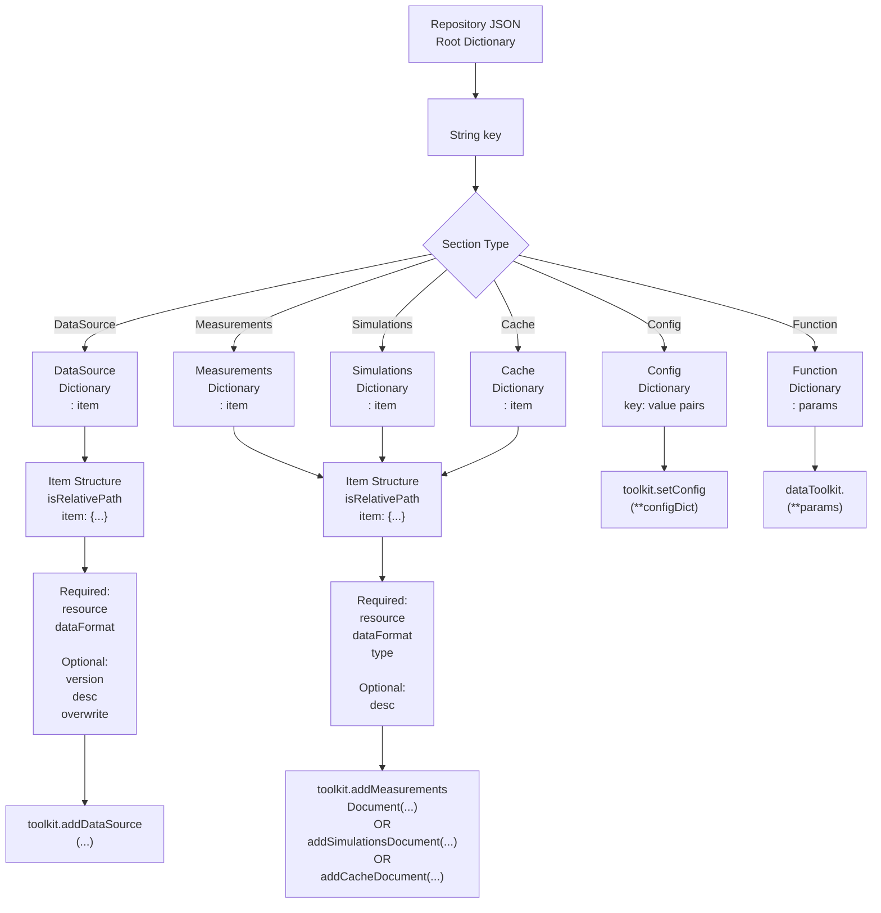

# Repository JSON Schema Reference

Complete schema documentation for repository JSON files.

---

## Top-Level Structure

A repository JSON is a dictionary mapping toolkit names to their configuration and data sections:

```json
{
    "<ToolkitName>": {
        "Config": { ... },
        "DataSource": { ... },
        "Measurements": { ... },
        "Simulations": { ... },
        "Cache": { ... },
        "Function": { ... }
    },
    "<AnotherToolkitName>": { ... }
}
```

**Rules:**
- Toolkit names must match registered toolkit names (case-sensitive)
- Each toolkit section is independent
- Section order doesn't matter
- Sections are optional (only include what you need)

---

## Section Types

### Config Section

**Purpose:** Set toolkit configuration via `toolkit.setConfig(**configDict)`

**Schema:**
```json
{
    "<ToolkitName>": {
        "Config": {
            "<key1>": "<value1>",
            "<key2>": 42,
            "<key3>": {
                "nested": "config"
            }
        }
    }
}
```

**Handler:** `_handle_Config` → Calls `toolkit.setConfig(**configDict)`

**Example:**
```json
{
    "GIS_Raster_Topography": {
        "Config": {
            "defaultSRTM": "SRTMGL1",
            "defaultCRS": 4326
        }
    }
}
```

---

### DataSource Section

**Purpose:** Register versioned datasources accessible via `toolkit.getDataSourceData()`

**Schema:**
```json
{
    "<ToolkitName>": {
        "DataSource": {
            "<datasourceName>": {
                "isRelativePath": "True" | "False" | true | false,
                "item": {
                    "resource": "<path or value>",
                    "dataFormat": "<format constant>",
                    "version": [<major>, <minor>, <patch>],
                    "desc": {
                        "<key>": "<value>",
                        ...
                    },
                    "overwrite": true | false  // Optional, default: false
                }
            }
        }
    }
}
```

**Handler:** `_handle_DataSource` → Calls `toolkit.addDataSource(...)`

**Required Fields:**
- `resource` — Path to data file or inline value
- `dataFormat` — One of the `datatypes` constants (e.g., `"parquet"`, `"geopandas"`)

**Optional Fields:**
- `version` — Version tuple `[major, minor, patch]` (default: `[0, 0, 1]`)
- `desc` — Metadata dictionary (default: `{}`)
- `overwrite` — Overwrite existing datasource (default: `false`)

**Path Resolution:**
- If `isRelativePath` is `"True"` or `true`: `resource` is resolved relative to repository JSON directory
- If `isRelativePath` is `"False"` or `false`: `resource` is used as absolute path

**Example:**
```json
{
    "MeteoLowFreq": {
        "DataSource": {
            "YAVNEEL": {
                "isRelativePath": "True",
                "item": {
                    "resource": "measurements/YAVNEEL.parquet",
                    "dataFormat": "parquet",
                    "version": [0, 0, 1],
                    "desc": {
                        "stationName": "YAVNEEL",
                        "latitude": 31.7683,
                        "longitude": 35.2137
                    }
                }
            }
        }
    }
}
```

---

### Measurements Section

**Purpose:** Add raw measurement documents to the Measurements collection

**Schema:**
```json
{
    "<ToolkitName>": {
        "Measurements": {
            "<documentName>": {
                "isRelativePath": "True" | "False" | true | false,
                "item": {
                    "resource": "<path or value>",
                    "dataFormat": "<format constant>",
                    "type": "<document type>",
                    "desc": {
                        "<key>": "<value>",
                        ...
                    }
                }
            }
        }
    }
}
```

**Handler:** `_DocumentHandler` → Calls `toolkit.addMeasurementsDocument(...)`

**Required Fields:**
- `resource` — Path to data file or inline value
- `dataFormat` — Format constant
- `type` — Application-defined document type (e.g., `"Experiment_rawData"`)

**Differences from DataSource:**
- No `version` field (documents are not versioned)
- Requires `type` field
- Creates a `Measurements` collection document (not a ToolkitDataSource)

**Example:**
```json
{
    "MeteoLowFreq": {
        "Measurements": {
            "raw_export_2024": {
                "isRelativePath": "True",
                "item": {
                    "resource": "exports/raw_2024.parquet",
                    "dataFormat": "parquet",
                    "type": "Experiment_rawData",
                    "desc": {
                        "exportDate": "2024-12-01",
                        "source": "IMS"
                    }
                }
            }
        }
    }
}
```

---

### Simulations Section

**Purpose:** Add simulation output documents to the Simulations collection

**Schema:**
```json
{
    "<ToolkitName>": {
        "Simulations": {
            "<documentName>": {
                "isRelativePath": "True" | "False" | true | false,
                "item": {
                    "resource": "<path or value>",
                    "dataFormat": "<format constant>",
                    "type": "<document type>",
                    "desc": {
                        "<key>": "<value>",
                        ...
                    }
                }
            }
        }
    }
}
```

**Handler:** `_DocumentHandler` → Calls `toolkit.addSimulationsDocument(...)`

**Same structure as Measurements**, but creates documents in the `Simulations` collection.

**Example:**
```json
{
    "OpenFOAM": {
        "Simulations": {
            "wind_simulation_001": {
                "isRelativePath": "True",
                "item": {
                    "resource": "simulations/wind_001.nc",
                    "dataFormat": "netcdf_xarray",
                    "type": "WindProfile",
                    "desc": {
                        "simulationDate": "2024-11-15",
                        "solver": "simpleFoam"
                    }
                }
            }
        }
    }
}
```

---

### Cache Section

**Purpose:** Add cached/computed documents to the Cache collection

**Schema:**
```json
{
    "<ToolkitName>": {
        "Cache": {
            "<documentName>": {
                "isRelativePath": "True" | "False" | true | false,
                "item": {
                    "resource": "<path or value>",
                    "dataFormat": "<format constant>",
                    "type": "<document type>",
                    "desc": {
                        "<key>": "<value>",
                        ...
                    }
                }
            }
        }
    }
}
```

**Handler:** `_DocumentHandler` → Calls `toolkit.addCacheDocument(...)`

**Same structure as Measurements/Simulations**, but creates documents in the `Cache` collection.

**Example:**
```json
{
    "MeteoLowFreq": {
        "Cache": {
            "processed_stats": {
                "isRelativePath": "True",
                "item": {
                    "resource": "cache/statistics.json",
                    "dataFormat": "JSON_dict",
                    "type": "ProcessedStatistics",
                    "desc": {
                        "computedDate": "2024-11-20",
                        "method": "hourly_distribution"
                    }
                }
            }
        }
    }
}
```

---

### Function Section

**Purpose:** Call named functions on the dataToolkit instance

**Schema:**
```json
{
    "<ToolkitName>": {
        "Function": {
            "<functionName>": {
                "params": {
                    "<param1>": "<value1>",
                    "<param2>": 42,
                    ...
                }
            }
        }
    }
}
```

**Or for multiple calls:**

```json
{
    "<ToolkitName>": {
        "Function": {
            "<functionName>": [
                {
                    "params": { ... }
                },
                {
                    "params": { ... }
                }
            ]
        }
    }
}
```

**Handler:** `_handle_Function` → Calls `dataToolkit.<functionName>(**params, overwrite=overwrite)`

**Requirements:**
- Function must exist on `dataToolkit` instance
- Function signature must accept `overwrite` parameter
- `params` can be a dict (single call) or list of dicts (multiple calls)

**Example:**
```json
{
    "MeteoLowFreq": {
        "Function": {
            "initializeToolkit": {
                "params": {
                    "autoLoadDefaults": true
                }
            }
        }
    }
}
```

---

## Path Resolution Rules

### How `basedir` is Determined

The `basedir` is the directory containing the repository JSON file:

```python
basedir = os.path.dirname(repository_json_path)
```

**Example:**
- Repository JSON at: `/home/user/repos/my_repo.json`
- `basedir` = `/home/user/repos/`

### Relative Path Resolution

For each item with `isRelativePath: "True"` or `isRelativePath: true`:

```python
if isRelativePath:
    absolute_path = os.path.join(basedir, resource)
else:
    absolute_path = resource  # Used as-is
```

**Example:**
- Repository JSON: `/home/user/repos/my_repo.json`
- `resource: "data/file.parquet"`
- `isRelativePath: "True"`
- Resolved to: `/home/user/repos/data/file.parquet`

### Absolute Path Handling

For items with `isRelativePath: "False"` or `isRelativePath: false`:

- Path is used exactly as specified
- No modification is performed
- Useful for shared network drives or fixed locations

---

## Validation Rules

### Toolkit Validation

- **Toolkit must exist** — Name must match a registered toolkit
- **Auto-registration** — If `auto_register_missing=True`, attempts to register from JSON hints or DB documents

### Section Validation

- **Valid section names** — Must be one of: `Config`, `DataSource`, `Measurements`, `Simulations`, `Cache`, `Function`
- **Case-sensitive** — Section names are title-cased internally

### DataSource Item Validation

- **Required fields:** `resource`, `dataFormat`
- **Version format:** Must be a list of 3 integers: `[major, minor, patch]`
- **isRelativePath:** Must be `"True"`, `"False"`, `true`, or `false`

### Document Item Validation

- **Required fields:** `resource`, `dataFormat`, `type`
- **Type field:** Must be a non-empty string

### Path Validation

- **Relative paths** — Directory must exist when resolved
- **Absolute paths** — File/directory must exist (checked during `getData()`)

---

## Complete Schema Diagram



<!-- mermaid source (for editing, paste into mermaid.live):

-->dSimulationsDocument(...)\nOR\naddCacheDocument(...)"]
    FuncSection --> FuncAction["dataToolkit.<functionName>\n(**params)"]
```
-->
-->dSimulationsDocument(...)\nOR\naddCacheDocument(...)"]
    FuncSection --> FuncAction["dataToolkit.<functionName>\n(**params)"]
```
-->
-->

---

## Common Errors

| Error | Cause | Solution |
|-------|-------|----------|
| `Unknown Handler X` | Section name doesn't match expected handlers | Use one of: `Config`, `DataSource`, `Measurements`, `Simulations`, `Cache`, `Function` |
| `Toolkit X not found` | Toolkit not registered | Register toolkit or enable `auto_register_missing` |
| `Source X already exists` | Datasource exists and `overwrite=False` | Set `overwrite: true` in item or use `--overwrite` flag |
| `isRelativePath must be defined` | Missing or invalid `isRelativePath` | Set to `"True"`, `"False"`, `true`, or `false` |
| `resource path not found` | Resolved path doesn't exist | Check path, ensure `isRelativePath` is correct |

---

## Implementation Details

The repository loading is implemented in `hera/utils/data/toolkit.py`:

- **`loadAllDatasourcesInRepositoryJSONToProject()`** — Main entry point
- **`_handle_Config()`** — Config section handler
- **`_handle_DataSource()`** — DataSource section handler
- **`_DocumentHandler()`** — Measurements/Simulations/Cache handler
- **`_handle_Function()`** — Function section handler
- **`_makeItemPathAbsolute()`** — Path resolution logic

---

## See Also

- [Repository Examples](../examples/repository_examples.md) — Complete working examples
- [Data Layer: Repository Pipeline](../architecture/data_layer.md#repository-json-structure) — How repositories are processed
- [Best Practices: Repository Structure](../guides/best_practices.md#repository-structure) — Organization guidelines
