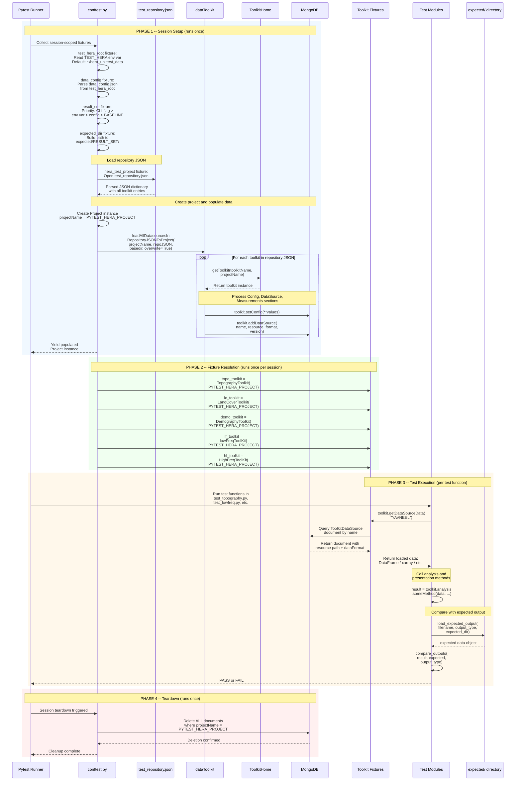
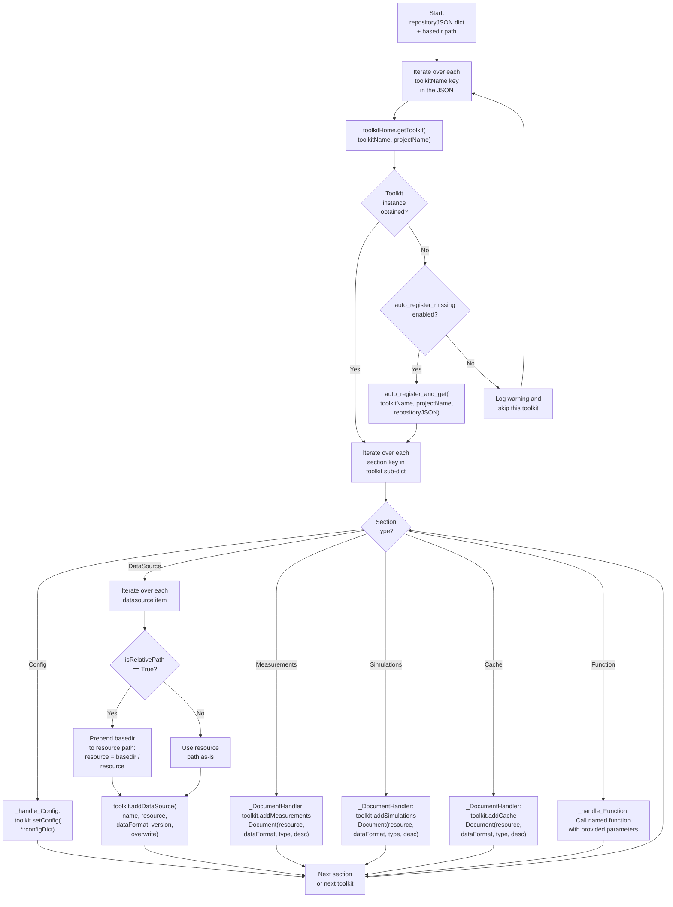
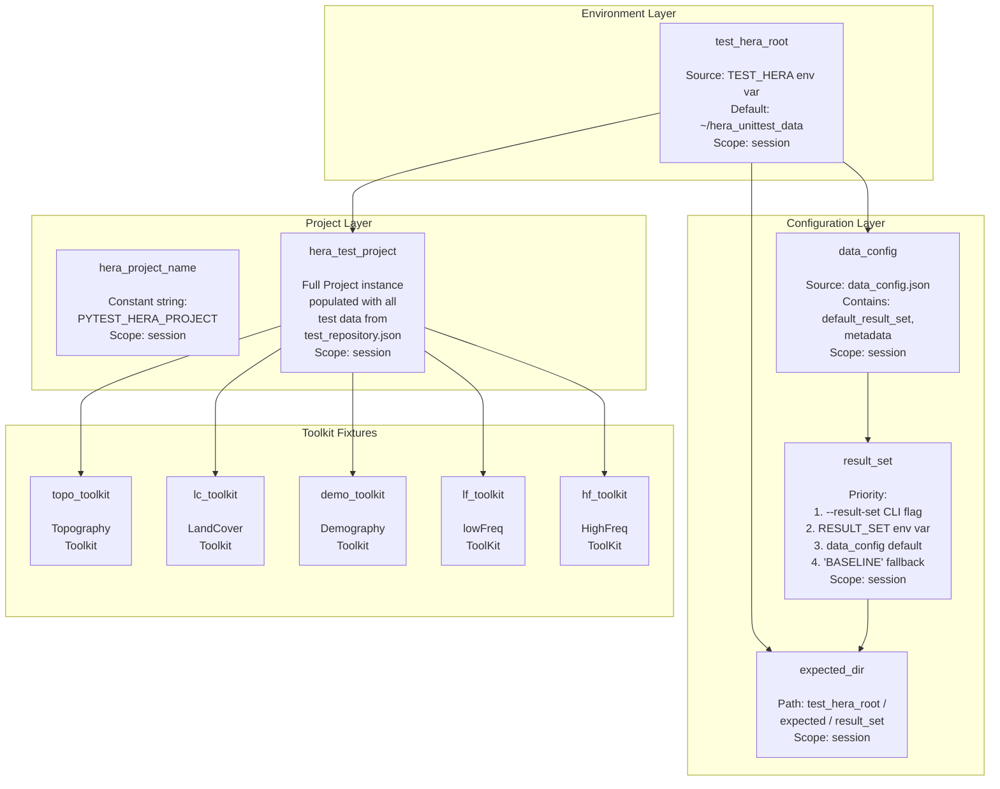
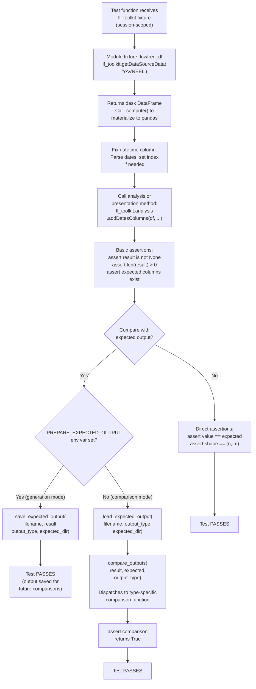
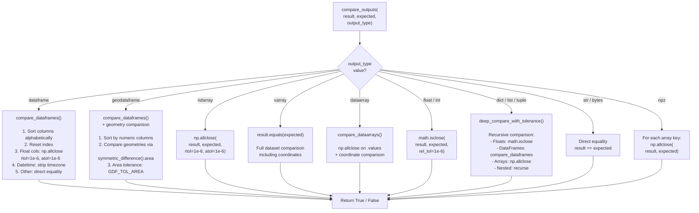

# Testing Flow

This page provides a complete technical walkthrough of the Hera test infrastructure — how tests are organized, how data flows from JSON files through MongoDB into toolkit instances, and how results are compared against expected outputs.

---

## Overview

The Hera test suite uses **native Pytest** with a **project-based data access** pattern. The core principle:

!!! tip "The Golden Rule"
    **Tests never access files directly by path.** They interact only with the `Project` and `Toolkit` APIs, exactly as production code does. Data is loaded into MongoDB once per session, and toolkits read it back through the standard datasource mechanism.

### Test Directory Structure

```
hera/tests/
├── conftest.py                      # Session fixtures, comparison helpers
├── test_datalayer.py                # Project CRUD tests
├── test_repository.py               # Repository add/get/load tests
├── test_topography.py               # TopographyToolkit tests
├── test_landcover.py                # LandCoverToolkit tests
├── test_lowfreq.py                  # lowFreqToolKit tests
├── test_highfreq.py                 # HighFreqToolKit tests
├── test_demography.py               # DemographyToolkit tests
├── repository/testCases/            # Test JSON data for repository tests
├── datalayer/testCases/             # Test JSON data for datalayer tests
├── expected/
│   ├── BASELINE/                    # Default expected outputs
│   └── REGRESSION_2025_11_11/       # Alternative result set
└── TESTING_GUIDE.md                 # Human-readable test guide
```

External test data lives in a separate directory:

```
~/hera_unittest_data/                # Configured via TEST_HERA env var
├── data_config.json                 # Data configuration metadata
├── test_repository.json             # Hera-format repository mapping
├── measurements/                    # Raw test data files
│   ├── GIS/raster/                  # HGT, TIF files
│   ├── GIS/vector/                  # SHP files
│   └── meteorology/                 # Parquet files
└── expected/                        # Expected output result sets
    ├── BASELINE/
    └── REGRESSION_20251113_1556/
```

---

## Session Lifecycle — The Complete Flow



---

## Phase 1: Session Setup (conftest.py)

### The hera_test_project Fixture

This is the **single most important fixture** in the test suite. It runs once per session and populates a fresh Hera project with all test data.

```python
# Simplified from hera/tests/conftest.py

@pytest.fixture(scope="session")
def hera_test_project(test_hera_root):
    from hera.datalayer.project import Project
    from hera.utils.data.toolkit import dataToolkit

    # 1. Read the repository JSON
    repo_json_path = test_hera_root / "test_repository.json"
    with open(repo_json_path) as fh:
        repo_json = json.load(fh)

    # 2. Create the project
    proj = Project(projectName="PYTEST_HERA_PROJECT")

    # 3. Load ALL datasources into the project
    dt = dataToolkit()
    dt.loadAllDatasourcesInRepositoryJSONToProject(
        projectName="PYTEST_HERA_PROJECT",
        repositoryJSON=repo_json,
        basedir=str(test_hera_root),
        overwrite=True,
    )

    yield proj

    # 4. Cleanup: remove all documents
    for doc in proj.getMeasurementsDocuments():
        doc.delete()
```

### What loadAllDatasourcesInRepositoryJSONToProject Does



!!! info "Overwrite Mode"
    The `overwrite=True` parameter ensures that running the test suite multiple times does not accumulate stale documents. Existing documents with the same datasource name are deleted before the new ones are inserted.

---

## Phase 2: Fixture Resolution

### Session-Scoped Toolkit Fixtures

Each toolkit test module depends on a session-scoped fixture that instantiates the real toolkit class, connected to the test project:

| Fixture | Toolkit Class | Depends On | Data Sources |
|---------|---------------|------------|--------------|
| `topo_toolkit` | `TopographyToolkit` | `hera_test_project` | `SRTMGL1` (HGT directory) |
| `lc_toolkit` | `LandCoverToolkit` | `hera_test_project` | `lc_mcd12q1` (TIF path) |
| `demo_toolkit` | `DemographyToolkit` | `hera_test_project` | `lamas_population` (SHP -> GeoDataFrame) |
| `lf_toolkit` | `lowFreqToolKit` | `hera_test_project` | `YAVNEEL` (parquet -> dask/pandas) |
| `hf_toolkit` | `HighFreqToolKit` | `hera_test_project` | `slicedYamim_sonic`, `slicedYamim_TRH` (parquet) |

### Function-Scoped Fixtures

| Fixture | Scope | Description |
|---------|-------|-------------|
| `project_fixture` | function | Temporary `Project` with cleanup (for `test_datalayer.py`) |
| `data_toolkit_fixture` | session | `dataToolkit` instance (for `test_repository.py`) |

### Fixture Dependency Graph



---

## Phase 3: Test Execution

### Test Modules Overview

| Module | Toolkit | Tests | Key Patterns |
|--------|---------|-------|--------------|
| `test_datalayer.py` | (Project directly) | 5 | CRUD operations, counters, config |
| `test_repository.py` | `dataToolkit` | 7 | Repository add/get/load, path resolution |
| `test_topography.py` | `TopographyToolkit` | 13 | Point/list/grid elevation, STL, CRS conversion |
| `test_landcover.py` | `LandCoverToolkit` | 11 | Land cover at point/area, roughness, coding map |
| `test_lowfreq.py` | `lowFreqToolKit` | 18 | Analysis, presentation, data matching, edge cases |
| `test_highfreq.py` | `HighFreqToolKit` | 24 | Sonic/TRH data, calculators, turbulence statistics |
| `test_demography.py` | `DemographyToolkit` | 7 | Population calculations, area creation, defaults |

### Anatomy of a Toolkit Test

Here is the typical pattern, using `test_lowfreq.py` as an example:



!!! note "Dask to Pandas"
    The `parquet` data handler returns a **dask DataFrame** for lazy loading. Test fixtures call `.compute()` to materialize it into a pandas DataFrame before running assertions.

### Test Data Mapping (test_repository.json)

| Toolkit Key | Config Entries | Datasources |
|-------------|----------------|-------------|
| `GIS_Raster_Topography` | `defaultSRTM: SRTMGL1` | `SRTMGL1` -> `measurements/GIS/raster` (string) |
| `GIS_LandCover` | `defaultLandCover: lc_mcd12q1` | `lc_mcd12q1` -> `measurements/GIS/raster/lc_mcd12q1.tif` (string) |
| `GIS_Demography` | — | `lamas_population` -> `measurements/GIS/vector/population_lamas.shp` (geopandas) |
| `MeteoLowFreq` | — | `YAVNEEL` -> `measurements/meteorology/lowfreqdata/YAVNEEL.parquet` (parquet) |
| `MeteoHighFreq` | — | `slicedYamim_sonic` + `slicedYamim_TRH` -> `measurements/meteorology/highfreqdata/` (parquet) |

---

## Comparison Helpers

The `conftest.py` module provides a rich set of comparison functions for validating test outputs against expected baselines.

### compare_outputs Dispatcher



### compare_dataframes — Deep Comparison

The `compare_dataframes` function handles several complex scenarios:

1. **Column Alignment** — Sorts columns alphabetically and resets index
2. **Numeric Tolerance** — Uses `np.allclose(rtol=1e-6, atol=1e-6)` for float columns
3. **Datetime Handling** — Strips timezone info before comparison
4. **Geometry Handling** — For GeoDataFrames, compares geometries via `symmetric_difference().area`
5. **Sort Stability** — For GeoDataFrames, sorts by preferred numeric columns to ensure deterministic comparison

### deep_compare_with_tolerance — Recursive Comparison

For nested structures (dicts, lists, tuples), the `deep_compare_with_tolerance` function recursively compares:

- **Floats** — `math.isclose(rel_tol=1e-6, abs_tol=1e-6)`
- **DataFrames** — Delegates to `compare_dataframes`
- **NumPy arrays** — `np.allclose`
- **Lists/Tuples** — Element-wise recursive comparison
- **Dicts** — Key-set comparison + recursive value comparison
- **Everything else** — Direct equality

---

## Expected Output Management

### Result Sets

Expected outputs are organized into **result sets** — named directories under `expected/`:

```
expected/
├── BASELINE/                        # Default result set
│   ├── getPointElevation.json
│   ├── expected_lowfreq_addDatesColumns.parquet
│   ├── expected_lowfreq_calcHourlyDist_density.npz
│   ├── create_xarray.nc
│   └── ...
└── REGRESSION_2025_11_11/           # Alternative result set
    └── ...
```

### Choosing a Result Set

The active result set is determined by (in priority order):

1. **CLI option:** `pytest --result-set REGRESSION_2025_11_11`
2. **Environment variable:** `RESULT_SET=REGRESSION_2025_11_11`
3. **Config default:** `data_config.json -> default_result_set`
4. **Hardcoded fallback:** `"BASELINE"`

### Save / Load Helpers

| Function | Purpose |
|----------|---------|
| `save_expected_output(filename, data, output_type, expected_dir)` | Serialize test output to the expected directory |
| `load_expected_output(filename, output_type, expected_dir)` | Deserialize expected output for comparison |

!!! warning "PREPARE_EXPECTED_OUTPUT Mode"
    Setting the `PREPARE_EXPECTED_OUTPUT=1` environment variable switches tests into **generation mode**: instead of comparing results against expected outputs, they **write** the current results as the new expected outputs. This is used when establishing a new baseline after intentional changes.

### Supported Output Formats

| output_type | Save Format | Load Method |
|-------------|-------------|-------------|
| `dataframe` | `.parquet` or `.json` | `pd.read_parquet()` / `pd.read_json()` |
| `geodataframe` | `.geojson` | `gpd.read_file()` |
| `xarray` / `dataarray` | `.nc` (NetCDF) | `xr.open_dataset()` / `xr.open_dataarray()` |
| `dict` / `list` | `.json` | `json.load()` |
| `float` / `int` | `.json` | `json.load()` + cast |
| `ndarray` / `npz` | `.npz` | `np.load()` |
| `str` / `string` | plain text | `open().read()` |

---

## Environment Variables

| Variable | Required | Default | Description |
|----------|----------|---------|-------------|
| `TEST_HERA` | No | `~/hera_unittest_data` | Path to the test data repository root |
| `RESULT_SET` | No | `BASELINE` | Name of the expected-output result set |
| `PREPARE_EXPECTED_OUTPUT` | No | (unset) | Set to `"1"` to generate expected outputs |
| `MPLBACKEND` | No | (system default) | Set to `Agg` for headless matplotlib |
| `GDF_TOL_AREA` | No | `1e-7` | Tolerance for geometry comparison area |

---

## Running Tests

### Quick Reference

```bash
# Activate the environment
cd /home/ilay/hera
source heraenv/bin/activate

# Run all tests
pytest hera/tests/ -v

# Run a specific module
pytest hera/tests/test_lowfreq.py -v

# Run a specific test class
pytest hera/tests/test_topography.py::TestGetPointElevation -v

# Run a single test function
pytest hera/tests/test_lowfreq.py::TestLowFreqToolkitInit::test_has_analysis -v

# Choose a result set
pytest hera/tests/ --result-set BASELINE -v

# Skip slow tests
pytest hera/tests/ -v -m "not slow"

# Generate expected outputs
PREPARE_EXPECTED_OUTPUT=1 pytest hera/tests/ -v
```

### Pytest Configuration (pytest.ini)

```ini
[pytest]
testpaths = hera/tests
python_files = test_*.py
python_classes = Test*
python_functions = test_*
addopts = -v --tb=short
markers =
    slow: marks tests as slow (deselect with '-m "not slow"')
    integration: marks tests that require MongoDB
```

---

## Adding New Tests

### Step-by-Step Guide

1. **Add test data** to `~/hera_unittest_data/measurements/<subdir>/`
2. **Update `test_repository.json`** with a new entry under the appropriate toolkit key
3. **Add a fixture** in `conftest.py` (session-scoped, depends on `hera_test_project`)
4. **Create a test module** `hera/tests/test_<name>.py`
5. **Use the fixture** to get a real toolkit instance — no file paths in tests
6. **Compare outputs** using `compare_outputs()` and expected files under `expected/BASELINE/`

### Example: Adding a New Toolkit Test

```python
# In conftest.py — add a session-scoped fixture
@pytest.fixture(scope="session")
def my_toolkit(hera_test_project):
    from hera.my_module import MyToolkit
    return MyToolkit(projectName=PYTEST_PROJECT_NAME)

# In test_my_toolkit.py
class TestMyToolkit:
    def test_basic(self, my_toolkit):
        data = my_toolkit.getDataSourceData("my_datasource")
        assert data is not None
        # ... assertions ...
```
