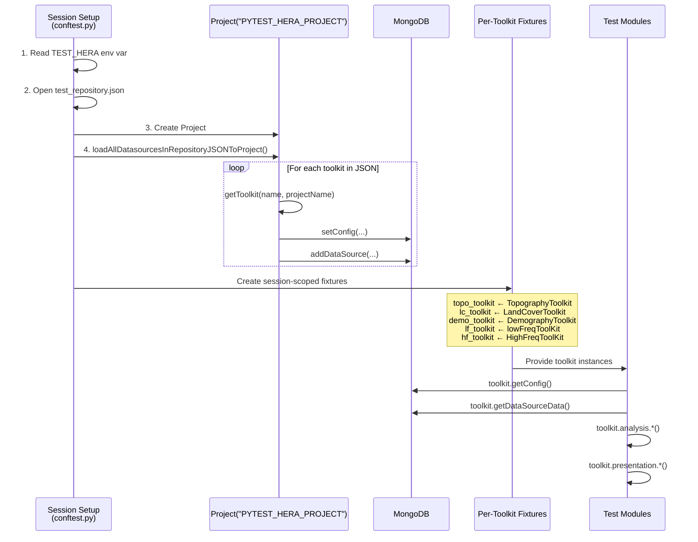

# Testing Guide — How to Run Tests

## Overview

The Hera test infrastructure uses **native Pytest** with a **Project-based data access** pattern.
All tests live under `hera/tests/` and can be executed with a single `pytest` command.

Data is loaded once per session into a shared Hera **Project** via `test_repository.json`,
and each toolkit test module receives a real toolkit instance backed by MongoDB —
no monkey-patching of `getConfig` / `getDataSourceData` is needed.

!!! tip "Key Principle"
    Tests do NOT know where files are stored on disk.
    They interact only with the Project and Toolkit APIs, exactly as production code does.

---

## Architecture

```
hera/
├── pytest.ini                          # Pytest configuration
├── hera/
│   ├── utils/data/toolkit.py           # dataToolkit (enhanced with direct-load methods)
│   └── tests/
│       ├── conftest.py                 # Session-scoped project, per-toolkit fixtures, helpers
│       ├── test_datalayer.py           # Project CRUD tests
│       ├── test_repository.py          # Repository add/get/load, path resolution
│       ├── test_topography.py          # TopographyToolkit tests
│       ├── test_landcover.py           # LandCoverToolkit tests
│       ├── test_lowfreq.py             # lowFreqToolKit + analysis + presentation
│       ├── test_highfreq.py            # HighFreqToolKit + calculators + turbulence
│       ├── test_demography.py          # DemographyToolkit tests
│       ├── repository/testCases/       # Test JSON data for repository tests
│       └── datalayer/testCases/        # Test JSON data for datalayer tests
└── ~/hera_unittest_data/               # External test data repository
    ├── data_config.json                # Data configuration metadata
    ├── test_repository.json            # Hera-format repository mapping all test data
    ├── measurements/                   # Raw test data files
    │   ├── GIS/raster/                 # HGT, TIF files
    │   ├── GIS/vector/                 # SHP files
    │   └── meteorology/               # Parquet files (low/high freq)
    └── expected/                       # Expected output result sets
        ├── BASELINE/
        ├── REGRESSION_20251113_1556/
        └── demo/
```

### Data Flow



---

## Prerequisites

### 1. Python Environment

```bash
cd /home/ilay/hera
source heraenv/bin/activate
pip install pytest   # if not already installed
```

### 2. Test Data Repository

The tests rely on external data files stored in `~/hera_unittest_data/`.
This directory must contain:

- `data_config.json` — metadata about paths, assets, and result sets
- `test_repository.json` — Hera-format repository mapping all test datasources to their toolkits
- `measurements/` — raw data files (HGT, TIF, SHP, Parquet, etc.)
- `expected/` — expected output files organized by result set

### 3. MongoDB

All toolkit tests require a running MongoDB instance.
The session-scoped project fixture loads data into MongoDB at startup and cleans up on teardown.

### 4. Environment Variables

| Variable | Required | Default | Description |
|----------|----------|---------|-------------|
| `TEST_HERA` | No | `~/hera_unittest_data` | Path to the test data repository root |
| `RESULT_SET` | No | `BASELINE` | Name of the expected-output result set |
| `PREPARE_EXPECTED_OUTPUT` | No | (unset) | Set to `"1"` to generate expected outputs instead of comparing |

See also: [Environment Variables Reference](../configuration/env_vars.md)

---

## How to Run Tests

### Run All Tests

```bash
cd /home/ilay/hera
source heraenv/bin/activate
export TEST_HERA=~/hera_unittest_data
pytest hera/tests/ -v
```

### Run a Specific Test Module

```bash
pytest hera/tests/test_datalayer.py -v
pytest hera/tests/test_repository.py -v
pytest hera/tests/test_topography.py -v
pytest hera/tests/test_landcover.py -v
pytest hera/tests/test_lowfreq.py -v
pytest hera/tests/test_highfreq.py -v
pytest hera/tests/test_demography.py -v
```

### Run a Specific Test Class or Function

```bash
# Run all tests in a class
pytest hera/tests/test_topography.py::TestGetPointElevation -v

# Run a single test
pytest hera/tests/test_topography.py::TestGetPointElevation::test_basic -v
```

### Choose a Result Set

```bash
# Via CLI option
pytest hera/tests/ --result-set BASELINE -v

# Via environment variable
export RESULT_SET=REGRESSION_20251113_1556
pytest hera/tests/ -v
```

### Run with Short Traceback

```bash
pytest hera/tests/ -v --tb=short
```

### Run Only Fast Tests (skip slow)

```bash
pytest hera/tests/ -v -m "not slow"
```

### Run with Parallel Workers (requires pytest-xdist)

```bash
pip install pytest-xdist
pytest hera/tests/ -v -n auto
```

### Generate Expected Outputs

When you need to update the baseline after intentional changes:

```bash
PREPARE_EXPECTED_OUTPUT=1 pytest hera/tests/ -v
```

This will write the current test outputs as the new expected outputs instead of comparing against existing ones.

---

## `test_repository.json` — Test Data Mapping

The file `~/hera_unittest_data/test_repository.json` maps test data files to Hera toolkit datasources
using the standard Hera repository JSON format. All paths are relative to the JSON file's directory.

| Toolkit Key | Config | DataSources |
|-------------|--------|-------------|
| `GIS_Raster_Topography` | `defaultSRTM: SRTMGL1` | `SRTMGL1` → `measurements/GIS/raster` (directory, format: string) |
| `GIS_LandCover` | `defaultLandCover: lc_mcd12q1` | `lc_mcd12q1` → `measurements/GIS/raster/lc_mcd12q1.tif` (format: string) |
| `GIS_Demography` | — | `lamas_population` → `measurements/GIS/vector/population_lamas.shp` (format: geopandas) |
| `MeteoLowFreq` | — | `YAVNEEL` → `measurements/meteorology/lowfreqdata/YAVNEEL.parquet` (format: parquet) |
| `MeteoHighFreq` | — | `slicedYamim_sonic` + `slicedYamim_TRH` → `measurements/meteorology/highfreqdata/` (format: parquet) |

To add new test data, add entries to this JSON and they will automatically be loaded into the test project.

See also: [Repository Examples](../examples/repository_examples.md) and [Repository Schema Reference](../reference/repository_schema.md)

---

## Test Modules — Detailed Description

### `test_datalayer.py`

Tests for `hera.datalayer.project.Project` CRUD operations.

| Test | Description |
|------|-------------|
| `test_project_init` | Verify Project creation and basic properties |
| `test_add_measurements_document` | Add a document, verify it persists |
| `test_get_measurements_documents` | Query documents by resource/format/type |
| `test_delete_measurements_documents` | Delete all documents, verify removal |
| `test_add_and_read_counters` | Read/write Counter documents via setConfig/getConfig |

**Requires:** MongoDB connection

---

### `test_repository.py`

Tests for `hera.utils.data.toolkit.dataToolkit` (repository management).

| Test | Description |
|------|-------------|
| `test_add_repository` | Register a repository JSON via `addRepository` |
| `test_get_repository` | Retrieve and verify loaded JSON content |
| `test_load_datasources_to_project` | Full round-trip: load repository JSON, assert correct document count |
| `test_resolve_relative_paths` | Verify `isRelativePath` handling produces absolute paths |
| `test_absolute_paths_unchanged` | Verify absolute paths are not modified |
| `test_load_repository_from_path` | Test the direct-load method (no MongoDB) |
| `test_load_repository_nonexistent` | Verify FileNotFoundError for missing files |

**Requires:** MongoDB connection (for add/get/load tests), test JSON in `repository/testCases/`

---

### `test_topography.py`

Tests for `hera.measurements.GIS.raster.topography.TopographyToolkit`.
Uses the `topo_toolkit` fixture from conftest (backed by project datasource `SRTMGL1`).

| Test | Description |
|------|-------------|
| `test_basic` (getPointElevation) | Single point elevation lookup |
| `test_second_file` | Elevation from a different HGT tile |
| `test_matches_hgt_file` | Verify toolkit result matches raw HGT binary read |
| `test_basic` (getPointListElevation) | Elevation for multiple points |
| `test_matches_hgt_files` | Multi-point comparison against raw HGT data |
| `test_basic` (getElevationOfXarray) | Elevation grid via xarray Dataset |
| `test_matches_hgt_file` (xarray) | Xarray grid comparison against raw HGT data |
| `test_basic` (getElevation) | Area elevation via bounding box |
| `test_matches_hgt_file` (area) | Area elevation comparison against raw HGT data |
| `test_basic` (convertPointsCRS) | CRS conversion (WGS84 -> ITM) |
| `test_basic` (createElevationSTL) | STL string generation |
| `test_basic` (getElevationSTL) | STL from existing Dataset |
| `test_basic` (calculateStatistics) | Mean, min, max statistics |

**Data source:** `SRTMGL1` (HGT directory path via `getDataSourceData`)

---

### `test_landcover.py`

Tests for `hera.measurements.GIS.raster.landcover.LandCoverToolkit`.
Uses the `lc_toolkit` fixture from conftest (backed by project datasource `lc_mcd12q1`).

| Test | Description |
|------|-------------|
| `test_basic` (getLandCoverAtPoint) | Land cover value at a single point |
| `test_against_raster` | Compare toolkit result with raw rasterio read |
| `test_basic` (getLandCover) | Land cover map for a bounding box |
| `test_map_vs_raster` | Sampled map values vs. raster file |
| `test_at_point` (roughness) | Roughness at a point |
| `test_area` (roughness) | Roughness map for a bounding box |
| `test_values_in_range` | Verify roughness values are within expected range |
| `test_roughnesslength2sandgrainroughness` | Conversion function |
| `test_known_landcover` | Known land cover value -> expected roughness |
| `test_out_of_bounds` | IndexError for out-of-bounds coordinates |
| `test_get_coding_map` | Coding map structure and values |

**Data source:** `lc_mcd12q1` (file path via `getDataSourceData`, opened with rasterio by toolkit)

---

### `test_lowfreq.py`

Tests for `hera.measurements.meteorology.lowfreqdata.toolkit.lowFreqToolKit`.
Uses the `lf_toolkit` fixture from conftest (backed by project datasource `YAVNEEL`).

| Category | Tests |
|----------|-------|
| Toolkit Init | `test_has_analysis`, `test_has_presentation`, `test_has_docType`, `test_docType_value` |
| Analysis | `test_basic` (addDatesColumns), `test_max_normalized`, `test_density`, `test_y_normalized_behaviour`, `test_basic` (resampleSecondMoments) |
| Presentation | `test_plotScatter`, `test_dateLinePlot`, `test_plotProbContourf`, `test_plotProbContourf_bySeason` |
| Data Matching | `test_dateLinePlot_matches_data`, `test_plotScatter_matches_data` |
| Edge Cases | `test_scatter_empty_dataframe`, `test_scatter_nan_and_outliers`, `test_scatter_WS_field` |
| Distribution | `test_contourf_distribution_ranges` |
| Save | `test_scatter_creates_non_empty_image` |

**Data source:** `YAVNEEL` (parquet via `getDataSourceData`, returns dask DataFrame → `.compute()`)

---

### `test_highfreq.py`

Tests for `hera.measurements.meteorology.highfreqdata` toolkit, analysis calculators, and turbulence statistics.
Uses the `hf_toolkit` fixture from conftest (backed by datasources `slicedYamim_sonic` and `slicedYamim_TRH`).

| Category | Tests |
|----------|-------|
| Toolkit | `test_docType_property` |
| Data Reading | `test_read_sonic_data`, `test_read_trh_data`, `test_read_nonexistent_datasource` |
| Time Range | `test_sonic_time_range`, `test_trh_time_range` |
| Specific Points | `test_sonic_first_row`, `test_trh_first_row` |
| Error Paths | `test_campbelToParquet_nonexistent`, `test_asciiToParquet_nonexistent` |
| AbstractCalculator | `test_init_basic`, `test_sampling_window`, `test_compute_methods_exist`, `test_set_save_properties` |
| MeanDataCalculator | `test_calculate_mean`, `test_hour_and_timeWithinDay`, `test_horizontalSpeed`, `test_sigma_sigmaH`, `test_Ustar_and_uStarOverWindSpeed`, `test_compute_returns_dataframe` |
| Advanced MeanData | `test_TKE`, `test_MOLength` |
| RawdataAnalysis | `test_singlePointTurbulenceStatistics_returns_instance`, `test_raises_on_invalid`, `test_AveragingCalculator`, `test_AveragingCalculator_raises_on_invalid` |
| Turbulence Stats | `test_instantiation`, `test_invalid_input_type`, `test_fluctuations`, `test_secondMoments`, `test_sigma`, `test_horizontalSpeed`, `test_Ustar`, `test_TKE`, `test_MOLength_Sonic` |

**Data sources:** `slicedYamim_sonic`, `slicedYamim_TRH` (parquet via `getDataSourceData`)

---

### `test_demography.py`

Tests for `hera.measurements.GIS.vector.demography.DemographyToolkit`.
Uses the `demo_toolkit` fixture from conftest (backed by project datasource `lamas_population`).

| Test | Description |
|------|-------------|
| `test_basic` (calculatePopulationInPolygon) | Basic polygon intersection |
| `test_partial_intersection` | Partial polygon overlap |
| `test_outside_bounds` | Polygon completely outside data extent |
| `test_invalid_datasource` | ValueError for non-existing data source |
| `test_with_known_values` | Synthetic data with known population values |
| `test_simple` (createNewArea) | Create new area and verify total population |
| `test_creates_and_sets_path` (setDefaultDirectory) | Directory creation and path assignment |

**Data source:** `lamas_population` (geopandas via `getDataSourceData`)

---

## Shared Fixtures (conftest.py)

### Session-Scoped Project Fixtures

| Fixture | Description |
|---------|-------------|
| `test_hera_root` | Validated path to `~/hera_unittest_data` |
| `data_config` | Parsed `data_config.json` dict |
| `result_set` | Active result-set name |
| `expected_dir` | Path to `expected/<result_set>/` |
| `hera_test_project` | **The shared Hera Project** with all test data loaded from `test_repository.json` |
| `hera_project_name` | The string `"PYTEST_HERA_PROJECT"` |

### Per-Toolkit Fixtures (session-scoped)

| Fixture | Toolkit Class | Data Sources |
|---------|---------------|--------------|
| `topo_toolkit` | `TopographyToolkit` | SRTMGL1 (HGT directory) |
| `lc_toolkit` | `LandCoverToolkit` | lc_mcd12q1 (TIF path) |
| `demo_toolkit` | `DemographyToolkit` | lamas_population (SHP → GeoDataFrame) |
| `lf_toolkit` | `lowFreqToolKit` | YAVNEEL (parquet → dask/pandas) |
| `hf_toolkit` | `HighFreqToolKit` | slicedYamim_sonic, slicedYamim_TRH (parquet) |

### Function-Scoped Fixtures

| Fixture | Description |
|---------|-------------|
| `project_fixture` | Temporary Project with cleanup (for `test_datalayer.py`) |
| `data_toolkit_fixture` | dataToolkit instance |

---

## Comparison Helpers

Available in `conftest.py` for use in tests:

```python
from hera.tests.conftest import compare_dataframes, compare_dataarrays, compare_outputs

# DataFrame comparison with numeric tolerance
assert compare_dataframes(result_df, expected_df, rtol=1e-6, atol=1e-6)

# DataArray comparison
assert compare_dataarrays(result_da, expected_da)

# Type-based comparison (supports: dataframe, geodataframe, xarray, float, dict, etc.)
assert compare_outputs(result, expected, "dataframe")
```

For more details on the comparison system, see [Test Flow](flow.md).

---

## `dataToolkit` Helper Methods

Two static methods on `hera.utils.data.toolkit.dataToolkit` support direct loading without MongoDB:

### `loadRepositoryFromPath(json_path)` (static)

```python
from hera.utils.data.toolkit import dataToolkit

repo = dataToolkit.loadRepositoryFromPath("/path/to/repository.json")
# Returns dict with all relative resource paths resolved to absolute
```

### `resolveDataSourcePaths(repositoryJSON, basedir)` (static)

```python
resolved = dataToolkit.resolveDataSourcePaths(repo_dict, basedir="/data/root")
# Deep-copies the dict and resolves all relative resource paths
```

---

## Troubleshooting

### Tests are skipped

- **"TEST_HERA directory not found"** — Set `TEST_HERA` env var or create `~/hera_unittest_data/`
- **"test_repository.json not found"** — Create the repository JSON (see `test_repository.json` section above)
- **"datasource not loaded in project"** — Verify MongoDB is running and the repository JSON is valid

### MongoDB connection errors

All toolkit tests (topography, landcover, demography, lowfreq, highfreq) require an active MongoDB instance.
The session-scoped `hera_test_project` fixture loads data into MongoDB at startup and cleans it up on teardown.

### Matplotlib backend issues

Presentation tests (plots) may require a non-interactive backend:

```bash
export MPLBACKEND=Agg
pytest hera/tests/test_lowfreq.py -v
```

See also: [Troubleshooting](../troubleshooting.md)

---

## Adding New Test Data

1. Place the data file under `~/hera_unittest_data/measurements/<appropriate_subdir>/`
2. Add an entry to `~/hera_unittest_data/test_repository.json` under the appropriate toolkit key
3. The data will be automatically loaded into the test project on the next test run
4. In your test module, access the data via `toolkit.getDataSourceData("your_datasource_name")`

---

## Adding New Tests

### Step-by-Step Guide

1. **Add test data** to `~/hera_unittest_data/measurements/<subdir>/`
2. **Update `test_repository.json`** with a new entry under the appropriate toolkit key
3. **Add a fixture** in `conftest.py` (session-scoped, depends on `hera_test_project`)
4. **Create a test module** `hera/tests/test_<name>.py`
5. **Use the fixture** to get a real toolkit instance — no file paths in tests
6. **Compare outputs** using `compare_outputs()` and expected files under `expected/BASELINE/`

### Example: Adding a New Toolkit Test

```python
# In conftest.py — add a session-scoped fixture
@pytest.fixture(scope="session")
def my_toolkit(hera_test_project):
    from hera.my_module import MyToolkit
    return MyToolkit(projectName=PYTEST_PROJECT_NAME)

# In test_my_toolkit.py
class TestMyToolkit:
    def test_basic(self, my_toolkit):
        data = my_toolkit.getDataSourceData("my_datasource")
        assert data is not None
        # ... assertions ...
```

---

## Related Documentation

- [Test Flow](flow.md) — Deep dive into the Pytest session lifecycle and comparison system
- [Repository Examples](../examples/repository_examples.md) — Examples of `test_repository.json` structure
- [Repository Schema Reference](../reference/repository_schema.md) — Complete schema documentation
- [Environment Variables](../configuration/env_vars.md) — All test-related environment variables
