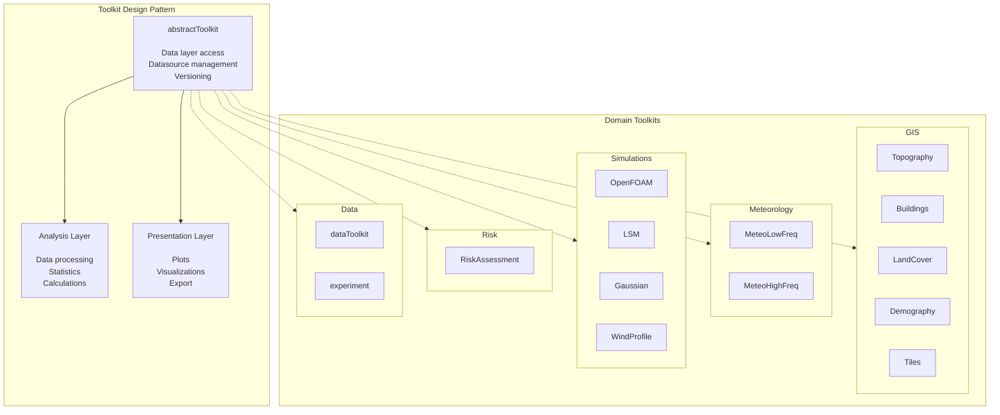
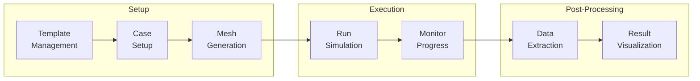
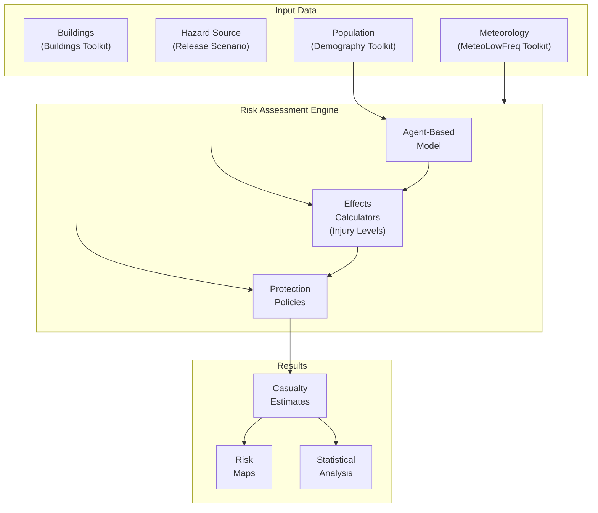

# Toolkit Catalog

This page provides a comprehensive overview of all built-in toolkits in Hera, organized by domain. Each section describes the toolkit's purpose, key methods, and its analysis/presentation pipeline.

---

## Toolkit Architecture

Every toolkit inherits from `abstractToolkit`, which itself inherits from `Project`. This means every toolkit has full data layer access plus domain-specific analysis and presentation capabilities.



<!-- mermaid source (for editing, paste into mermaid.live):

-->-> GIS_domain
    Base -.-> Meteo_domain
    Base -.-> Sim_domain
    Base -.-> Risk_domain
    Base -.-> Data_domain
```
-->
-->-> GIS_domain
    Base -.-> Meteo_domain
    Base -.-> Sim_domain
    Base -.-> Risk_domain
    Base -.-> Data_domain
```
-->
-->
-->

| Constant | Toolkit Name | Category | Class | Description |
|----------|-------------|----------|-------|-------------|
| `toolkitHome.GIS_RASTER_TOPOGRAPHY` | `"GIS_Raster_Topography"` | GIS | `TopographyToolkit` | Elevation data from SRTM, terrain analysis, STL generation |
| `toolkitHome.GIS_VECTOR_TOPOGRAPHY` | `"GIS_Vector_Topography"` | GIS | `TopographyToolkit` | Vector-based topography (contour lines, survey points) |
| `toolkitHome.GIS_BUILDINGS` | `"GIS_Buildings"` | GIS | `BuildingsToolkit` | Building footprints, 3D STL meshes for CFD |
| `toolkitHome.GIS_DEMOGRAPHY` | `"GIS_Demography"` | GIS | `DemographyToolkit` | Population data from census shapefiles |
| `toolkitHome.GIS_LANDCOVER` | `"GIS_LandCover"` | GIS | `LandCoverToolkit` | Land cover classification, surface roughness |
| `toolkitHome.GIS_TILES` | `"GIS_Tiles"` | GIS | `TilesToolkit` | Tile-based raster data management |
| `toolkitHome.METEOROLOGY_LOWFREQ` | `"MeteoLowFreq"` | Meteorology | `lowFreqToolKit` | Hourly/daily station data, analysis, visualization |
| `toolkitHome.METEOROLOGY_HIGHFREQ` | `"MeteoHighFreq"` | Meteorology | `HighFreqToolKit` | High-frequency sonic anemometer and TRH data |
| `toolkitHome.SIMULATIONS_OPENFOAM` | `"OpenFOAM"` | Simulations | `OFToolkit` | OpenFOAM CFD simulation lifecycle management |
| `toolkitHome.LSM` | `"LSM"` | Simulations | `LSMToolkit` | Lagrangian Stochastic Model for dispersion |
| `toolkitHome.GAUSSIANDISPERSION` | `"GaussianDispersion"` | Simulations | `gaussianToolkit` | Gaussian puff/plume dispersion models |
| `toolkitHome.WINDPROFILE` | `"WindProfile"` | Simulations | `WindProfileToolkit` | Vertical wind profile modeling |
| `toolkitHome.RISKASSESSMENT` | `"RiskAssessment"` | Risk | `RiskToolkit` | Agent-based risk assessment framework |
| `toolkitHome.EXPERIMENT` | `"experiment"` | Data | `experimentHome` | Experimental data workflow management |
| — | `"heraData"` | Data | `dataToolkit` | Repository management toolkit |

Use the constant instead of the string to avoid typos:

```python
from hera import toolkitHome

# Recommended: use the constant
topo = toolkitHome.getToolkit(toolkitHome.GIS_RASTER_TOPOGRAPHY, projectName="MY_PROJECT")

# Also works, but error-prone:
topo = toolkitHome.getToolkit("GIS_Raster_Topography", projectName="MY_PROJECT")
```

---

## GIS Toolkits

### GIS_Raster_Topography

**Class:** `hera.measurements.GIS.raster.topography.TopographyToolkit`

Provides elevation data access and terrain analysis from SRTM (HGT) files.

| Method | Description |
|--------|-------------|
| `getPointElevation(lat, lon)` | Get elevation at a single WGS84 coordinate |
| `getPointListElevation(points)` | Get elevations for a list of coordinates |
| `getElevation(minx, miny, maxx, maxy, dxdy)` | Get gridded elevation as xarray Dataset |
| `getElevationOfXarray(ds)` | Add elevation data to an existing xarray Dataset |
| `createElevationSTL(...)` | Generate STL mesh from elevation data |
| `convertPointsCRS(points, inputCRS, outputCRS)` | Transform coordinates between CRS |

**Analysis methods:** `calculateStatistics(elevation)` — domain size, min/max/mean elevation, standard deviation.

```python
from hera import toolkitHome

topo = toolkitHome.getToolkit(toolkitHome.GIS_RASTER_TOPOGRAPHY, projectName="MY_PROJECT")

# Single point elevation
elev = topo.getPointElevation(lat=32.5, long=35.2)

# Grid elevation
ds = topo.getElevation(minx=35.0, miny=32.0, maxx=35.1, maxy=32.1, dxdy=30)

# Generate STL for CFD simulations
stl = topo.createElevationSTL(ds, solidName="Terrain")
```

---

### GIS_Vector_Topography

**Class:** `hera.measurements.GIS.vector.topography.TopographyToolkit`

Works with vector-based topography data (contour lines, survey points). Provides region cutting, STL generation from vector data, and DEM format export.

| Method | Description |
|--------|-------------|
| `cutRegionFromSource(shape, datasource)` | Extract topography within a polygon |
| `regionToSTL(shape, dxdy, datasource)` | Generate STL mesh from vector topography |
| `toDEM(region, dxdy)` | Convert to DEM format string |

---

### GIS_Buildings

**Class:** `hera.measurements.GIS.vector.buildings.toolkit.BuildingsToolkit`

Manages building footprint data (typically from OpenStreetMap or cadastral sources) and converts them to 3D STL meshes for CFD simulations.

| Method | Description |
|--------|-------------|
| `getBuildingsFromRectangle(minx, miny, maxx, maxy)` | Get building footprints in a bounding box |
| `buildingsGeopandasToSTLRasterTopography(...)` | Convert buildings to 3D STL using raster topography |
| `regionToSTL(...)` | Generate complete building STL for a region |
| `get_buildings_height(gdf)` | Extract height from GeoDataFrame (uses levels * 3 if height missing) |

---

### GIS_Demography

**Class:** `hera.measurements.GIS.vector.demography.DemographyToolkit`

Population data analysis from census shapefiles (e.g., LAMAS Israel population data).

| Method | Description |
|--------|-------------|
| `calculatePopulationInPolygon(polygon, datasource)` | Calculate population within a polygon |
| `createNewArea(polygon, datasource)` | Create a new area GeoDataFrame from a polygon |
| `setDefaultDirectory(path)` | Set default data directory |

```python
demo = toolkitHome.getToolkit(toolkitHome.GIS_DEMOGRAPHY, projectName="MY_PROJECT")
pop = demo.calculatePopulationInPolygon(my_polygon, "lamas_population")
```

---

### GIS_LandCover

**Class:** `hera.measurements.GIS.raster.landcover.LandCoverToolkit`

Land cover classification data from MODIS MCD12Q1 and similar datasets. Provides surface roughness estimation for atmospheric simulations.

| Method | Description |
|--------|-------------|
| `getLandCoverAtPoint(lat, lon)` | Get land cover class at a single point |
| `getLandCover(minx, miny, maxx, maxy, dxdy)` | Get gridded land cover classification |
| `getRoughness(...)` | Calculate aerodynamic roughness length (z0) from land cover |

---

### GIS_Tiles

**Class:** `hera.measurements.GIS.raster.tiles.TilesToolkit`

Tile-based raster data management for large datasets.

---

## Meteorology Toolkits

### MeteoLowFreq

**Class:** `hera.measurements.meteorology.lowfreqdata.toolkit.lowFreqToolKit`

Manages low-frequency meteorological station data (hourly, daily). Provides comprehensive analysis and visualization capabilities.

#### Analysis Layer (`toolkit.analysis`)

| Method | Description |
|--------|-------------|
| `addDatesColumns(data, datecolumn)` | Add year, month, day, season columns to DataFrame |
| `calcHourlyDist(data, field, density)` | Calculate hourly distribution of a variable |
| `resampleSecondMoments(data, ...)` | Resample second-moment statistics |
| `matchDataWithOther(data, other, field)` | Match and merge two station datasets |

**Seasons:** Winter (DJF), Spring (MAM), Summer (JJA), Autumn (SON)

#### Presentation Layer (`toolkit.presentation`)

The presentation layer has two sub-layers:

- **`dailyPlots`** — Daily cycle visualizations
    - `plotScatter(data, plotField)` — Scatter plot of a variable over time
    - `plotDaily(data, plotField)` — Daily aggregated plot

- **`seasonalPlots`** — Seasonal analysis plots
    - `plotProbContourf_bySeason(data, fields)` — Probability contour plot by season
    - `plotSeasonalHourly(data, field)` — Seasonal hourly distribution

```python
lf = toolkitHome.getToolkit(toolkitHome.METEOROLOGY_LOWFREQ, projectName="MY_PROJECT")

# Load data
df = lf.getDataSourceData("YAVNEEL").compute()

# Enrich with date columns
enriched = lf.analysis.addDatesColumns(df, datecolumn="datetime")

# Create visualizations
ax = lf.presentation.dailyPlots.plotScatter(enriched, plotField="RH")
ax = lf.presentation.seasonalPlots.plotProbContourf_bySeason(enriched, fields=["T", "RH"])
```

---

### MeteoHighFreq

**Class:** `hera.measurements.meteorology.highfreqdata.toolkit.HighFreqToolKit`

Manages high-frequency (10-20 Hz) sonic anemometer and TRH sensor data.

#### Analysis Layer (`toolkit.analysis`)

The analysis layer (`RawdataAnalysis`) provides:

- **Data Calculators** — Mean, turbulence statistics, eddy covariance
- **Quality Control** — Spike detection, stationarity tests
- **Spectral Analysis** — Power spectra, co-spectra

#### Data Formats

| Doc Type | Description |
|----------|-------------|
| `StationsData` | Station metadata documents |
| `MeasurementsData` | Raw measurement time series |

```python
hf = toolkitHome.getToolkit(toolkitHome.METEOROLOGY_HIGHFREQ, projectName="MY_PROJECT")

# Load sonic data
sonic_df = hf.getDataSourceData("slicedYamim_sonic").compute()

# Run analysis
stats = hf.analysis.calculateMeanData(sonic_df)
```

---

## Simulation Toolkits

### OpenFOAM

**Class:** `hera.simulations.openFoam.toolkit.OFToolkit`

Full lifecycle management for OpenFOAM CFD simulations.



<!-- mermaid source (for editing, paste into mermaid.live):

-->

    Templates --> CaseSetup --> Mesh
    Mesh --> RunCase --> Monitor
    Monitor --> Analysis_OF --> Visualization
```
-->
-->

    Templates --> CaseSetup --> Mesh
    Mesh --> RunCase --> Monitor
    Monitor --> Analysis_OF --> Visualization
```
-->
-->
-->

| Phase | Step | Description |
|-------|------|-------------|
| Setup | Template Management | Save, load, and manage OpenFOAM case templates |
| Setup | Case Setup | Configure boundary conditions, solver settings |
| Setup | Mesh Generation | blockMesh, snappyHexMesh integration |
| Execution | Run Simulation | Run cases, parallel execution (MPI) |
| Execution | Monitor Progress | Track solver convergence and residuals |
| Post-Processing | Data Extraction | Extract fields, probes, sample data |
| Post-Processing | Visualization | Generate plots and ParaView-ready output |

| Capability | Description |
|------------|-------------|
| Template Management | Save, load, and manage OpenFOAM case templates |
| Case Setup | Configure boundary conditions, solver settings |
| Mesh Generation | blockMesh, snappyHexMesh integration |
| Simulation Control | Run cases, parallel execution (MPI) |
| Post-Processing | Extract data, generate visualizations |

---

### LSM

**Class:** `hera.simulations.LSM.toolkit.LSMToolkit`

Lagrangian Stochastic Model (LSM) for atmospheric dispersion simulations.

| Capability | Description |
|------------|-------------|
| Model Setup | Configure particle release, domain, meteorology |
| Simulation Runs | Execute LSM computations |
| Analysis | Concentration statistics, plume characteristics |
| Presentation | Concentration maps, particle trajectories |

---

### GaussianDispersion

**Class:** `hera.simulations.gaussian.toolkit.gaussianToolkit`

Gaussian dispersion modeling for atmospheric pollutant transport.

| Capability | Description |
|------------|-------------|
| Cloud Dispersion | Gaussian puff/plume models |
| Meteorology Integration | Wind field and stability class handling |
| Concentration Estimation | Downwind concentration calculations |

---

### WindProfile

**Class:** `hera.simulations.windProfile.toolkit.WindProfileToolkit`

Vertical wind profile modeling and analysis.

---

## Risk Assessment

### RiskAssessment

**Class:** `hera.riskassessment.riskToolkit.RiskToolkit`

Agent-based risk assessment modeling framework.



<!-- mermaid source (for editing, paste into mermaid.live):

-->s
    Effects --> Protection
    Protection --> Casualties
    Casualties --> RiskMaps
    Casualties --> Analysis_RA
```
-->
-->s
    Effects --> Protection
    Protection --> Casualties
    Casualties --> RiskMaps
    Casualties --> Analysis_RA
```
-->
-->
-->

| Component | Description |
|-----------|-------------|
| **Agents** | Agent-based population model with spatial distribution |
| **Effects** | Injury level calculators (thermal, toxic, overpressure) |
| **Protection Policies** | Sheltering, evacuation, response models |
| **Analysis** | Casualty statistics, risk quantification |
| **Presentation** | Risk maps, casualty roses, bar plots |

---

## Data & Utility Toolkits

### dataToolkit

**Class:** `hera.utils.data.toolkit.dataToolkit`

The special repository management toolkit. See [Data Layer](../architecture/data_layer.md) for full documentation.

### experiment

**Class:** `hera.measurements.experiment.experiment.experimentHome`

Manages experimental data workflows — organizing raw data files into structured experiments with metadata tracking.
