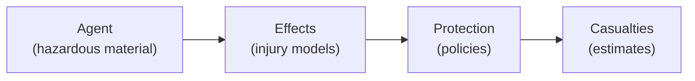

# Risk Assessment Toolkit

The Risk Assessment toolkit provides an agent-based framework for modeling hazards, calculating injury effects, applying protection policies, and estimating casualties.

```python
from hera import toolkitHome

risk = toolkitHome.getToolkit("RiskAssessment", projectName="MY_PROJECT")
```

---

## Concepts

The risk assessment framework models a chain of events:

1. **Hazard source** releases a dangerous agent (chemical, thermal, blast)
2. The agent **disperses** through the environment (using simulation toolkits like Gaussian or LSM)
3. **Effects** are calculated on the exposed population based on dose, concentration, or overpressure
4. **Protection policies** (sheltering, evacuation) modify the exposure
5. **Casualties** are estimated based on injury levels



---

## Agents

An **Agent** represents a hazardous material with its associated effects (injury models). Agents are loaded from a repository.

```python
# List available agents
risk.listAgentsNames()
# ['Chlorine', 'Ammonia', 'Propane']

# Load an agent
agent = risk.getAgent("Chlorine")

# Access agent properties
print(agent.name)                # "Chlorine"
print(agent.effectNames)         # ['inhalation', 'thermal']
print(agent.tenbergeCoefficient) # Tenberge coefficient for the agent

# Access a specific effect
inhalation_effect = agent["inhalation"]
```

### Creating an agent repository

From the CLI:

```bash
# Create an agent repository from JSON files
hera-riskassessment agents createRepository myAgents --path /path/to/agents/
```

---

## Effects and injury levels

Effects calculators determine the injury level based on exposure parameters (concentration, duration, distance, etc.). Each agent can have multiple effect types.

---

## Protection policies

Protection policies model how sheltering, evacuation, or other protective actions reduce exposure. A `ProtectionPolicy` object defines the protection level and its impact on the effect calculations.

---

## Analysis

The analysis layer provides:

- **Risk area calculation** — determine the geographic area at risk for a given scenario
- **Casualty estimation** — estimate the number and severity of casualties
- **Statistical analysis** — aggregate results across multiple scenarios or weather conditions

```python
# Access the analysis layer
risk.analysis

# Access the presentation layer for visualizations
risk.presentation
```

---

## Presentation

The presentation layer generates visualizations:

- **Casualty plots** — bar charts and spatial maps of estimated casualties
- **Risk maps** — geographic visualization of risk zones
- **Casualty roses** — directional risk distribution

---

## Integration with other toolkits

Risk assessment typically uses data from several other toolkits:

| Input | Source toolkit | Purpose |
|-------|--------------|---------|
| Population data | `GIS_Demography` | Number and distribution of people at risk |
| Building footprints | `GIS_Buildings` | Sheltering factors and indoor/outdoor ratios |
| Terrain | `GIS_Raster_Topography` | Elevation effects on dispersion |
| Weather | `MeteoLowFreq` | Wind speed, direction, stability for dispersion |
| Dispersion results | `GaussianDispersion` or `LSM` | Concentration fields from source to receptor |

```python
# A typical risk assessment workflow
topo = toolkitHome.getToolkit("GIS_Raster_Topography", projectName="MY_PROJECT")
demo = toolkitHome.getToolkit("GIS_Demography", projectName="MY_PROJECT")
meteo = toolkitHome.getToolkit("MeteoLowFreq", projectName="MY_PROJECT")
risk = toolkitHome.getToolkit("RiskAssessment", projectName="MY_PROJECT")

# Each toolkit contributes its domain data to the risk analysis
```

For the full API details, see the [Toolkit Catalog](overview.md) and the [API Reference](../developer_guide/api/risk.md).
