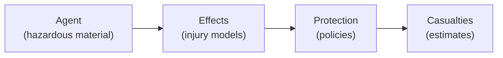

# Risk Assessment Toolkit

The Risk Assessment toolkit provides an agent-based framework for modeling hazards, calculating injury effects, applying protection policies, and estimating casualties.

```python
from hera import toolkitHome

risk = toolkitHome.getToolkit(toolkitHome.RISKASSESSMENT, projectName="MY_PROJECT")
```

---

## Concepts

The risk assessment framework models a chain of events:

1. **Hazard source** releases a dangerous agent (chemical, thermal, blast)
2. The agent **disperses** through the environment (using simulation toolkits like Gaussian or LSM)
3. **Effects** are calculated on the exposed population based on dose, concentration, or overpressure
4. **Protection policies** (sheltering, evacuation) modify the exposure
5. **Casualties** are estimated based on injury levels



---

## Agents

An **Agent** represents a hazardous material with its associated effects (injury models). Agents are loaded from a repository.

```python
# List available agents
risk.listAgentsNames()
# ['Chlorine', 'Ammonia', 'Propane']

# Load an agent
agent = risk.getAgent("Chlorine")

# Access agent properties
print(agent.name)                # "Chlorine"
print(agent.effectNames)         # ['inhalation', 'thermal']
print(agent.tenbergeCoefficient) # Tenberge coefficient for the agent

# Access a specific effect
inhalation_effect = agent["inhalation"]
```

### Creating an agent repository

From the CLI:

```bash
# Create an agent repository from JSON files
hera-riskassessment agents createRepository myAgents --path /path/to/agents/
```

---

## Effects and injury levels

Each agent has one or more **effects** — named injury models that describe how exposure to the agent harms a population. An effect combines two things: a **calculator** that computes the toxic load from concentration data, and one or more **injury levels** that map the toxic load to a percentage of people affected.

### The chain: Concentration → Toxic Load → Injury

```
Concentration field    →    Calculator    →    Toxic Load    →    Injury Levels    →    % Affected
(from dispersion)          (Haber/TenBerge)    (cumulative)       (Severe/Mild/...)     (per level)
```

1. A dispersion simulation (LSM or Gaussian) produces a **concentration field** — concentration values over space and time
2. A **calculator** integrates the concentration over time to produce a **toxic load** (dose)
3. **Injury levels** convert the toxic load into a percentage of the population affected at each severity

### Calculators

Calculators determine *how* concentration is converted to dose. The choice depends on the toxicological model for the agent:

| Calculator | What it computes | When to use |
|-----------|-----------------|-------------|
| **Haber** | `D(T) = integral(C dt)` — simple time integral | Agents where dose is proportional to concentration × time |
| **Ten Berge** | `D(T) = integral(C^n dt)` — concentration raised to power n | Agents where higher concentrations are disproportionately more dangerous (most real chemicals) |
| **Max Concentration** | Peak concentration value | Agents where the instantaneous peak matters, not cumulative dose |

The Ten Berge exponent `n` (the `tenbergeCoefficient`) is an agent property — it controls how much weight is given to high vs. low concentrations. When `n=1`, Ten Berge reduces to Haber.

All calculators accept concentration data as either `pandas.DataFrame` or `xarray.Dataset`, and account for the population's breathing rate.

### Injury levels

Injury levels define the **dose-response relationship** — given a toxic load, what percentage of the population is affected? Each effect can have multiple severity levels (e.g., Severe, Mild, Light):

| Injury level type | Dose-response model | Parameters |
|------------------|--------------------|-----------|
| **Lognormal10** | Log-normal CDF (base 10) | `TL_50` (toxic load at 50% effect), `sigma` (spread) |
| **Threshold** | Binary: 0% below, 100% above | `threshold` value |
| **Exponential** | Exponential curve | `k` (rate parameter) |

The most common model is **Lognormal10**, which uses two parameters per severity level:

- **TL_50** — the toxic load at which 50% of the population is affected
- **sigma** — how steep the dose-response curve is

### How effects are defined in the agent JSON

Each effect in the agent descriptor specifies the calculator, the dose-response model, and the parameters for each severity level:

```json
{
    "effects": {
        "RegularPopulation": {
            "type": "Lognormal10",
            "calculator": {
                "TenBerge": {"breathingRate": 10}
            },
            "parameters": {
                "type": "Lognormal10DoseResponse",
                "levels": ["Severe", "Mild", "Light"],
                "parameters": {
                    "Severe": {"TL_50": 1000, "sigma": 0.5},
                    "Mild":   {"TL_50": 100,  "sigma": 0.4},
                    "Light":  {"TL_50": 10,   "sigma": 0.3}
                }
            }
        }
    }
}
```

This defines an effect called `"RegularPopulation"` that:

- Uses the **Ten Berge** calculator with a breathing rate of 10 L/min
- Has **Lognormal10** dose-response at three severity levels
- At a toxic load of 1000, 50% of the population has Severe injuries

### Working with effects in code

#### Loading an agent and exploring its effects

```python
risk = toolkitHome.getToolkit(toolkitHome.RISKASSESSMENT, projectName="MY_PROJECT")

# Load an agent
agent = risk.getAgent("Chlorine")

# Agent-level properties
print(agent.name)                  # 'Chlorine'
print(agent.tenbergeCoefficient)   # 2.0
print(agent.effectNames)           # ['RegularPopulation']
```

#### Inspecting an effect

```python
# Access an effect by name (dictionary-style)
effect = agent["RegularPopulation"]

# The effect's calculator
print(type(effect.calculator))     # <class 'CalculatorTenBerge'>

# List all severity levels in this effect
print(effect.levelNames)           # ['Severe', 'Mild', 'Light']
```

#### Inspecting injury levels

Each severity level has its own dose-response parameters:

```python
# Access a specific injury level
severe = effect["Severe"]
mild = effect["Mild"]
light = effect["Light"]

# For Lognormal10 levels, inspect the parameters:
# TL_50 — the toxic load at which 50% of the population is affected
# sigma — the spread of the dose-response curve
print(f"Severe: TL_50={severe.TL_50}, sigma={severe.sigma}")
print(f"Mild:   TL_50={mild.TL_50}, sigma={mild.sigma}")
print(f"Light:  TL_50={light.TL_50}, sigma={light.sigma}")

# For Threshold levels:
# threshold — the binary cutoff value
# print(f"Threshold: {level.threshold}")

# For Exponential levels:
# k — the rate parameter
# print(f"k: {level.k}")
```

#### Computing toxic loads and injury percentages

```python
# Given a concentration field from a dispersion simulation:
# concentration_data is an xarray.Dataset with a "C" field

# Step 1: Calculate toxic loads using the effect
toxic_loads = effect.calculateToxicLoads(concentration_data, field="C")

# Step 2: Get the percentage affected at each severity level
# for a given toxic load value
toxic_load_value = 500
percent_severe = effect.getPercent("Severe", toxic_load_value)
percent_mild = effect.getPercent("Mild", toxic_load_value)
print(f"At toxic load {toxic_load_value}: {percent_severe:.1%} severe, {percent_mild:.1%} mild")

# Step 3: Calculate contours of injury regions on a 2D map
contours = severe.calculateContours(toxic_loads, time="datetime", x="x", y="y")
# Returns a GeoDataFrame with polygons for each time step and severity level
```

#### Modifying the Ten Berge coefficient

The Ten Berge coefficient can be changed after loading — this rebuilds all effects:

```python
# Change the exponent (e.g., for sensitivity analysis)
agent.tenbergeCoefficient = 1.5
# All effects are automatically recalculated with the new coefficient
```

#### Serializing an agent

```python
# Export agent to JSON (for saving or inspection)
import json
print(json.dumps(agent.toJSON(), indent=2))
```

### Physical properties

Agents can also have physical properties used for evaporation and dispersion modeling:

```python
# Access physical properties
props = agent.physicalproperties

# Molecular weight, density, vapor pressure at a temperature
mw = props.molecularWeight           # e.g., 70.9 g/mol
density = props.getDensity(20)       # density at 20°C
volatility = props.getVolatility(20) # vapor saturation at 20°C
vp = props.vaporPressure(293)        # vapor pressure at 293K
```

---

## Protection policies

Protection policies model how sheltering, evacuation, or other protective actions reduce exposure. A `ProtectionPolicy` builds a **pipeline of actions** that modify the concentration field before injury calculations.

### Indoor sheltering

The indoor model computes the indoor concentration `Cin` based on the outdoor concentration `Cout` and the building's air exchange rate:

```
Cin[t] = (Cin[t-1] + alpha × dt × Cout[t]) / (1 + alpha × dt)
```

Where `alpha = 1/turnover` is the air exchange rate. A longer turnover time means better protection (slower air exchange).

```python
from hera.riskassessment import ProtectionPolicy
from hera.utils import ureg

# Create a policy with indoor sheltering
policy = ProtectionPolicy()
policy.indoor(
    turnover=2*ureg.hour,    # air exchange every 2 hours
    enter="5min",            # population enters buildings 5 min after release
    stay="2h"                # stays indoor for 2 hours
)

# Apply to a concentration field
protected = policy.compute(concentration_data, C="C")
```

### Masking

Masks reduce the inhaled concentration by a protection factor:

```python
policy.masks(
    protectionFactor=1000,   # mask reduces concentration by 1000x
    wear="0min",             # masks on immediately
    duration="3h"            # worn for 3 hours
)
```

### Chaining actions

Actions can be chained — each modifies the concentration field for the next:

```python
policy = ProtectionPolicy()
policy.indoor(turnover=2*ureg.hour, enter="5min", stay="2h") \
      .masks(protectionFactor=100, wear="0min", duration="3h")
result = policy.compute(concentration_data, C="C")
```

---

## Analysis

The analysis layer provides:

- **Risk area calculation** — determine the geographic area at risk for a given scenario
- **Casualty estimation** — estimate the number and severity of casualties
- **Statistical analysis** — aggregate results across multiple scenarios or weather conditions

```python
# Access the analysis layer
risk.analysis

# Access the presentation layer for visualizations
risk.presentation
```

---

## Presentation

The presentation layer generates visualizations:

- **Casualty plots** — bar charts and spatial maps of estimated casualties
- **Risk maps** — geographic visualization of risk zones
- **Casualty roses** — directional risk distribution

---

## Integration with other toolkits

Risk assessment typically uses data from several other toolkits:

| Input | Source toolkit | Purpose |
|-------|--------------|---------|
| Population data | `GIS_Demography` | Number and distribution of people at risk |
| Building footprints | `GIS_Buildings` | Sheltering factors and indoor/outdoor ratios |
| Terrain | `GIS_Raster_Topography` | Elevation effects on dispersion |
| Weather | `MeteoLowFreq` | Wind speed, direction, stability for dispersion |
| Dispersion results | `GaussianDispersion` or `LSM` | Concentration fields from source to receptor |

```python
# A typical risk assessment workflow
topo = toolkitHome.getToolkit(toolkitHome.GIS_RASTER_TOPOGRAPHY, projectName="MY_PROJECT")
demo = toolkitHome.getToolkit(toolkitHome.GIS_DEMOGRAPHY, projectName="MY_PROJECT")
meteo = toolkitHome.getToolkit(toolkitHome.METEOROLOGY_LOWFREQ, projectName="MY_PROJECT")
risk = toolkitHome.getToolkit(toolkitHome.RISKASSESSMENT, projectName="MY_PROJECT")

# Each toolkit contributes its domain data to the risk analysis
```

For the full API details, see the [Toolkit Catalog](overview.md) and the [API Reference](../developer_guide/api/risk.md).
