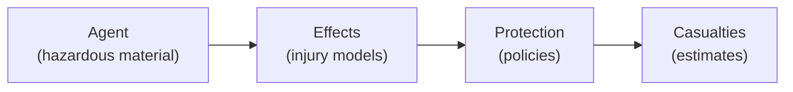

# Risk Assessment Toolkit

The Risk Assessment toolkit provides an agent-based framework for modeling hazards, calculating injury effects, applying protection policies, and estimating casualties.

```python
from hera import toolkitHome

risk = toolkitHome.getToolkit(toolkitHome.RISKASSESSMENT, projectName="MY_PROJECT")
```

---

## Concepts

The risk assessment framework models a chain of events:

1. **Hazard source** releases a dangerous agent (chemical, thermal, blast)
2. The agent **disperses** through the environment (using simulation toolkits like Gaussian or LSM)
3. **Effects** are calculated on the exposed population based on dose, concentration, or overpressure
4. **Protection policies** (sheltering, evacuation) modify the exposure
5. **Casualties** are estimated based on injury levels



<!-- mermaid source (for editing, paste into mermaid.live):

-->jury models)"]
    Effects --> Protection["Protection\n(policies)"]
    Protection --> Casualties["Casualties\n(estimates)"]
```
-->
-->jury models)"]
    Effects --> Protection["Protection\n(policies)"]
    Protection --> Casualties["Casualties\n(estimates)"]
```
-->
-->
-->

---

## Agents

An **Agent** represents a hazardous material with its associated effects (injury models). Agents are loaded from a repository.

```python
# List available agents
risk.listAgentsNames()
# ['Chlorine', 'Ammonia', 'Propane']

# Load an agent
agent = risk.getAgent("Chlorine")

# Access agent properties
print(agent.name)                # "Chlorine"
print(agent.effectNames)         # ['inhalation', 'thermal']
print(agent.tenbergeCoefficient) # Tenberge coefficient for the agent

# Access a specific effect
inhalation_effect = agent["inhalation"]
```

### Creating an agent repository

From the CLI:

```bash
# Create an agent repository from JSON files
hera-riskassessment agents createRepository myAgents --path /path/to/agents/
```

---

## Effects and injury levels

Each agent has one or more **effects** — named injury models that describe how exposure to the agent harms a population. An effect combines two things: a **calculator** that computes the toxic load from concentration data, and one or more **injury levels** that map the toxic load to a percentage of people affected.

### The chain: Concentration → Toxic Load → Injury

```
Concentration field    →    Calculator    →    Toxic Load    →    Injury Levels    →    % Affected
(from dispersion)          (Haber/TenBerge)    (cumulative)       (Severe/Mild/...)     (per level)
```

1. A dispersion simulation (LSM or Gaussian) produces a **concentration field** — concentration values over space and time
2. A **calculator** integrates the concentration over time to produce a **toxic load** (dose)
3. **Injury levels** convert the toxic load into a percentage of the population affected at each severity

### Calculators

Calculators determine *how* concentration is converted to dose. The choice depends on the toxicological model for the agent:

| Calculator | What it computes | When to use |
|-----------|-----------------|-------------|
| **Haber** | `D(T) = integral(C dt)` — simple time integral | Agents where dose is proportional to concentration × time |
| **Ten Berge** | `D(T) = integral(C^n dt)` — concentration raised to power n | Agents where higher concentrations are disproportionately more dangerous (most real chemicals) |
| **Max Concentration** | Peak concentration value | Agents where the instantaneous peak matters, not cumulative dose |

The Ten Berge exponent `n` (the `tenbergeCoefficient`) is an agent property — it controls how much weight is given to high vs. low concentrations. When `n=1`, Ten Berge reduces to Haber.

All calculators accept concentration data as either `pandas.DataFrame` or `xarray.Dataset`, and account for the population's breathing rate.

### Injury levels

Injury levels define the **dose-response relationship** — given a toxic load, what percentage of the population is affected? Each effect can have multiple severity levels (e.g., Severe, Mild, Light):

| Injury level type | Dose-response model | Parameters |
|------------------|--------------------|-----------|
| **Lognormal10** | Log-normal CDF (base 10) | `TL_50` (toxic load at 50% effect), `sigma` (spread) |
| **Threshold** | Binary: 0% below, 100% above | `threshold` value |
| **Exponential** | Exponential curve | `k` (rate parameter) |

#### Lognormal10

The most common model. Uses a log-normal cumulative distribution function (base 10) with two parameters per severity level:

- **TL_50** — the toxic load at which 50% of the population is affected
- **sigma** — how spread out the dose-response curve is (larger = more gradual transition)

The percentage affected at a given toxic load `D` is: `P(D) = CDF_lognormal(D; TL_50, sigma)`

**JSON format:**

```json
{
    "effects": {
        "RegularPopulation": {
            "type": "Lognormal10",
            "calculator": {
                "TenBerge": {"breathingRate": 10}
            },
            "parameters": {
                "type": "Lognormal10DoseResponse",
                "levels": ["Severe", "Mild", "Light"],
                "parameters": {
                    "Severe": {"TL_50": 1000, "sigma": 0.5},
                    "Mild":   {"TL_50": 100,  "sigma": 0.4},
                    "Light":  {"TL_50": 10,   "sigma": 0.3}
                }
            }
        }
    }
}
```

This defines an effect called `"RegularPopulation"` that uses the Ten Berge calculator and has three severity levels. At a toxic load of 1000, 50% of the population has Severe injuries.

#### Threshold

A binary model — 0% affected below the threshold, 100% above. Commonly used with the **MaxConcentration** calculator for acute exposure standards (e.g., AEGL, ERPG levels).

- **threshold** — the concentration value (with units) above which the population is affected

**JSON format:**

```json
{
    "effects": {
        "AEGL": {
            "type": "Threshold",
            "calculator": {
                "MaxConcentration": {"sampling": "10min"}
            },
            "parameters": {
                "type": "Threshold",
                "levels": ["AEGL-3", "AEGL-2", "AEGL-1"],
                "parameters": {
                    "AEGL-3": {"threshold": "50.0*mg/m**3"},
                    "AEGL-2": {"threshold": "8.6*mg/m**3"},
                    "AEGL-1": {"threshold": "1.5*mg/m**3"}
                }
            }
        }
    }
}
```

This defines three AEGL levels with concentration thresholds. The MaxConcentration calculator uses the peak concentration over a sampling period instead of a cumulative dose. At any point where the concentration exceeds the threshold, 100% of the population at that location is affected at that level.

#### Exponential

A smooth dose-response curve: `P(D) = 1 - exp(-k × D)`. The percentage affected increases continuously with toxic load, approaching 100% asymptotically.

- **k** — the rate parameter (larger = steeper response)

**JSON format:**

```json
{
    "effects": {
        "ExponentialEffect": {
            "type": "Exponential",
            "calculator": {
                "Haber": {"breathingRate": 10}
            },
            "parameters": {
                "type": "Exponential",
                "levels": ["HighExposure", "LowExposure"],
                "parameters": {
                    "HighExposure": {"k": 0.01},
                    "LowExposure":  {"k": 0.001}
                }
            }
        }
    }
}
```

### Combining calculators and injury levels

Any calculator can be paired with any injury level type. Common combinations:

| Use case | Calculator | Injury level | Example |
|---------|-----------|-------------|---------|
| Toxic gas (cumulative dose) | TenBerge | Lognormal10 | Chlorine inhalation over time |
| Acute exposure standards | MaxConcentration | Threshold | AEGL/ERPG concentration limits |
| Simple dose-response | Haber | Exponential | Linear dose accumulation |
| Sensitivity analysis | TenBerge | Lognormal10 | Vary `tenbergeCoefficient` to test assumptions |

### Working with effects in code

#### Loading an agent and exploring its effects

```python
risk = toolkitHome.getToolkit(toolkitHome.RISKASSESSMENT, projectName="MY_PROJECT")

# Load an agent
agent = risk.getAgent("Chlorine")

# Agent-level properties
print(agent.name)                  # 'Chlorine'
print(agent.tenbergeCoefficient)   # 2.0
print(agent.effectNames)           # ['RegularPopulation']
```

#### Inspecting an effect

```python
# Access an effect by name (dictionary-style)
effect = agent["RegularPopulation"]

# The effect's calculator
print(type(effect.calculator))     # <class 'CalculatorTenBerge'>

# List all severity levels in this effect
print(effect.levelNames)           # ['Severe', 'Mild', 'Light']
```

#### Inspecting injury levels

Each severity level has its own dose-response parameters:

```python
# Access a specific injury level
severe = effect["Severe"]
mild = effect["Mild"]
light = effect["Light"]

# For Lognormal10 levels, inspect the parameters:
# TL_50 — the toxic load at which 50% of the population is affected
# sigma — the spread of the dose-response curve
print(f"Severe: TL_50={severe.TL_50}, sigma={severe.sigma}")
print(f"Mild:   TL_50={mild.TL_50}, sigma={mild.sigma}")
print(f"Light:  TL_50={light.TL_50}, sigma={light.sigma}")

# For Threshold levels:
# threshold — the binary cutoff value
# print(f"Threshold: {level.threshold}")

# For Exponential levels:
# k — the rate parameter
# print(f"k: {level.k}")
```

#### Computing toxic loads and injury percentages

```python
# Given a concentration field from a dispersion simulation:
# concentration_data is an xarray.Dataset with a "C" field

# Step 1: Calculate toxic loads using the effect
toxic_loads = effect.calculateToxicLoads(concentration_data, field="C")

# Step 2: Get the percentage affected at each severity level
# for a given toxic load value
toxic_load_value = 500
percent_severe = effect.getPercent("Severe", toxic_load_value)
percent_mild = effect.getPercent("Mild", toxic_load_value)
print(f"At toxic load {toxic_load_value}: {percent_severe:.1%} severe, {percent_mild:.1%} mild")

# Step 3: Calculate contours of injury regions on a 2D map
contours = severe.calculateContours(toxic_loads, time="datetime", x="x", y="y")
# Returns a GeoDataFrame with polygons for each time step and severity level
```

#### Modifying the Ten Berge coefficient

The Ten Berge coefficient can be changed after loading — this rebuilds all effects:

```python
# Change the exponent (e.g., for sensitivity analysis)
agent.tenbergeCoefficient = 1.5
# All effects are automatically recalculated with the new coefficient
```

#### Serializing an agent

```python
# Export agent to JSON (for saving or inspection)
import json
print(json.dumps(agent.toJSON(), indent=2))
```

### Physical properties

Agents can also have physical properties used for evaporation and dispersion modeling:

```python
# Access physical properties
props = agent.physicalproperties

# Molecular weight, density, vapor pressure at a temperature
mw = props.molecularWeight           # e.g., 70.9 g/mol
density = props.getDensity(20)       # density at 20°C
volatility = props.getVolatility(20) # vapor saturation at 20°C
vp = props.vaporPressure(293)        # vapor pressure at 293K
```

---

## Protection policies

Protection policies model how sheltering, evacuation, or other protective actions reduce exposure. A `ProtectionPolicy` builds a **pipeline of actions** that modify the concentration field before injury calculations.

### Indoor sheltering

The indoor model computes the indoor concentration `Cin` based on the outdoor concentration `Cout` and the building's air exchange rate:

```
Cin[t] = (Cin[t-1] + alpha × dt × Cout[t]) / (1 + alpha × dt)
```

Where `alpha = 1/turnover` is the air exchange rate. A longer turnover time means better protection (slower air exchange).

```python
from hera.riskassessment import ProtectionPolicy
from hera.utils import ureg

# Create a policy with indoor sheltering
policy = ProtectionPolicy()
policy.indoor(
    turnover=2*ureg.hour,    # air exchange every 2 hours
    enter="5min",            # population enters buildings 5 min after release
    stay="2h"                # stays indoor for 2 hours
)

# Apply to a concentration field
protected = policy.compute(concentration_data, C="C")
```

### Masking

Masks reduce the inhaled concentration by a protection factor:

```python
policy.masks(
    protectionFactor=1000,   # mask reduces concentration by 1000x
    wear="0min",             # masks on immediately
    duration="3h"            # worn for 3 hours
)
```

### Chaining actions

Actions can be chained — each modifies the concentration field for the next:

```python
policy = ProtectionPolicy()
policy.indoor(turnover=2*ureg.hour, enter="5min", stay="2h") \
      .masks(protectionFactor=100, wear="0min", duration="3h")
result = policy.compute(concentration_data, C="C")
```

---

## Analysis

The analysis layer provides:

- **Risk area calculation** — determine the geographic area at risk for a given scenario
- **Casualty estimation** — estimate the number and severity of casualties
- **Statistical analysis** — aggregate results across multiple scenarios or weather conditions

```python
# Access the analysis layer
risk.analysis

# Access the presentation layer for visualizations
risk.presentation
```

---

## Presentation

The presentation layer generates visualizations:

- **Casualty plots** — bar charts and spatial maps of estimated casualties
- **Risk maps** — geographic visualization of risk zones
- **Casualty roses** — directional risk distribution

---

## Integration with other toolkits

Risk assessment typically uses data from several other toolkits:

| Input | Source toolkit | Purpose |
|-------|--------------|---------|
| Population data | `GIS_Demography` | Number and distribution of people at risk |
| Building footprints | `GIS_Buildings` | Sheltering factors and indoor/outdoor ratios |
| Terrain | `GIS_Raster_Topography` | Elevation effects on dispersion |
| Weather | `MeteoLowFreq` | Wind speed, direction, stability for dispersion |
| Dispersion results | `GaussianDispersion` or `LSM` | Concentration fields from source to receptor |

```python
# A typical risk assessment workflow
topo = toolkitHome.getToolkit(toolkitHome.GIS_RASTER_TOPOGRAPHY, projectName="MY_PROJECT")
demo = toolkitHome.getToolkit(toolkitHome.GIS_DEMOGRAPHY, projectName="MY_PROJECT")
meteo = toolkitHome.getToolkit(toolkitHome.METEOROLOGY_LOWFREQ, projectName="MY_PROJECT")
risk = toolkitHome.getToolkit(toolkitHome.RISKASSESSMENT, projectName="MY_PROJECT")

# Each toolkit contributes its domain data to the risk analysis
```

For the full API details, see the [Toolkit Catalog](overview.md) and the [API Reference](../developer_guide/api/risk.md).

---

## Complete Examples

### Example 1: Toxic gas release with Lognormal10 dose-response

This example models a chlorine gas release using the LSM dispersion model and Lognormal10 injury levels with the Ten Berge calculator. It covers the full pipeline: dispersion → concentration → toxic load → injury contours → casualty estimation.

```python
from hera import toolkitHome
from unum.units import kg, mg

# ---------------------------------------------------------------
# Step 1: Set up toolkits
# ---------------------------------------------------------------
PROJECT = "ChlorineRelease"

lsm  = toolkitHome.getToolkit(toolkitHome.LSM, projectName=PROJECT)
risk = toolkitHome.getToolkit(toolkitHome.RISKASSESSMENT, projectName=PROJECT)
demo = toolkitHome.getToolkit(toolkitHome.GIS_DEMOGRAPHY, projectName=PROJECT)

# ---------------------------------------------------------------
# Step 2: Run or retrieve an LSM dispersion simulation
# ---------------------------------------------------------------
# Option A: run a new simulation from a template
template = lsm.getTemplateByName("urban_chlorine")
template.run(
    topography="/data/topography",
    stations=weather_stations_df,
    simulationName="chlorine_run_001",
    windSpeed=3.0,
    windDirection=225,
    releaseRate=5.0
)

# Option B: retrieve an existing simulation
simulations = lsm.getSimulations(windSpeed=3.0, windDirection=225)
sim = simulations[0]

# ---------------------------------------------------------------
# Step 3: Get concentration field
# ---------------------------------------------------------------
# Q = total released mass (scales the normalized LSM output)
concentration = sim.getConcentration(Q=500 * kg)
# Result: xarray.Dataset with 'C' field in mg/m³ at each (x, y, z, datetime)

# ---------------------------------------------------------------
# Step 4: Load the agent and compute toxic loads
# ---------------------------------------------------------------
agent = risk.getAgent("Chlorine")
print(f"Agent: {agent.name}")
print(f"Ten Berge coefficient: {agent.tenbergeCoefficient}")
print(f"Effects: {agent.effectNames}")

# The agent has a Lognormal10 effect with Ten Berge calculator
effect = agent["RegularPopulation"]
print(f"Calculator: {type(effect.calculator).__name__}")  # CalculatorTenBerge
print(f"Severity levels: {effect.levelNames}")            # ['Severe', 'Mild', 'Light']

# Compute toxic loads: integral(C^n dt) over time
# Uses concentration at ground level (z=0 or z=10)
toxic_loads = effect.calculateToxicLoads(
    concentration.sel(z=10),
    field="C"
)

# ---------------------------------------------------------------
# Step 5: Calculate injury contours
# ---------------------------------------------------------------
# Get contour polygons for the Severe injury level
severe_contours = effect["Severe"].calculateContours(
    toxic_loads,
    time="datetime",
    x="x",
    y="y"
)
# Result: GeoDataFrame with columns:
#   datetime | severity | percentEffected | TotalPolygon | DiffPolygon

# ---------------------------------------------------------------
# Step 6: Project onto population data for casualty estimates
# ---------------------------------------------------------------
# Load demographic data
population = demo.getDataSourceData("census_2020")

# Project injury contours onto population
release_location = (178000, 665000)  # ITM coordinates
wind_direction_math = 45  # mathematical angle

casualties = severe_contours.project(
    demographic=population,
    loc=release_location,
    mathematical_angle=wind_direction_math
)

# Result: DataFrame with affected population per severity level
print(casualties.groupby("severity")["effectedtotal_pop"].sum())

# ---------------------------------------------------------------
# Step 7: Apply protection policy (optional)
# ---------------------------------------------------------------
from hera.riskassessment import ProtectionPolicy
from hera.utils import ureg

policy = ProtectionPolicy()
policy.indoor(turnover=2 * ureg.hour, enter="10min", stay="3h")

# Apply protection to the concentration field before computing toxic loads
protected_concentration = policy.compute(concentration.sel(z=10), C="C")

# Recalculate with protected concentrations
protected_toxic_loads = effect.calculateToxicLoads(protected_concentration, field="C")
protected_contours = effect["Severe"].calculateContours(
    protected_toxic_loads, time="datetime", x="x", y="y"
)

# Compare casualties with and without protection
protected_casualties = protected_contours.project(
    demographic=population,
    loc=release_location,
    mathematical_angle=wind_direction_math
)
print("Without protection:", casualties["effectedtotal_pop"].sum())
print("With indoor shelter:", protected_casualties["effectedtotal_pop"].sum())

# ---------------------------------------------------------------
# Step 8: Visualize
# ---------------------------------------------------------------
risk.presentation.plotCasualtiesRose(
    results=severe_contours,
    area=population,
    severityList=["Severe", "Mild"],
    loc=release_location,
    meteorological_angles=[0, 45, 90, 135, 180, 225, 270, 315]
)
```

---

### Example 2: Industrial accident with Threshold (AEGL) dose-response

This example models an industrial chemical release using AEGL threshold levels with the MaxConcentration calculator. Instead of cumulative dose, AEGL uses peak concentration over a sampling period.

```python
from hera import toolkitHome
from unum.units import kg

# ---------------------------------------------------------------
# Step 1: Set up toolkits
# ---------------------------------------------------------------
PROJECT = "IndustrialAccident"

lsm  = toolkitHome.getToolkit(toolkitHome.LSM, projectName=PROJECT)
risk = toolkitHome.getToolkit(toolkitHome.RISKASSESSMENT, projectName=PROJECT)
demo = toolkitHome.getToolkit(toolkitHome.GIS_DEMOGRAPHY, projectName=PROJECT)

# ---------------------------------------------------------------
# Step 2: Get concentration from LSM simulation
# ---------------------------------------------------------------
sim = lsm.getSimulations(simulationName="factory_release")[0]
concentration = sim.getConcentration(Q=100 * kg)

# ---------------------------------------------------------------
# Step 3: Load an agent with Threshold effects
# ---------------------------------------------------------------
# This agent uses AEGL levels — binary thresholds based on peak
# concentration, not cumulative dose.
#
# Agent JSON looks like:
# {
#     "name": "HydrogenFluoride",
#     "effectParameters": {"tenbergeCoefficient": 1},
#     "effects": {
#         "AEGL10min": {
#             "type": "Threshold",
#             "calculator": {"MaxConcentration": {"sampling": "10min"}},
#             "parameters": {
#                 "type": "Threshold",
#                 "levels": ["AEGL-3", "AEGL-2", "AEGL-1"],
#                 "parameters": {
#                     "AEGL-3": {"threshold": "139*mg/m**3"},
#                     "AEGL-2": {"threshold": "34*mg/m**3"},
#                     "AEGL-1": {"threshold": "1.3*mg/m**3"}
#                 }
#             }
#         }
#     }
# }

agent = risk.getAgent("HydrogenFluoride")
print(f"Agent: {agent.name}")
print(f"Effects: {agent.effectNames}")  # ['AEGL10min']

# Access the AEGL effect
aegl = agent["AEGL10min"]
print(f"Calculator: {type(aegl.calculator).__name__}")  # CalculatorMaxConcentration
print(f"Levels: {aegl.levelNames}")  # ['AEGL-3', 'AEGL-2', 'AEGL-1']

# ---------------------------------------------------------------
# Step 4: Inspect threshold values
# ---------------------------------------------------------------
for level_name in aegl.levelNames:
    level = aegl[level_name]
    print(f"{level_name}: threshold = {level.threshold}")
    # AEGL-3: threshold = 139 mg/m³ (life-threatening)
    # AEGL-2: threshold = 34 mg/m³  (irreversible health effects)
    # AEGL-1: threshold = 1.3 mg/m³ (notable discomfort)

# ---------------------------------------------------------------
# Step 5: Calculate injury regions
# ---------------------------------------------------------------
# The MaxConcentration calculator finds the peak concentration
# at each location over the sampling period.
# The Threshold injury level then marks locations where
# peak concentration exceeds each AEGL threshold.

# Calculate contours for the most severe level (AEGL-3)
aegl3_contours = aegl["AEGL-3"].calculateContours(
    concentration.sel(z=10),
    time="datetime",
    x="x",
    y="y"
)

# Calculate for all levels
aegl2_contours = aegl["AEGL-2"].calculateContours(
    concentration.sel(z=10),
    time="datetime",
    x="x",
    y="y"
)

aegl1_contours = aegl["AEGL-1"].calculateContours(
    concentration.sel(z=10),
    time="datetime",
    x="x",
    y="y"
)

# ---------------------------------------------------------------
# Step 6: Estimate affected population
# ---------------------------------------------------------------
population = demo.getDataSourceData("census_2020")
release_location = (180000, 663000)  # ITM coordinates

# Project each AEGL zone onto population
for name, contours in [("AEGL-3", aegl3_contours),
                        ("AEGL-2", aegl2_contours),
                        ("AEGL-1", aegl1_contours)]:
    if len(contours) > 0:
        casualties = contours.project(
            demographic=population,
            loc=release_location,
            mathematical_angle=45
        )
        if casualties is not None:
            total = casualties["effectedtotal_pop"].sum()
            print(f"{name}: {total:.0f} people in affected zone")
        else:
            print(f"{name}: no affected population")
    else:
        print(f"{name}: concentration below threshold everywhere")

# ---------------------------------------------------------------
# Step 7: Compare with protection (masks)
# ---------------------------------------------------------------
from hera.riskassessment import ProtectionPolicy
from hera.utils import ureg

# Gas masks with protection factor 1000
policy = ProtectionPolicy()
policy.masks(protectionFactor=1000, wear="5min", duration="4h")

protected = policy.compute(concentration.sel(z=10), C="C")

# With masks, the effective concentration is 1000x lower
# so fewer locations exceed the AEGL thresholds
aegl3_protected = aegl["AEGL-3"].calculateContours(
    protected, time="datetime", x="x", y="y"
)
print(f"AEGL-3 zone without masks: {len(aegl3_contours)} polygons")
print(f"AEGL-3 zone with masks:    {len(aegl3_protected)} polygons")
```

### Key differences between the two examples

| Aspect | Example 1 (Lognormal10) | Example 2 (Threshold) |
|--------|------------------------|----------------------|
| **Agent** | Chlorine | Hydrogen Fluoride |
| **Calculator** | TenBerge (`integral(C^n dt)`) | MaxConcentration (peak C) |
| **Injury model** | Lognormal10 — gradual % affected | Threshold — binary 0%/100% |
| **Parameters** | TL_50, sigma per severity | threshold (with units) per AEGL level |
| **Result** | % of population affected at each severity | Zone where concentration exceeds standard |
| **Use case** | Toxic exposure over time | Acute exposure standards (AEGL, ERPG) |
| **Protection** | Indoor sheltering (air exchange) | Gas masks (protection factor) |
