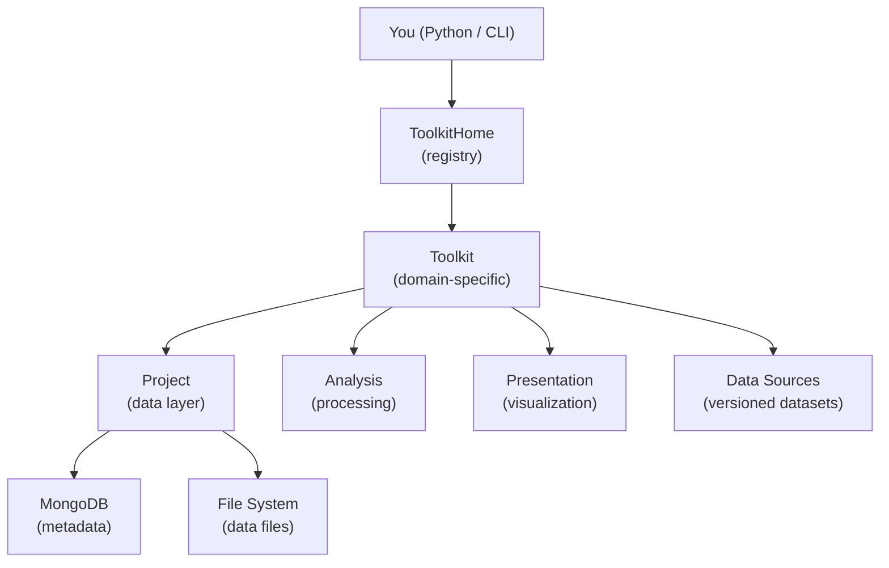

# Key Concepts

A gentle introduction to the main ideas behind Hera. Understanding these concepts will help you work effectively with the platform.

---

## The Big Picture: A Metadata-Driven Data Lake

At its core, Hera is a **data lake with a metadata layer**. Your data — weather observations, simulation outputs, GIS files, processed results — lives as ordinary files on disk. Hera doesn't move or copy those files. Instead, it stores **metadata documents** in MongoDB that describe each piece of data: what it is, where it lives, what format it's in, and any additional properties you attach to it.

```
┌─────────────────────────────────────────────────────┐
│                    MongoDB                          │
│                                                     │
│  ┌─────────────────────────────────────────┐        │
│  │ Document                                │        │
│  │   projectName: "WindStudy"              │        │
│  │   type: "WeatherStation"                │        │
│  │   dataFormat: "parquet"                 │        │
│  │   resource: "/data/station_A.parquet" ──┼──┐     │
│  │   desc:                                 │  │     │
│  │     station: "A"                        │  │     │
│  │     location: "Haifa"                   │  │     │
│  │     elevation: 120                      │  │     │
│  │     period: "2023-2024"                 │  │     │
│  └─────────────────────────────────────────┘  │     │
│                                               │     │
└───────────────────────────────────────────────┼─────┘
                                                │
                    ┌───────────────────────────┘
                    ▼
         ┌─────────────────────┐
         │  /data/             │
         │   station_A.parquet │  ← actual data on disk
         │   station_B.parquet │
         │   dem_30m.tif       │
         └─────────────────────┘
```

The `desc` field is a free-form dictionary — you can attach any metadata you need, forming a **tree-like structure** that you can later [query by any level of nesting](working_with_data.md#querying). This is what makes Hera different from simply organizing files in folders: every piece of data is searchable by any combination of its metadata fields. The `dataFormat` field tells Hera how to load the file — see [resource types](working_with_data.md#resource-types) for all supported formats.

### A small example: store and retrieve

```python
from hera import Project

proj = Project(projectName="WindStudy")

# Store: register a file with metadata
proj.addMeasurementsDocument(
    resource="/data/station_A.parquet",
    dataFormat="parquet",
    type="WeatherStation",
    desc={
        "station": "A",
        "location": "Haifa",
        "elevation": 120,
        "period": "2023-2024",
        "variables": ["temperature", "wind_speed", "wind_direction"]
    }
)

# Retrieve: find data by any metadata field
docs = proj.getMeasurementsDocuments(type="WeatherStation", location="Haifa")

# Load the actual data into a pandas DataFrame
df = docs[0].getData()
print(df.head())
```

You can query by any combination of fields — find all stations above 100m elevation, all data from 2024, all parquet files of a certain type, etc. The metadata acts as a catalog for your data lake.

### Three collections for different roles

Hera organizes documents into three collections based on their role in the scientific workflow:

| Collection | Role | Example |
|-----------|------|---------|
| **Measurements** | Raw input data that comes from the real world | Weather station files, GIS shapefiles, sensor readings |
| **Simulations** | Results produced by computational models | OpenFOAM output, dispersion model results |
| **Cache** | Derived or intermediate results | Processed statistics, function return values, aggregations |

This separation helps you understand the provenance of any piece of data — where it came from and what role it plays.

For details on adding data, data formats, the `type` field, and querying, see **[Working with Data](working_with_data.md)**.

---

## Toolkits: Portals to Specific Data Types

While Projects give you raw access to all your data, **Toolkits** provide a domain-specific lens. A toolkit understands a particular kind of data — how to read it, process it, and visualize it.

Think of toolkits as **portals**: each one is focused on a specific data type and knows the right questions to ask about it.

```python
from hera import toolkitHome

# The meteorology toolkit knows how to work with weather station data
meteo = toolkitHome.getToolkit("MeteoLowFreq", projectName="WindStudy")

# It manages named, versioned datasets
df = meteo.getDataSourceData("station_haifa")

# It provides domain-specific analysis
enriched = meteo.analysis.addDatesColumns(df, datecolumn="datetime")
hourly = meteo.analysis.calcHourlyDist(enriched, field="wind_speed")

# And domain-specific visualization
meteo.presentation.seasonalPlots.plotSeasonalHourly(enriched, field="wind_speed")
```

Without a toolkit, you'd query the raw project and handle all the data loading, processing, and plotting yourself. With a toolkit, the domain knowledge is built in:

| Without toolkit (raw Project) | With toolkit |
|------------------------------|-------------|
| `proj.getMeasurementsDocuments(type="WeatherStation", station="A")` | `meteo.getDataSourceData("station_haifa")` |
| Manual pandas processing | `meteo.analysis.addDatesColumns(df, ...)` |
| Manual matplotlib plotting | `meteo.presentation.dailyPlots.plotScatter(df, ...)` |
| You manage versions manually | `meteo.getDataSourceData("station_haifa", version=(1,0,0))` |

Each toolkit adds three things on top of the Project data layer:

1. **Data Sources** — versioned, named datasets (no need to remember query filters)
2. **Analysis** — domain-specific processing methods
3. **Presentation** — domain-specific visualizations

For the full details on projects — directory-based auto-detection, configuration, counters, and all data manipulation methods — see the **[Projects](projects.md)** page.

---

## Available Toolkits

Hera ships with built-in toolkits for several domains:

| Domain | Toolkits | What they do |
|--------|----------|-------------|
| **GIS** | Topography, Buildings, LandCover, Demography | Elevation data, building footprints, land classification, population |
| **Meteorology** | MeteoLowFreq, MeteoHighFreq | Weather station data (hourly and high-frequency) |
| **Simulations** | OpenFOAM, LSM, Gaussian, WindProfile | CFD, dispersion modeling, wind profiles |
| **Risk** | RiskAssessment | Agent-based hazard and casualty modeling |
| **Data** | experiment, dataToolkit | Experiment workflows, repository management |

You can also register your own custom toolkits. See the [Toolkit Catalog](../toolkits/overview.md) for detailed documentation of each toolkit.

---

## Data Sources

A **Data Source** is a versioned, named dataset managed by a toolkit. It is the primary way toolkits organize their data within a project.

Each data source has:

- **Name** — a human-readable identifier (e.g., `"YAVNEEL"`, `"Israel_DEM"`)
- **Version** — a 3-tuple `(major, minor, patch)` for tracking changes
- **Resource** — the actual data (file path, JSON, etc.)
- **Data format** — how to read the resource (parquet, netcdf, string, etc.)

```python
# List data sources for a toolkit
topo.getDataSourceList()
# ['Israel_DEM', 'SRTM_30m']

# Get a specific version
ds = topo.getDataSourceData("Israel_DEM", version=(1, 0, 0))

# Get the default version (latest or explicitly set)
ds = topo.getDataSourceData("Israel_DEM")

# View all data sources as a table
topo.getDataSourceTable()
```

### Versioning

Multiple versions of the same data source can coexist. When you request data without specifying a version, Hera returns:

1. The **default version** — if one is stored in the project config
2. The **latest version** — otherwise (highest version number), which is then automatically saved as the default for stable subsequent calls

```python
# Set a default version
topo.setDataSourceDefaultVersion("Israel_DEM", version=(1, 0, 0))
```

---

## Repositories

A **Repository** is a JSON file that describes a collection of data sources and their locations. Repositories make it easy to share and reproduce project setups — instead of manually adding data sources one by one, you load a repository file that configures everything at once.

```bash
# Register a repository
hera-project repository add my_repository.json

# Load it into a project
hera-project repository load my_repository MY_PROJECT
```

A repository JSON maps toolkit names to their data sources, configurations, and documents:

```json
{
    "MeteoLowFreq": {
        "Config": { "defaultStation": "YAVNEEL" },
        "Datasource": {
            "YAVNEEL": {
                "isRelativePath": "True",
                "item": {
                    "resource": "data/yavneel.parquet",
                    "dataFormat": "parquet"
                }
            }
        }
    }
}
```

---

## How it all fits together



1. You ask **ToolkitHome** for a toolkit by name
2. ToolkitHome finds and instantiates the right **Toolkit** class
3. The toolkit is bound to a **Project**, giving it access to MongoDB and the file system
4. You work with **Data Sources** through the toolkit — loading data, running analysis, creating visualizations
5. **Repositories** let you define and share entire project setups as JSON files

For the full technical details, see the [Core Concepts](../architecture/core_concepts.md) page in the Developer Guide.
