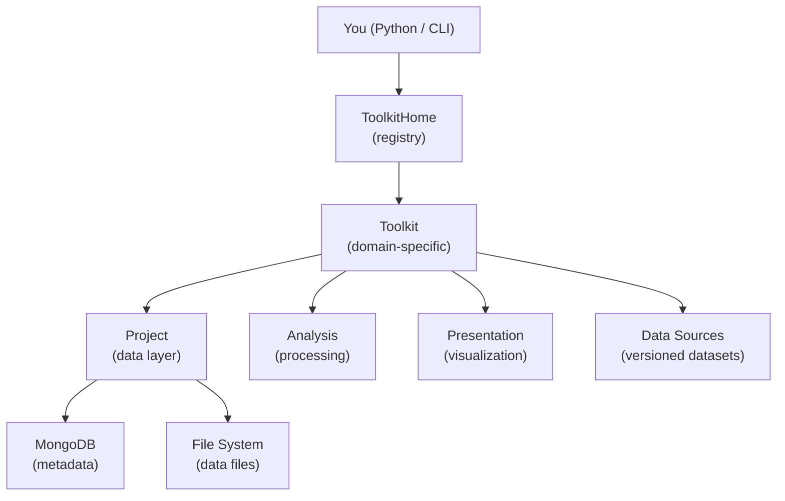

# Key Concepts

A gentle introduction to the main ideas behind Hera. Understanding these concepts will help you work effectively with the platform.

---

## What is Hera?

Hera is a platform for managing scientific data — measurements, simulations, and cached results — in a structured, reproducible way. It stores metadata in MongoDB and provides a Python API and CLI tools to organize, query, and process your data.

Everything in Hera revolves around three core ideas: **Projects**, **Toolkits**, and **Data Sources**.

---

## Projects

A **Project** is a container for all your data. Think of it as a workspace — every measurement file, simulation result, and cached computation belongs to a project.

```python
from hera import Project

proj = Project(projectName="MY_PROJECT")
```

A project gives you access to three document collections:

| Collection | What it stores | Example |
|-----------|---------------|---------|
| **Measurements** | Raw input data | Weather station readings, GIS shapefiles, sensor data |
| **Simulations** | Computation results | OpenFOAM output, dispersion model results |
| **Cache** | Derived/intermediate data | Processed statistics, function return values |

Each document in a collection has:

- **resource** — where the data lives (a file path or inline data)
- **dataFormat** — what kind of data it is (parquet, netcdf, JSON, etc.)
- **type** — an application-defined label for organizing documents
- **desc** — a free-form metadata dictionary for querying

Projects also support **configuration** (key-value settings) and **counters** (atomic sequential IDs), both stored in the database.

### Working with a Project

```python
# Add a measurement
proj.addMeasurementsDocument(
    resource="/data/weather/station_A.parquet",
    dataFormat="parquet",
    type="WeatherStation",
    desc={"station": "A", "location": "Haifa"}
)

# Query measurements
docs = proj.getMeasurementsDocuments(type="WeatherStation", station="A")

# Load the actual data
df = docs[0].getData()

# Save data with automatic format detection
proj.saveCacheData(name="daily_stats", data=stats_df, desc={"period": "2024"})
```

---

## Toolkits

A **Toolkit** is a domain-specific module built on top of a Project. Every toolkit inherits all of the Project's data layer capabilities, plus adds:

- **Analysis layer** — domain-specific data processing (statistics, calculations, transformations)
- **Presentation layer** — visualization and plotting
- **Data sources** — versioned, named datasets managed by the toolkit

You never create toolkits directly. Instead, you ask the **ToolkitHome** registry:

```python
from hera import toolkitHome

# Get a GIS toolkit
topo = toolkitHome.getToolkit("GIS_Raster_Topography", projectName="MY_PROJECT")

# Get a meteorology toolkit
meteo = toolkitHome.getToolkit("MeteoLowFreq", projectName="MY_PROJECT")
```

### What toolkits are available?

Hera ships with built-in toolkits for several domains:

| Domain | Toolkits | What they do |
|--------|----------|-------------|
| **GIS** | Topography, Buildings, LandCover, Demography | Elevation data, building footprints, land classification, population |
| **Meteorology** | MeteoLowFreq, MeteoHighFreq | Weather station data (hourly and high-frequency) |
| **Simulations** | OpenFOAM, LSM, Gaussian, WindProfile | CFD, dispersion modeling, wind profiles |
| **Risk** | RiskAssessment | Agent-based hazard and casualty modeling |
| **Data** | experiment, dataToolkit | Experiment workflows, repository management |

You can also register your own custom toolkits. See the [Toolkit Catalog](../toolkits/overview.md) for detailed documentation of each toolkit.

### Using a toolkit

Every toolkit follows the same pattern:

```python
# 1. Get the toolkit
lf = toolkitHome.getToolkit("MeteoLowFreq", projectName="MY_PROJECT")

# 2. Access data sources
df = lf.getDataSourceData("YAVNEEL")

# 3. Use analysis
enriched = lf.analysis.addDatesColumns(df, datecolumn="datetime")

# 4. Use presentation
ax = lf.presentation.dailyPlots.plotScatter(enriched, plotField="Temperature")
```

---

## Data Sources

A **Data Source** is a versioned, named dataset managed by a toolkit. It is the primary way toolkits organize their data within a project.

Each data source has:

- **Name** — a human-readable identifier (e.g., `"YAVNEEL"`, `"Israel_DEM"`)
- **Version** — a 3-tuple `(major, minor, patch)` for tracking changes
- **Resource** — the actual data (file path, JSON, etc.)
- **Data format** — how to read the resource (parquet, netcdf, string, etc.)

```python
# List data sources for a toolkit
topo.getDataSourceList()
# ['Israel_DEM', 'SRTM_30m']

# Get a specific version
ds = topo.getDataSourceData("Israel_DEM", version=(1, 0, 0))

# Get the default version (latest or explicitly set)
ds = topo.getDataSourceData("Israel_DEM")

# View all data sources as a table
topo.getDataSourceTable()
```

### Versioning

Multiple versions of the same data source can coexist. When you request data without specifying a version, Hera returns:

1. The **default version** — if one has been explicitly set
2. The **latest version** — otherwise (highest version number)

```python
# Set a default version
topo.setDataSourceDefaultVersion("Israel_DEM", version=(1, 0, 0))
```

---

## Repositories

A **Repository** is a JSON file that describes a collection of data sources and their locations. Repositories make it easy to share and reproduce project setups — instead of manually adding data sources one by one, you load a repository file that configures everything at once.

```bash
# Register a repository
hera-project repository add my_repository.json

# Load it into a project
hera-project repository load my_repository MY_PROJECT
```

A repository JSON maps toolkit names to their data sources, configurations, and documents:

```json
{
    "MeteoLowFreq": {
        "Config": { "defaultStation": "YAVNEEL" },
        "Datasource": {
            "YAVNEEL": {
                "isRelativePath": "True",
                "item": {
                    "resource": "data/yavneel.parquet",
                    "dataFormat": "parquet"
                }
            }
        }
    }
}
```

---

## How it all fits together



1. You ask **ToolkitHome** for a toolkit by name
2. ToolkitHome finds and instantiates the right **Toolkit** class
3. The toolkit is bound to a **Project**, giving it access to MongoDB and the file system
4. You work with **Data Sources** through the toolkit — loading data, running analysis, creating visualizations
5. **Repositories** let you define and share entire project setups as JSON files

For the full technical details, see the [Core Concepts](../architecture/core_concepts.md) page in the Developer Guide.
