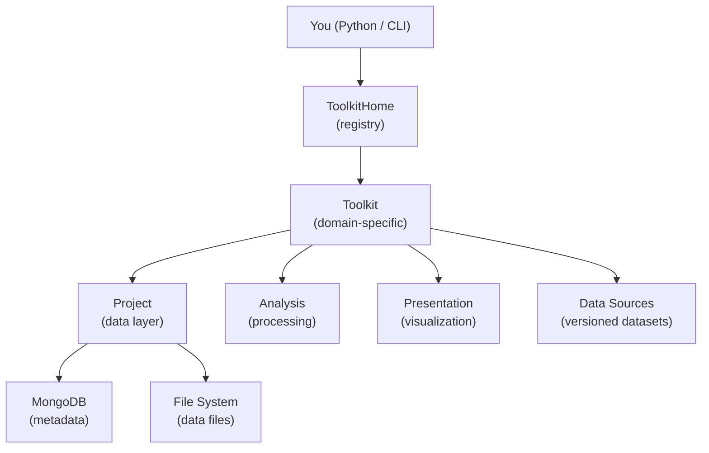

# Key Concepts

A gentle introduction to the main ideas behind Hera. Understanding these concepts will help you work effectively with the platform.

---

## The Big Picture: A Metadata-Driven Data Lake

At its core, Hera is a **data lake with a metadata layer**. Your data — weather observations, simulation outputs, GIS files, processed results — lives as ordinary files on disk. Hera doesn't move or copy those files. Instead, it stores **metadata documents** in MongoDB that describe each piece of data: what it is, where it lives, what format it's in, and any additional properties you attach to it.

```
┌─────────────────────────────────────────────────────┐
│                    MongoDB                          │
│                                                     │
│  ┌─────────────────────────────────────────┐        │
│  │ Document                                │        │
│  │   projectName: "WindStudy"              │        │
│  │   type: "WeatherStation"                │        │
│  │   dataFormat: "parquet"                 │        │
│  │   resource: "/data/station_A.parquet" ──┼──┐     │
│  │   desc:                                 │  │     │
│  │     station: "A"                        │  │     │
│  │     location: "Haifa"                   │  │     │
│  │     elevation: 120                      │  │     │
│  │     period: "2023-2024"                 │  │     │
│  └─────────────────────────────────────────┘  │     │
│                                               │     │
└───────────────────────────────────────────────┼─────┘
                                                │
                    ┌───────────────────────────┘
                    ▼
         ┌─────────────────────┐
         │  /data/             │
         │   station_A.parquet │  ← actual data on disk
         │   station_B.parquet │
         │   dem_30m.tif       │
         └─────────────────────┘
```

The `desc` field is a free-form dictionary — you can attach any metadata you need, forming a **tree-like structure** that you can later [query by any level of nesting](#querying). This is what makes Hera different from simply organizing files in folders: every piece of data is searchable by any combination of its metadata fields. The `dataFormat` field tells Hera how to load the file — see [resource types](#resource-types) for all supported formats.

### A small example: store and retrieve

```python
from hera import Project

proj = Project(projectName="WindStudy")

# Store: register a file with metadata
proj.addMeasurementsDocument(
    resource="/data/station_A.parquet",
    dataFormat="parquet",
    type="WeatherStation",
    desc={
        "station": "A",
        "location": "Haifa",
        "elevation": 120,
        "period": "2023-2024",
        "variables": ["temperature", "wind_speed", "wind_direction"]
    }
)

# Retrieve: find data by any metadata field
docs = proj.getMeasurementsDocuments(type="WeatherStation", location="Haifa")

# Load the actual data into a pandas DataFrame
df = docs[0].getData()
print(df.head())
```

You can query by any combination of fields — find all stations above 100m elevation, all data from 2024, all parquet files of a certain type, etc. The metadata acts as a catalog for your data lake.

### Three collections for different roles

Hera organizes documents into three collections based on their role in the scientific workflow:

| Collection | Role | Example |
|-----------|------|---------|
| **Measurements** | Raw input data that comes from the real world | Weather station files, GIS shapefiles, sensor readings |
| **Simulations** | Results produced by computational models | OpenFOAM output, dispersion model results |
| **Cache** | Derived or intermediate results | Processed statistics, function return values, aggregations |

This separation helps you understand the provenance of any piece of data — where it came from and what role it plays.

### The `type` field

The `type` field is a string label that you define to categorize documents within a collection. It has no fixed vocabulary — you choose type names that make sense for your domain. Hera uses `type` as the primary grouping mechanism for documents.

For example, within the Measurements collection you might have:

| `type` value | What it represents |
|-------------|-------------------|
| `"WeatherStation"` | Meteorological station data files |
| `"ToolkitDataSource"` | Versioned data sources managed by toolkits |
| `"Experiment_rawData"` | Raw experiment data files |
| `"BuildingFootprints"` | GIS building vector data |
| `"ElevationGrid"` | DEM / topography raster data |

Toolkits use `type` internally to organize their data — for instance, all toolkit data sources are stored with `type="ToolkitDataSource"`. When you query documents, `type` is typically the first filter you apply.

### Resource types (data formats) {#resource-types}

The `dataFormat` field tells Hera how to read the `resource`. When you call `doc.getData()`, Hera dispatches to the correct handler based on this field. The supported formats are:

| Format | `dataFormat` value | Python type returned by `getData()` | File extension |
|--------|-------------------|--------------------------------------|---------------|
| **Parquet** | `"parquet"` | `pandas.DataFrame` or `dask.DataFrame` | `.parquet` |
| **CSV** | `"csv_pandas"` | `pandas.DataFrame` | `.csv` |
| **HDF5** | `"HDF"` | `pandas.DataFrame` or `dask.DataFrame` | `.hdf` |
| **NetCDF** | `"netcdf_xarray"` | `xarray.Dataset` | `.nc` |
| **Zarr** | `"zarr_xarray"` | `xarray.Dataset` | `.zarr` |
| **GeoPackage** | `"geopandas"` | `geopandas.GeoDataFrame` | `.gpkg` |
| **GeoJSON** | `"JSON_geopandas"` | `geopandas.GeoDataFrame` | `.json` |
| **GeoTIFF** | `"geotiff"` | GDAL dataset | `.tif` |
| **JSON (dict)** | `"JSON_dict"` | `dict` | `.json` |
| **JSON (pandas)** | `"JSON_pandas"` | `pandas.DataFrame` | `.json` |
| **NumPy array** | `"numpy_array"` | `numpy.ndarray` | `.npy` |
| **NumPy dict** | `"numpy_dict_array"` | dict of `numpy.ndarray` | `.npz` |
| **Image** | `"image"` | `numpy.ndarray` (pixel data) | `.png` |
| **Pickle** | `"pickle"` | any Python object | `.pckle` |
| **String** | `"string"` | `str` | `.txt` |
| **Timestamp** | `"time"` | `pandas.Timestamp` | — |
| **Dict** | `"dict"` | `dict` (stored inline in resource) | — |
| **Class** | `"Class"` | class instance or class object | — |

When saving data with `proj.saveData()` or `proj.saveCacheData()`, Hera auto-detects the format from the Python object type (e.g., a `pandas.DataFrame` is saved as parquet, an `xarray.DataArray` as zarr).

### Querying the database {#querying}

Hera uses [MongoEngine](http://mongoengine.org/) under the hood. When you call `getMeasurementsDocuments()`, keyword arguments are translated into MongoDB queries. The `desc` fields are flattened using double-underscore (`__`) notation — the same convention MongoEngine uses for nested document queries.

**Basic queries** — filter by top-level fields:

```python
# Find by type
docs = proj.getMeasurementsDocuments(type="WeatherStation")

# Find by type and data format
docs = proj.getMeasurementsDocuments(type="WeatherStation", dataFormat="parquet")
```

**Querying nested `desc` fields** — pass desc fields directly as keyword arguments:

```python
# Find stations in Haifa
docs = proj.getMeasurementsDocuments(type="WeatherStation", location="Haifa")

# Find stations above 100m elevation
docs = proj.getMeasurementsDocuments(type="WeatherStation", elevation=120)
```

Behind the scenes, `location="Haifa"` becomes a MongoDB query on `desc.location`, using MongoEngine's `__` syntax: `desc__location="Haifa"`.

**Structured (nested) metadata queries** — when your `desc` has nested dictionaries, the double-underscore notation traverses the hierarchy:

```python
# Store a document with nested metadata
proj.addMeasurementsDocument(
    resource="/data/sim_result.nc",
    dataFormat="netcdf_xarray",
    type="DispersionRun",
    desc={
        "scenario": {
            "source": "factory_A",
            "release_rate": 10.0,
            "wind": {
                "speed": 5.0,
                "direction": 270
            }
        },
        "status": "completed"
    }
)

# Query by nested fields — Hera flattens them with __ notation
docs = proj.getSimulationsDocuments(
    type="DispersionRun",
    scenario__source="factory_A"            # desc.scenario.source
)

docs = proj.getSimulationsDocuments(
    type="DispersionRun",
    scenario__wind__speed=5.0               # desc.scenario.wind.speed
)

# Combine multiple nested filters
docs = proj.getSimulationsDocuments(
    type="DispersionRun",
    scenario__source="factory_A",
    scenario__wind__direction=270,
    status="completed"
)
```

This makes it possible to build rich, hierarchical metadata and query any level of the tree without loading documents into memory first.

### Building queries from dictionaries: `dictToMongoQuery`

When you pass keyword arguments to `getMeasurementsDocuments()`, Hera handles the flattening automatically. But sometimes you have a query as a Python dictionary — for example, loaded from a JSON config file or built programmatically. The utility function `dictToMongoQuery` converts a nested dictionary into MongoEngine's `__` query format:

```python
from hera.utils import dictToMongoQuery

# A nested query dict (e.g., loaded from JSON)
query_dict = {
    "scenario": {
        "source": "factory_A",
        "wind": {
            "speed": 5.0,
            "direction": 270
        }
    },
    "status": "completed"
}

# Convert to MongoEngine query format
mongo_query = dictToMongoQuery(query_dict)
# Result:
# {
#     "scenario__source": "factory_A",
#     "scenario__wind__speed": 5.0,
#     "scenario__wind__direction": 270,
#     "status": "completed"
# }

# Use it directly in a query
docs = proj.getMeasurementsDocuments(type="DispersionRun", **mongo_query)
```

The conversion rules:

| Input | Output |
|-------|--------|
| `{"field": "value"}` | `{"field": "value"}` |
| `{"field": {"sub": 1}}` | `{"field__sub": 1}` |
| `{"a": {"b": {"c": 3}}}` | `{"a__b__c": 3}` |
| `{"items": [10, 20]}` | `{"items__0": 10, "items__1": 20}` |

This is especially useful when your query parameters come from an external source (a JSON file, CLI arguments, or a repository configuration) rather than hardcoded keyword arguments.

Hera also provides `ConfigurationToJSON` (`hera.utils.jsonutils`) which handles the reverse direction — converting Python objects (including physical units via `Unum`) into JSON-safe dictionaries suitable for storing in `desc` fields. Together, these utilities form the bridge between structured Python data and MongoDB queries.

---

## Toolkits: Portals to Specific Data Types

While Projects give you raw access to all your data, **Toolkits** provide a domain-specific lens. A toolkit understands a particular kind of data — how to read it, process it, and visualize it.

Think of toolkits as **portals**: each one is focused on a specific data type and knows the right questions to ask about it.

```python
from hera import toolkitHome

# The meteorology toolkit knows how to work with weather station data
meteo = toolkitHome.getToolkit("MeteoLowFreq", projectName="WindStudy")

# It manages named, versioned datasets
df = meteo.getDataSourceData("station_haifa")

# It provides domain-specific analysis
enriched = meteo.analysis.addDatesColumns(df, datecolumn="datetime")
hourly = meteo.analysis.calcHourlyDist(enriched, field="wind_speed")

# And domain-specific visualization
meteo.presentation.seasonalPlots.plotSeasonalHourly(enriched, field="wind_speed")
```

Without a toolkit, you'd query the raw project and handle all the data loading, processing, and plotting yourself. With a toolkit, the domain knowledge is built in:

| Without toolkit (raw Project) | With toolkit |
|------------------------------|-------------|
| `proj.getMeasurementsDocuments(type="WeatherStation", station="A")` | `meteo.getDataSourceData("station_haifa")` |
| Manual pandas processing | `meteo.analysis.addDatesColumns(df, ...)` |
| Manual matplotlib plotting | `meteo.presentation.dailyPlots.plotScatter(df, ...)` |
| You manage versions manually | `meteo.getDataSourceData("station_haifa", version=(1,0,0))` |

Each toolkit adds three things on top of the Project data layer:

1. **Data Sources** — versioned, named datasets (no need to remember query filters)
2. **Analysis** — domain-specific processing methods
3. **Presentation** — domain-specific visualizations

---

## Projects (in detail)

A **Project** is a container for all your data. Think of it as a workspace — every measurement file, simulation result, and cached computation belongs to a project.

```python
from hera import Project

proj = Project(projectName="MY_PROJECT")
```

### Directory-based projects

You don't always need to specify the project name explicitly. If you omit `projectName`, Hera looks for a `caseConfiguration.json` file in the current working directory:

```json
{
    "projectName": "MY_PROJECT"
}
```

If the file is found, the project name is loaded from it automatically:

```python
# When run from a directory containing caseConfiguration.json:
proj = Project()  # projectName is loaded from the file
```

This is the recommended workflow for project directories — you create the project once with the CLI, and then any script run from that directory automatically connects to the right project:

```bash
# Create a project directory with its caseConfiguration.json
hera-project project create MY_PROJECT --directory /data/my_experiment

# Now work from that directory
cd /data/my_experiment
python my_analysis.py   # Project() inside the script picks up "MY_PROJECT" automatically
```

This convention means your scripts don't hardcode project names, making them portable across different projects. Toolkits work the same way — `toolkitHome.getToolkit("MeteoLowFreq")` without a `projectName` will also read from `caseConfiguration.json`.

If no `caseConfiguration.json` exists and no name is provided, Hera uses a read-only **default project** used internally for repository management.

Projects also support **configuration** (key-value settings) and **counters** (atomic sequential IDs), both stored in the database.

---

## Available Toolkits

Hera ships with built-in toolkits for several domains:

| Domain | Toolkits | What they do |
|--------|----------|-------------|
| **GIS** | Topography, Buildings, LandCover, Demography | Elevation data, building footprints, land classification, population |
| **Meteorology** | MeteoLowFreq, MeteoHighFreq | Weather station data (hourly and high-frequency) |
| **Simulations** | OpenFOAM, LSM, Gaussian, WindProfile | CFD, dispersion modeling, wind profiles |
| **Risk** | RiskAssessment | Agent-based hazard and casualty modeling |
| **Data** | experiment, dataToolkit | Experiment workflows, repository management |

You can also register your own custom toolkits. See the [Toolkit Catalog](../toolkits/overview.md) for detailed documentation of each toolkit.

---

## Data Sources

A **Data Source** is a versioned, named dataset managed by a toolkit. It is the primary way toolkits organize their data within a project.

Each data source has:

- **Name** — a human-readable identifier (e.g., `"YAVNEEL"`, `"Israel_DEM"`)
- **Version** — a 3-tuple `(major, minor, patch)` for tracking changes
- **Resource** — the actual data (file path, JSON, etc.)
- **Data format** — how to read the resource (parquet, netcdf, string, etc.)

```python
# List data sources for a toolkit
topo.getDataSourceList()
# ['Israel_DEM', 'SRTM_30m']

# Get a specific version
ds = topo.getDataSourceData("Israel_DEM", version=(1, 0, 0))

# Get the default version (latest or explicitly set)
ds = topo.getDataSourceData("Israel_DEM")

# View all data sources as a table
topo.getDataSourceTable()
```

### Versioning

Multiple versions of the same data source can coexist. When you request data without specifying a version, Hera returns:

1. The **default version** — if one has been explicitly set
2. The **latest version** — otherwise (highest version number)

```python
# Set a default version
topo.setDataSourceDefaultVersion("Israel_DEM", version=(1, 0, 0))
```

---

## Repositories

A **Repository** is a JSON file that describes a collection of data sources and their locations. Repositories make it easy to share and reproduce project setups — instead of manually adding data sources one by one, you load a repository file that configures everything at once.

```bash
# Register a repository
hera-project repository add my_repository.json

# Load it into a project
hera-project repository load my_repository MY_PROJECT
```

A repository JSON maps toolkit names to their data sources, configurations, and documents:

```json
{
    "MeteoLowFreq": {
        "Config": { "defaultStation": "YAVNEEL" },
        "Datasource": {
            "YAVNEEL": {
                "isRelativePath": "True",
                "item": {
                    "resource": "data/yavneel.parquet",
                    "dataFormat": "parquet"
                }
            }
        }
    }
}
```

---

## How it all fits together



1. You ask **ToolkitHome** for a toolkit by name
2. ToolkitHome finds and instantiates the right **Toolkit** class
3. The toolkit is bound to a **Project**, giving it access to MongoDB and the file system
4. You work with **Data Sources** through the toolkit — loading data, running analysis, creating visualizations
5. **Repositories** let you define and share entire project setups as JSON files

For the full technical details, see the [Core Concepts](../architecture/core_concepts.md) page in the Developer Guide.
