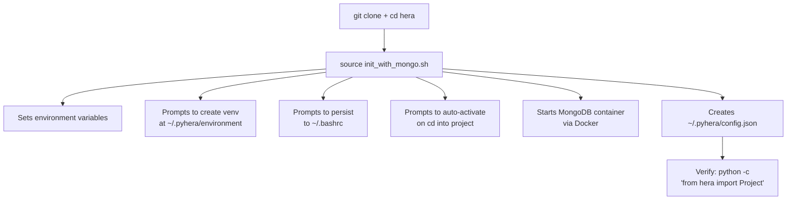
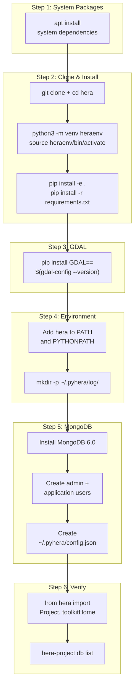

# Installation & Setup

This guide walks you through installing Hera and configuring the required services. There are two paths: a **Quick Install** using the provided scripts and Docker, or a **Manual Installation** for full control over each step.

---

## Prerequisites

| Requirement | Minimum Version | Notes |
|-------------|----------------|-------|
| **OS** | Ubuntu 22.04 LTS | Verified with this version |
| **Python** | 3.9+ | Tested with 3.9, 3.10, 3.11 |
| **Git** | 2.x | For cloning the repository |
| **pip** | 21+ | For installing Python packages |
| **Docker** | 20+ | Required for quick install only |

---

## Quick Install (recommended)

The fastest way to get Hera running. Uses Docker for MongoDB and scripts to automate environment setup.

### Installation Flow



<!-- mermaid source (for editing, paste into mermaid.live):

-->    Init --> Config["Creates ~/.pyhera/config.json"]
    Config --> Verify["Verify: python -c\n'from hera import Project'"]
```
-->
-->    Init --> Config["Creates ~/.pyhera/config.json"]
    Config --> Verify["Verify: python -c\n'from hera import Project'"]
```
-->
-->

### Steps

1. **Clone the repository:**

    ```bash
    git clone https://github.com/KaplanOpenSource/hera
    cd hera
    ```

2. **Run the initialization script:**

    ```bash
    source init_with_mongo.sh
    ```

    This single script will interactively:

    - Set up Hera environment variables (`HERA_REPO_ROOT`, `PYHERA_DIR`, `PYTHONPATH`)
    - Prompt to create a Python virtual environment at `~/.pyhera/environment` with all dependencies installed
    - Prompt to persist the environment to `~/.bashrc`
    - Prompt to auto-activate the Hera environment when you `cd` into the project directory
    - Pull and start a MongoDB 5.0 Docker container with preconfigured credentials
    - Create the `~/.pyhera/config.json` configuration file automatically

    After running, everything is ready to use.

3. **Install system dependencies and third-party tools (optional):**

    ```bash
    make install-deps       # System packages (libcairo, GDAL, etc.)
    make install-paraview   # ParaView 5.11.0
    make install-freecad    # FreeCad Python3 bindings
    make install-openfoam   # OpenFOAM 10
    make install-deps-all   # All of the above
    ```

### Helper Scripts

| Script | Purpose |
|---|---|
| `source set_hera_environment.sh` | Set environment variables, create venv, configure `.bashrc` (called automatically by `init_with_mongo.sh`) |
| `source activate_hera.sh` | Activate the Hera venv and environment in the current shell |
| `init_with_mongo.sh` | Full initialization: environment setup + MongoDB via Docker |

### Managing MongoDB with Make

After initial setup, use the Makefile to manage the MongoDB container:

```bash
make mongo-up              # Start MongoDB (data at ~/mongo-db-datadir)
make mongo-down            # Stop MongoDB
make mongo-status          # Check container status
make mongo-logs            # Tail container logs
make mongo-clean           # Remove container and delete all data
make mongo-up MONGO_DATA=/path/to/data   # Override data directory
```

### Running Tests

```bash
make test-setup            # Create test data directory at ~/hera_unittest_data
make test                  # Run all tests (requires MongoDB + test data)
```

Run `make help` to see all available targets.

---

## Manual Installation

If you prefer not to use Docker or need more control over each step, follow these instructions.

### Installation Flow



<!-- mermaid source (for editing, paste into mermaid.live):

-->-> EnvVars --> Dirs
    Dirs --> MongoInstall --> MongoUsers --> MongoConfig
    MongoConfig --> VerifyImport --> VerifyCLI
```
-->
-->-> EnvVars --> Dirs
    Dirs --> MongoInstall --> MongoUsers --> MongoConfig
    MongoConfig --> VerifyImport --> VerifyCLI
```
-->
-->

### Step 1: System Packages

```bash
sudo apt install libcairo2-dev pkg-config python3-dev libgirepository1.0-dev libgdal-dev gdal-bin python3-gdal
```

### Step 2: Clone and Install

```bash
git clone https://github.com/KaplanOpenSource/hera
cd hera

# Create and activate a virtual environment
python3.9 -m venv heraenv
source heraenv/bin/activate

# Install in development mode
pip install -e .

# Install runtime dependencies
pip install -r requirements.txt
```

!!! tip "Development Mode"
    Using `pip install -e .` installs Hera in **editable mode**, meaning changes to the source code take effect immediately without reinstalling.

If `pip install -r requirements.txt` fails, reinstall `setuptools` first:

```bash
pip install --upgrade --force-reinstall setuptools
pip install -r requirements.txt
```

### Step 3: Install GDAL Python Binding

Use `gdalinfo --version` to obtain your OS GDAL version, then:

```bash
pip install GDAL==`gdal-config --version`
```

### Step 4: Set Up PATH and Environment

Add the following to your shell profile (`~/.bashrc`, `~/.zshrc`, etc.):

```bash
export PYTHONPATH=$PYTHONPATH:/path/to/hera
export PATH=$PATH:/path/to/hera/hera/bin
```

Create required directories:

```bash
mkdir -p ~/.pyhera/log/
```

!!! tip "Use the setup script instead"
    You can also run `source set_hera_environment.sh` to configure environment variables interactively, even if you're doing the rest manually.

#### Environment Variables

These variables are optional but useful for testing and advanced configurations:

| Variable | Required | Default | Description |
|----------|----------|---------|-------------|
| `HOME` | Yes (OS) | OS default | Location of `~/.pyhera/config.json` |
| `TEST_HERA` | No | `~/hera_unittest_data` | Root directory for test data |
| `RESULT_SET` | No | `BASELINE` | Name of the expected-output result set for tests |
| `PREPARE_EXPECTED_OUTPUT` | No | unset | Set to `1` to generate test baselines |
| `MPLBACKEND` | No | system default | Set to `Agg` for headless matplotlib (no display) |
| `GDF_TOL_AREA` | No | `1e-7` | Tolerance for geometry comparison in tests |
| `HERA_FULL_LOGGING_TESTS` | No | unset | Set to enable full logging during tests |

See the [Environment Variables Reference](../configuration/env_vars.md) for complete details.

### Step 5: MongoDB Setup

Install MongoDB 6.0 following the [official instructions](https://www.mongodb.com/docs/manual/tutorial/install-mongodb-on-ubuntu/) and ensure it runs on port 27017.

Start MongoDB with `mongosh` and create users:

```javascript
use admin

db.createUser(
  {
    user: "Admin",
    pwd: "Admin",
    roles: [ { role: "userAdminAnyDatabase", db: "admin" } , "readWriteAnyDatabase"]
  }
)

use admin
db.createUser(
  {
    user: "{username}",
    pwd:  "{password}",
    roles: [ { role: "readWrite", db: "{dbName}" } ]
  }
)
```

Then create `~/.pyhera/config.json`:

```json
{
    "{username}": {
        "dbIP": "{host}",
        "dbName": "{database name}",
        "password": "{password}",
        "username": "{username}"
    }
}
```

#### Config File Format

| Field | Type | Description |
|-------|------|-------------|
| `connectionName` | `str` (top-level key) | A name for this connection. Defaults to the OS username if not specified at runtime. |
| `username` | `str` | MongoDB username |
| `password` | `str` | MongoDB password |
| `dbIP` | `str` | MongoDB server address (hostname:port) |
| `dbName` | `str` | Name of the MongoDB database to use |

!!! note "Multiple Connections"
    You can define multiple connection entries in the same config file. Each entry is a top-level key. When creating a `Project`, you can specify which connection to use via `connectionName`:

    ```python
    from hera import Project
    proj = Project(projectName="MY_PROJECT", connectionName="production")
    ```

    If `connectionName` is not provided, Hera uses the current OS username as the key.

#### What Happens on First Run

If `~/.pyhera/config.json` does not exist when Hera is first imported, the system will:

1. Automatically create the directory `~/.pyhera/`
2. Generate a template `config.json` with placeholder values
3. Raise an `IOError` with a message asking you to fill in the connection details

### Step 6: Verify Installation

#### Python API

```python
from hera import Project, toolkitHome

# Create or connect to a project
proj = Project(projectName="MY_PROJECT")
print(f"Project: {proj.projectName}")
print(f"Files directory: {proj.FilesDirectory}")

# List available toolkits
table = toolkitHome.getToolkitTable("MY_PROJECT")
print(table)
```

#### CLI Tools

```bash
# List database connections
hera-project db list

# List projects
hera-project project list

# List available toolkits
hera-toolkit list --project MY_PROJECT
```

#### Expected Output

If everything is configured correctly, you should see:

- No `IOError` about missing config files
- A list of database connections
- A list of registered toolkits (may be empty for a new project)

---

## Troubleshooting Installation

| Problem | Cause | Solution |
|---------|-------|----------|
| `IOError: config file doesn't exist` | Missing `~/.pyhera/config.json` | Create the file with valid MongoDB connection details |
| `ConnectionRefusedError` | MongoDB not running | Start MongoDB: `sudo systemctl start mongod` or `make mongo-up` |
| `ModuleNotFoundError: No module named 'hera'` | Package not installed | Run `pip install -e .` from the hera root |
| `command not found: hera-project` | `hera/bin/` not in PATH | Run `source activate_hera.sh` or add to PATH manually |
| `ImportError: mongoengine` | Missing dependencies | Run `pip install -r requirements.txt` |

See the [Troubleshooting](../troubleshooting.md) page for more common errors and solutions.
