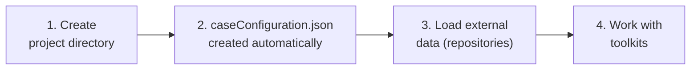

# Projects

A **Project** is Hera's unit of organization. Every document in the database — whether a measurement, simulation, or cached result — carries a `projectName` field that associates it with a project.

---

## Projects are defined by their documents

There is no master table of project names in Hera. A project **exists** as long as there are documents with its name. When the last document with `projectName="WindStudy"` is deleted, the project effectively ceases to exist. Creating a project is simply creating the first document with that name.

```python
from hera import Project

# This connects to (or implicitly creates) a project
proj = Project(projectName="WindStudy")

# List all projects that have at least one document
from hera.datalayer import getProjectList
getProjectList()
# ['WindStudy', 'CoastalSim', 'RiskAnalysis']
```

From the CLI:

```bash
# List all projects
hera-project project list

# Create a project directory with a caseConfiguration.json
hera-project project create WindStudy --directory /data/wind_study
```

---

## Directory-based projects

You don't always need to specify the project name explicitly. If you omit `projectName`, Hera looks for a `caseConfiguration.json` file in the current working directory:

```json
{
    "projectName": "WindStudy"
}
```

If the file is found, the project name is loaded automatically:

```python
# When run from a directory containing caseConfiguration.json:
proj = Project()  # projectName loaded from the file
```

This is the recommended workflow — create the project once with the CLI, then any script run from that directory connects to the right project:

```bash
# Create the project directory
hera-project project create WindStudy --directory /data/wind_study

# Work from that directory
cd /data/wind_study
python my_analysis.py   # Project() picks up "WindStudy" automatically
```

Toolkits follow the same convention — `toolkitHome.getToolkit("MeteoLowFreq")` without a `projectName` reads from `caseConfiguration.json` too.

If no `caseConfiguration.json` exists and no name is provided, Hera uses a read-only **default project** used internally for repository management.

---

## Project lifecycle

A typical project goes through these steps:



**Step 1 — Create a project directory:**

```bash
hera-project project create WindStudy --directory /data/wind_study
cd /data/wind_study
```

This creates the directory and a `caseConfiguration.json` file inside it.

**Step 2 — Load external data from repositories:**

A [repository](concepts.md#repositories) is a JSON file that describes a collection of data sources — where they are, what format they're in, and which toolkit they belong to. Loading a repository populates your project with all the data sources it declares:

```bash
# Register a repository (one-time setup)
hera-project repository add /path/to/my_repository.json

# Load all its data sources into the project
hera-project repository load my_repository WindStudy
```

Or load all registered repositories at once:

```bash
hera-project project updateRepositories --projectName WindStudy
```

See [Repositories](concepts.md#repositories) in Key Concepts for the JSON format, and [Working with data sources](working_with_data.md#data-sources) for how to interact with them.

**Step 3 — Work with toolkits:**

Once the data is loaded, [toolkits](concepts.md#toolkits-portals-to-specific-data-types) provide domain-specific access to it. Every toolkit is initialized with a project name — this binds the toolkit to the project's data:

```python
from hera import toolkitHome

# The toolkit is bound to "WindStudy" and works with its data
meteo = toolkitHome.getToolkit("MeteoLowFreq", projectName="WindStudy")

# Or from the project directory — projectName is auto-detected
meteo = toolkitHome.getToolkit("MeteoLowFreq")

# Access the loaded data sources
df = meteo.getDataSourceData("YAVNEEL")
```

See the [Toolkit Catalog](../toolkits/overview.md) for all available toolkits and their capabilities.

---

## Data sources as external databases

Data sources are external datasets — weather observations, GIS files, simulation inputs — that are loaded into a project and then accessed through toolkits. Think of them as **external databases that get imported** into your project's MongoDB.

The flow is:

1. **External data** exists on disk (parquet files, netcDF, shapefiles, etc.)
2. A **repository JSON** describes where each file is and which toolkit it belongs to
3. You **load** the repository into a project — this creates measurement documents pointing to the files
4. **Toolkits** access the data through named, versioned data sources

```python
# After loading a repository, the toolkit can access the data by name
topo = toolkitHome.getToolkit("GIS_Raster_Topography", projectName="WindStudy")
topo.getDataSourceList()
# ['Israel_DEM_30m', 'SRTM_90m']

# The data itself still lives on disk — Hera stores the metadata and path
elevation = topo.getDataSourceData("Israel_DEM_30m")
```

This means the same external data files can be shared across multiple projects — each project just stores its own metadata documents pointing to the files. For the full details on versions, defaults, and querying, see [Working with data sources](working_with_data.md#data-sources).

---

## Three document collections

Each project organizes its data into three MongoDB collections:

| Collection | Role | Methods |
|-----------|------|---------|
| **Measurements** | Raw input data (station files, GIS data, sensor readings) | `addMeasurementsDocument`, `getMeasurementsDocuments`, `deleteMeasurementsDocuments` |
| **Simulations** | Computational model output (CFD results, dispersion runs) | `addSimulationsDocument`, `getSimulationsDocuments`, `deleteSimulationsDocuments` |
| **Cache** | Derived or intermediate results (statistics, function caches) | `addCacheDocument`, `getCacheDocuments`, `deleteCacheDocuments` |

All three collections share the same document structure and the same query interface. The separation is purely organizational — it helps you understand the provenance of each piece of data.

For detailed examples of adding, querying, and loading data, see [Working with Data](working_with_data.md).

---

## Project configuration

Each project has a **config** — a key-value store persisted in the database as a special cache document. Use it for project-level settings that should survive between sessions.

```python
proj = Project(projectName="WindStudy")

# Set configuration values
proj.setConfig(
    defaultStation="YAVNEEL",
    outputCRS=2039,
    domainSize={"width": 5000, "height": 5000}
)

# Read configuration
config = proj.getConfig()
print(config["defaultStation"])   # "YAVNEEL"
print(config["outputCRS"])        # 2039
print(config["domainSize"])       # {"width": 5000, "height": 5000}

# Update a single key (other keys are preserved)
proj.setConfig(outputCRS=4326)
```

**`initConfig`** sets values only if the keys don't already exist — useful for setting defaults without overwriting user choices:

```python
# These only take effect if the keys are not already set
proj.initConfig(
    defaultStation="BET_DAGAN",
    outputCRS=2039
)
```

Toolkits use the same config mechanism — each toolkit's settings are stored in the project config under toolkit-specific keys (e.g., `YAVNEEL_defaultVersion` for data source version defaults).

---

## Counters

Projects have built-in **atomic counters** — named integers stored in the database that increment safely even with concurrent access. A common use case is generating unique identifiers for output files.

```python
proj = Project(projectName="WindStudy")

# getCounterAndAdd returns the current value and increments atomically.
# On first call the counter is created starting at 0.
run_id = proj.getCounterAndAdd("simulation_run")  # 0
output = f"/data/results/run_{run_id}.nc"

run_id = proj.getCounterAndAdd("simulation_run")  # 1
output = f"/data/results/run_{run_id}.nc"
```

This is what `saveData` uses internally to generate unique file names.

| Method | Description |
|--------|-------------|
| `getCounterAndAdd(name, addition=1)` | Return current value and increment. Creates the counter at 0 if it doesn't exist. |
| `getCounter(name)` | Return current value without incrementing. Returns `None` if not defined. |
| `setCounter(name, defaultValue=0)` | Create or reset a counter. |

Counters are per-project and stored inside the project config document.

---

## Data manipulation methods

Projects provide methods for adding, querying, deleting, and saving data. Here is a summary — for full examples with code, see [Working with Data](working_with_data.md).

### Adding documents

| Method | Description |
|--------|-------------|
| `addMeasurementsDocument(resource, dataFormat, type, desc)` | Add a measurement document |
| `addSimulationsDocument(resource, dataFormat, type, desc)` | Add a simulation document |
| `addCacheDocument(resource, dataFormat, type, desc)` | Add a cache document |
| `saveData(name, data, desc, kind)` | Auto-detect format, save file to disk, create document |
| `saveMeasurementData(name, data, desc)` | Save as measurement (shorthand) |
| `saveSimulationData(name, data, desc)` | Save as simulation (shorthand) |
| `saveCacheData(name, data, desc)` | Save as cache (shorthand) |

See [Adding data](working_with_data.md#adding-data) for examples.

### Querying documents

| Method | Description |
|--------|-------------|
| `getMeasurementsDocuments(**filters)` | Query measurement documents |
| `getSimulationsDocuments(**filters)` | Query simulation documents |
| `getCacheDocuments(**filters)` | Query cache documents |
| `getAllDocuments(**filters)` | Query across all collections |
| `getDocumentByID(id)` | Get a single document by its MongoDB ID |
| `getMetadata()` | Return all document descriptions as a DataFrame |

See [Querying the database](working_with_data.md#querying) for examples of basic, nested, and structured queries.

### Deleting documents

| Method | Description |
|--------|-------------|
| `deleteMeasurementsDocuments(**filters)` | Delete matching measurement documents |
| `deleteSimulationsDocuments(**filters)` | Delete matching simulation documents |
| `deleteCacheDocuments(**filters)` | Delete matching cache documents |

### Export and import

| Method | Description |
|--------|-------------|
| `export(path)` | Export all project documents to a zip file |
| `Project.load(proj, path, is_hard_import)` | Import documents from an exported zip |

```bash
# CLI equivalents
hera-project project dump WindStudy --format json --fileName backup.json
hera-project project load WindStudy backup.json
```
