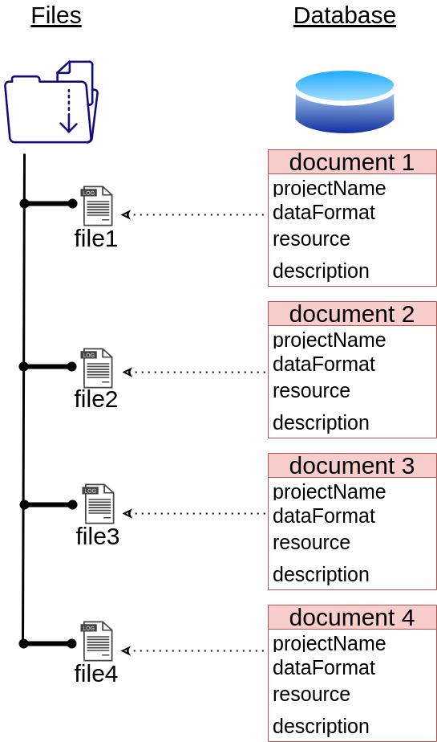

.. _datalayerPage:

Datalayer
*********

The data the that is produced in by the measurements or the simulation might be large
and therefore we usually store the data on the disk
and keep only the metadata in the database. Each record in the database (called a 'document') represents
a single piece of data (pandas, dask, xarray or any other data) associated with a **project**.

The meta data includes the fields:

 - The project name that contains the data.
 - The data (or a reference to it).
 - The format of the data on the disk.
 - fields that describe the data.

Each user has its own database that stores documents, but it is also possible to access
a different databases.

The datalayer also includes a command line interface to load, remove and move data around.

Setup
=====

The library uses a connection to the database that is defined in the path
~/.pyhera/config.json. The structure of the config.json is

..  code-block:: javascript

    {
    <connection name 1> : {
        "dbIP": "DB IP",
        "dbName": "...",
        "password": "..." ,
        "username": "..."
    },
    <connection name 1> : {
        "dbIP": "DB IP",
        "dbName": "...",
        "password": "..." ,
        "username": "..."
    }
}

The default connection is the **default with the linux user name**.
It is possible to add other database connections. See below on how
to access other databases.

10-minute tutorial
===================

This tutorial demonstrate how to store and retrieve data from the database
with the default connection (the username of the linux system).

Each document is to a project. That is, the projectName property
of the document cannot be empty.

.. include:: datalayer/addgetdata.rst

Usage
=====

.. toctree::
    :maxdepth: 2

    datalayer/cli
    datalayer/usage
    datalayer/datahandlers
    datalayer/architecture

API
=====

.. toctree::
    :maxdepth: 3

    datalayer/document
    datalayer/collection
    datalayer/datahandlers
