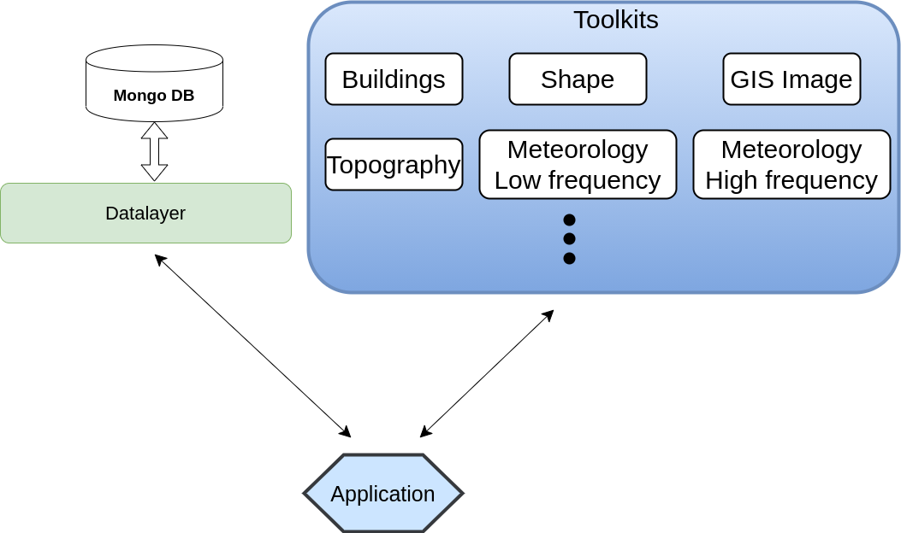

.. pyhera documentation master file, created by
   sphinx-quickstart on Tue Nov 26 15:51:03 2019.
   You can adapt this file completely to your liking, but it should at least
   contain the root `toctree` directive.

Welcome to Hera's documentation!
##################################

Overview
========

The 'Hera' project aims to make the departmental data more accessible and to standardize its storage,
and provide tools for analysis and presentation.

The library manages data by providing interface to store pieces of data
and their metadata (i.e description of the data). Then, the library
provides tools that help to load, analysis and presentations for specific data types.

The hera package has two parts.
 - :ref:`Data layer <datalayerPage>`: The datalayer provides interface to store the metadata (data that describes the data itself)
               of each piece of data as a document in the database

 - :ref:`Toolkit <toolkitPage>`: Interfaces to manage different types of data.
master

Installing & setup
==================

We currently recommend using the package as a development package.
You must have MongoDB installed.

1. Download the package from the git repository.

::

     git clone [path to repository] path-to-save/pyhera

2. Add the path to the to the PYTHONPATH.

::

   export PYTHONPATH=$PYTHONPATH:path-to-save/pyhera/hera

   we recommend to add it to the .bashrc.

and also

   export PATH=$PATH:path-to-save/pyhera/hera/bin

3. Create a configuration file in $HOME/.pyhera

.. literalinclude:: examples/configfile/config.json

example configuration file  can be downloaded :download:`here <examples/configfile/config.json>`.

The default database name is the linux username and it **must** exist.

4. In order to compile the documentation you must have the furo theme installed:

::

   pip install furo

Usage and API
=============

.. toctree::
   :maxdepth: 3
   :caption: Contents:

   datalayer
   toolkit
   instructions_for_dev

Indices and tables
==================

* :ref:`genindex`
* :ref:`modindex`
* :ref:`search`
